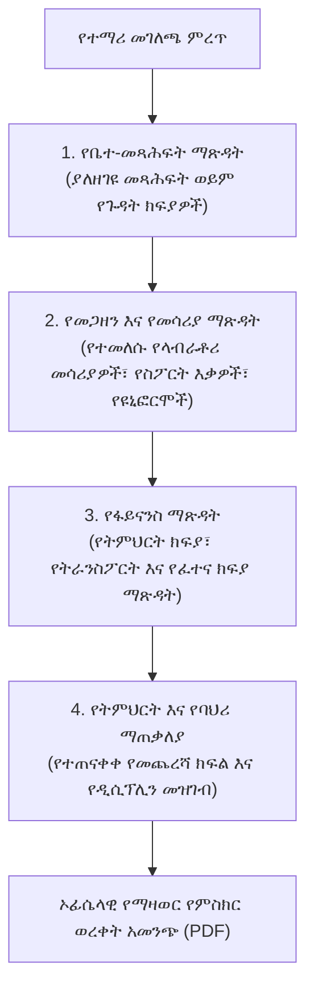

# የትምህርት ቤት መልቀቂያ ማጽዳት እና የማዛወር የምስክር ወረቀቶች

አንድ ተማሪ ወደ ሌላ ተቋም ሲዛወር ወይም የመጨረሻ ክፍላቸውን ሲያጠናቅቅ፣ የትምህርት ቤቶች የትምህርት መዝገቦች ከመልቀቃቸው በፊት ሁሉም የተቋም ግዴታዎች መሟላታቸውን ማረጋገጥ አለባቸው። **የትምህርት ቤት መልቀቂያ ማጽዳት የስራ ሂደት** (`/registrar/school-leaving`) የመጨረሻውን-ወደ-መጨረሻው የማጽዳት ሂደትን ዲጂታል ያደርጋል፣ በክፍሎች መካከል የመፈረም ማስተባበር ያደርጋል እና ኦፊሴላዊ፣ ከተጭበርባሪነት-የተጠበቁ የማዛወር የምስክር ወረቀቶችን (TC) ያመነጫል።

---

## ባለ 4-ክፍል የማጽዳት ቧንቧ

---

## በደረጃ-በደረጃ፦ የትምህርት ቤት መልቀቂያ ማጽዳትን ማካሄድ

### 1. የተማሪውን መዝገብ ያግኙ
1. በሬጅስትራር መሄጃ ምናሌ ውስጥ **የትምህርት ቤት መልቀቂያ**ን ጠቅ ያድርጉ።
2. ተማሪውን በ**ስም**፣ በ**የተማሪ መታወቂያ / ኮድ** ወይም በ**ክፍል ሴክሽን** ይፈልጉ።
3. **የማጽዳት ምርመራ ፓነሉን** ለመክፈት ተማሪውን ይምረጡ።

### 2. የክፍል ማጽዳቶች

| የማጽዳት ምርመራ | ኃላፊነት ያለው ሚና | የማረጋገጫ ዘዴ |
| :--- | :--- | :--- |
| **📚 የቤተ-መጻሕፍት ማጽዳት** | ቤተ-መጻሕፍት ኃላፊ / ሬጅስትራር | ሁሉም የተበደሩ የቤተ-መጻሕፍት መጻሕፍት ተመልሰው መግባታቸውን እና ማንኛውም የመተኪያ ቅጣት መከፈሉን ያረጋግጣል። |
| **🎒 መጋዘን እና ንብረቶች** | መጋዘን ጠባቂ | የላብራቶሪ ኪቶች፣ የስፖርት ዩኒፎርሞች፣ መቆለፊያዎች ወይም የሙዚቃ መሳሪያዎች መመለሳቸውን ያረጋግጣል። |
| **💰 የፋይናንስ ማጽዳት** | የፋይናንስ ኦፊሰር | በትምህርት ክፍያ፣ በባስ ትራንስፖርት እና በምግብ እቅዶች ላይ ዜሮ የቀረ ሂሳብ መኖሩን ያረጋግጣል። |
| **⚖️ ባህሪ እና የትምህርት ሁኔታ** | ዳይሬክተር / የመማሪያ ክፍል መምህር | የባህሪ ሁኔታን (*ጥሩ*, *አጥጋቢ*, *ምሳሌያዊ*) እና ትምህርትን ለመቀጠል ብቁነትን ያረጋግጣል። |

---

## በደረጃ-በደረጃ፦ የማዛወር የምስክር ወረቀት (TC) ማመንጨት

ሁሉም የማጽዳት ምልክቶች **የጸደቀ (አረንጓዴ)** በሚያሳዩበት ጊዜ፦

1. ወደ **የምስክር ወረቀት መስጫ ቅፅ** ይሸብልሉ፦
   - **የመስጫ ቀን እና የመልቀቂያ ቀን**፦ በኢትዮጵያ አቆጣጠር (E.C.) ወይም በጎርጎርያን (G.C.) ቀኖችን ይምረጡ።
   - **የመልቀቂያ ምክንያት**፦ መደበኛ ምክንያት ይምረጡ (*ወደ ሌላ ትምህርት ቤት ማዛወር*, *የቤተሰብ መንቀሳቀስ*, *ምረቃ*, *ሌላ*)።
   - **የመድረሻ ትምህርት ቤት እና ክልል**፦ የመድረሻ ተቋም ስም እና የክልል አስተዳደራዊ ዞን ያስገቡ (ለምሳሌ *አዲስ አበባ*, *ኦሮሚያ*, *ሲዳማ*)።
   - **የተጠናቀቀ የመጨረሻ ክፍል**፦ የተጠናቀቀውን የመጨረሻ ክፍል ይግለጹ (ለምሳሌ *8ኛ ክፍል* ወይም *10ኛ ክፍል*)።
   - **የባህሪ ደረጃ**፦ የባህሪ ሁኔታን ይምረጡ (*ጥሩ*, *በጣም ጥሩ*, *አጥጋቢ*)።
   - **የመገኘት ሁኔታ**፦ ድምር የመገኘት ደረጃን ይምረጡ (*አጥጋቢ*, *ከፍተኛ ጊዜ-አክባሪነት*)።
   - **አጠቃላይ ማስታወሻዎች**፦ አማራጭ የባህሪ ምስክርነቶችን ወይም ልዩ የትምህርት ክብሮችን ያስገቡ።
2. **የማጽዳት መዝገብ አስቀምጥ**ን ጠቅ ያድርጉ።
3. **ኦፊሴላዊ የምስክር ወረቀት አትም**ን ጠቅ ያድርጉ።

---

## ከተጭበርባሪነት-የተጠበቁ የደህንነት ባህሪያት

እያንዳንዱ የተፈጠረ የማዛወር የምስክር ወረቀት የሚከተሉትን ያካትታል፦

- **የማረጋገጫ QR ኮድ**፦ ከYeneSchool ብሔራዊ መዝገብ ጋር ትክክለኛነቱን ለማረጋገጥ በመድረሻ ትምህርት ቤት የመግቢያ ኦፊሰሮች ሊቃኝ የሚችል።
- **ልዩ የማጽዳት ተከታታይ ቁጥር**፦ ድግግሞሽ መስጠትን ለመከላከል በትምህርት ቤት የኦዲት መዝገብ ውስጥ በቋሚነት ይመዘገባል።
- **ኦፊሴላዊ አርማ እና የውሃ ምልክት**፦ የትምህርት ቤቱን ብጁ የአብነት ቅንብሮች በመጠቀም ተቀርፆ የተዘጋጀ።
- **የዳይሬክተር እና የሬጅስትራር የፊርማ ቦታዎች**፦ ለህጋዊ ፊርማ እና ለኦፊሴላዊ ማህተም የተመደቡ መስኮች።

---

## ቀጣይ እርምጃዎች

- [የተማሪ አስተዳደር ማውጫ](/am/registrar/student-management) — የተማሪ መገለጫ ዝርዝሮችን መፈለግ እና ማርትዕ
- [ብጁ የምስክር ወረቀት አብነት ገንቢ](/am/registrar/certificate-templates) — የምስክር ወረቀት አቀማመጥ እና የውሃ ምልክት ማበጀት
- [የመረጃ ወጥነት እና የጤና ኦዲት](/am/director/data-consistency) — ክፍለ-ጊዜ ከመዝጋት በፊት የተማሪ መዝገቦችን ኦዲት ያድርጉ