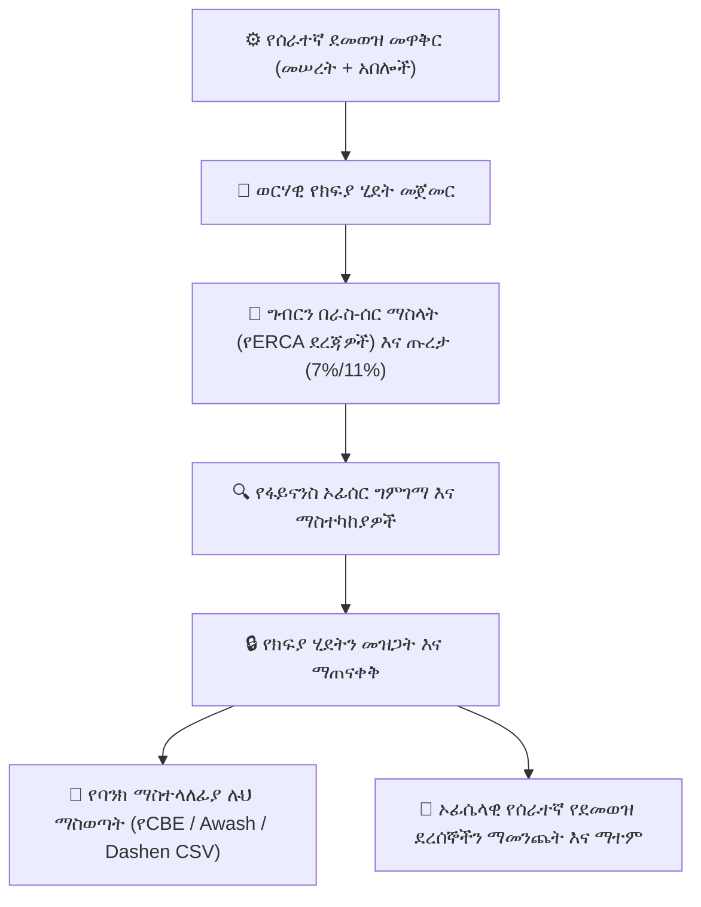

# የሰራተኛ ክፍያ እና የደመወዝ አስተዳደር

የ**YeneSchool ክፍያ ሞጁል (Payroll Module)** (`PayrollRun`፣ `PayrollSalary`፣ `PayrollEntry`) ለማስተማር ሰራተኞች፣ ለአስተዳደር ሰራተኞች እና ለድጋፍ ሰራተኞች ወርሃዊ የደመወዝ ስሌቶችን በራስ-ሰር ያከናውናል። ህጋዊ ተቀናሾችን (የኢትዮጵያ የገቢ ግብር እና የጡረታ ፈንዶች)፣ አበሎችን፣ የተጣራ ክፍያ ስሌትን እና በራስ-ሰር የባንክ ማስተላለፊያ ፋይል ማመንጨትን ይይዛል።

---

## 1. የሰራተኛ የደመወዝ መዋቅሮችን ማዋቀር

እያንዳንዱ የሰራተኛ መገለጫ ከተበጀ የደመወዝ መገለጫ (`PayrollSalary`) ጋር የተገናኘ ነው፦

### የደመወዝ መገለጫ ክፍሎች
1. ወደ **Finance > Payroll > Salary Structures (ፋይናንስ > ክፍያ > የደመወዝ መዋቅሮች)** ይሂዱ።
2. የሰራተኛውን ይፈልጉ ወይም በስራ ሚና አብነት ይፍጠሩ (ለምሳሌ፣ *Senior High School Teacher (ከፍተኛ ሁለተኛ ደረጃ መምህር)*፣ *Lab Technician (ላብራቶሪ ቴክኒሺያን)*፣ *Registrar (ሬጅስትራር)*)።
3. የገቢ ክፍሎቹን ያዋቅሩ፦
   - **ጠቅላላ የመሠረት ደመወዝ (ETB) (Gross Base Salary)**፦ የውል ወርሃዊ መሠረታዊ ደመወዝ።
   - **የስራ እና የኃላፊነት አበል (Position & Responsibility Allowance)**፦ ለዲፓርትመንት ኃላፊዎች፣ ለክፍል መምህራን ወይም ለክለብ አስተባባሪዎች።
   - **የትራንስፖርት እና የመኖሪያ ቤት አበል (Transport & Housing Allowance)**፦ መደበኛ ወርሃዊ አበሎች።
   - **የአፈፃፀም ቦነስ / ትርፍ ሰዓት (Performance Bonus / Overtime)**፦ ለቅዳሜ/እሁድ ትምህርት ወይም ተጨማሪ ጊዜያቶች ተጨማሪ ካሳ።
4. **Save Salary Structure (የደመወዝ መዋቅር አስቀምጥ)** ን ይጫኑ።

---

## 2. ህጋዊ ተቀናሾች እና የኢትዮጵያ የግብር ስሌት

YeneSchool የኢትዮጵያን የስራ እና የገቢ ደንቦች በማክበር አስገዳጅ ህጋዊ ተቀናሾችን በራስ-ሰር ያሰላል፦

| ክፍል | መጠን / ህጎች | ማስታወሻ |
| :--- | :--- | :--- |
| **የሰራተኛ የጡረታ መዋጮ** | ከጠቅላላ የመሠረት ደመወዝ 7.0% | በቀጥታ ከሰራተኛው የደመወዝ ክፍያ ይቀነሳል። |
| **የአሰሪ የጡረታ መዋጮ** | ከጠቅላላ የመሠረት ደመወዝ 11.0% | በትምህርት ተቋሙ ይከፈላል። |
| **የስራ ገቢ ግብር (PIT)** | ተራማጅ ደረጃዎች (0% – 35%) | የጡረታ ነፃነትን (ተቀናሽን) ተከትሎ በሚግባ ገቢ ላይ በመመስረት በራስ-ሰር ይሰላል። |
| **በፈቃደኝነት የሚደረጉ ተቀናሾች** | ቋሚ የETB መጠን | የሰራተኛ የህብረት ስራ ማህበር ብድሮች፣ የደመወዝ ቅድመ-ክፍያዎች ወይም የማህበራዊ ደህንነት ፈንድ። |

---

## 3. ወርሃዊ ክፍያ ማከናወን

### የክፍያ ሂደት ደረጃ በደረጃ
1. ወደ **Finance > Payroll > Payroll Runs (ፋይናንስ > ክፍያ > የክፍያ ሂደቶች)** ይሂዱ።
2. **+ Start New Payroll Run (አዲስ የክፍያ ሂደት ጀምር)** ን ይጫኑ።
3. **Pay Period (የክፍያ ጊዜ)** (ለምሳሌ፣ *Meskerem 2017 / September 2024 (መስከረም 2017 / መስከረም 2024)*) እና **Branch (ቅርንጫፍ)** ን ይምረጡ።
4. ስርዓቱ ሁሉንም ንቁ ሰራተኞች ይሞላል፣ ጠቅላላ ገቢዎችን ያሰላል፣ ህጋዊ የጡረታ/ግብር ቀመሮችን ይተገብራል እና ትክክለኛውን **Net Salary Payable (የሚከፈል የተጣራ ደመወዝ)** ያሰላል።
5. **Review & Adjust (ገምግም እና አስተካክል)**፦ ማንኛውንም የአንድ-ጊዜ ተቀናሾች (ለምሳሌ፣ ያለማብቃት መቅረት የደመወዝ ቅነሳ) ወይም ቦነሶች ያክሉ።
6. **Lock & Finalize Payroll Run (ክፍያ ሂደቱን ዝጋ እና አጠናቅቅ)** ን ይጫኑ። ከተጠናቀቀ በኋላ፣ መዝገቦቹ የማይለወጡ ይሆናሉ እና በኦዲት መዝገብ ይቀመጣሉ።

---

## 4. የባንክ ማስተላለፊያ ማስወጫ ሉሆች እና የደመወዝ ደረሰኞች

### የኢትዮጵያ ንግድ ባንክ (CBE) ቀጥታ ተቀማጭ ማስወጣት
1. በተጠናቀቀው የክፍያ ሂደት ውስጥ **Export Bank Transfer File (የባንክ ማስተላለፊያ ፋይል ማስወጣት)** ን ይጫኑ።
2. የባንክ አገልግሎት አቅራቢዎን ይምረጡ (ለምሳሌ፣ *Commercial Bank of Ethiopia (CBE) (የኢትዮጵያ ንግድ ባንክ)*፣ *Awash Bank (አዋሽ ባንክ)*፣ *Dashen Bank (ዳሽን ባንክ)*)።
3. ስርዓቱ የሰራተኞች ህጋዊ ስሞች፣ የባንክ መለያ ቁጥሮች እና የተጣሩ መጠኖች ያለው ተስማሚ የCSV/Excel የክፍያ ማስተላለፊያ ፋይል ያመነጫል፣ ይህም ለባንኩ የኮርፖሬት ፖርታል በቀጥታ ለጅምላ ሰቀላ ዝግጁ ነው።

### የሰራተኛ ዲጂታል የደመወዝ ደረሰኞች
- ሰራተኞች ወርሃዊ **PDF Payslip (የደመወዝ ደረሰኝ)** ን በግል ፖርታላቸው ወይም በሞባይል መተግበሪያቸው በደህንነት ማየት እና ማውረድ ይችላሉ።
- የደመወዝ ደረሰኞች የተቋሙን አርማ፣ ጠቅላላ ገቢዎችን፣ በዝርዝር የተቀናሾችን ግብር እና ጡረታ እንዲሁም የመጨረሻውን የሚቀበሉትን ደመወዝ በግልጽ ያሳያሉ።

---

## ቀጣይ እርምጃዎች

- [Fee Structures & Tuition Setup (የክፍያ መዋቅሮች እና የትምህርት ክፍያ ማዋቀር)](/am/finance/fee-structures) — የተማሪ የትምህርት ክፍያ እቃዎችን ያዋቅሩ
- [Overdue Fee Reports & Reminders (ያለጊዜያቸው ያለፉ የክፍያ ሪፖርቶች እና ማሳሰቢያዎች)](/am/finance/overdue-reports) — ያልተከፈሉ የወላጅ ክፍያ ሂሳቦችን ይከታተሉ
- [Recording Payments & Receipts (ክፍያዎች እና ደረሰኞች መመዝገብ)](/am/finance/record-payment) — የካሽየር ክፍያ የስራ ሂደቶች