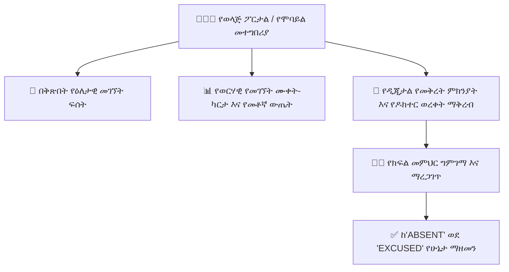

# የወላጅ መገኘት ክትትል እና የመቅረት ምክንያት አቀራረብ

**የወላጅ የመገኘት ማዕከል (Parent Attendance Center)** ለቤተሰቦች ስለ ልጆቻቸው የዕለታዊ የክፍል መገኘት፣ የመምጫ ሰዓቶች፣ የወርሃዊ የመገኘት መጠኖች እና ራስ-ሰር የመቅረት ማንቂያዎችን ግልጽ፣ በቅጽበት የማየት አቅም ይሰጣል። ወላጆች የዲጂታል ህክምና ምክንያቶችን እና የእረፍት ጥያቄዎችን በቀጥታ በፖርታሉ በኩል ማቅረብ ይችላሉ።

---

## 1. የበርካታ ልጆች የመገኘት መቀያየሪያ

በትምህርት ቤቱ ከአንድ በላይ ልጆች ያሏቸው ወላጆች ለሚከተሉት፦
- በላይኛው ራዕስ ላይ የ**ልጅ መቀያየሪያ (Child Switcher)** አለ። የተወሰነውን ክፍል ክፍል፣ የክፍል መምህር እና የግል የመገኘት ታሪክ ለማየት በማንኛውም ልጅ ላይ ይንኩ።
- በቅጽበት የጠዋት ሁኔታ ባጆች (badges) ተማሪው በአሁኑ ጊዜ በትምህርት ቤት ግቢ ውስጥ መሆን አለመሆኑን ያሳያሉ (ለምሳሌ፣ *ናሆም፡ በ9ኛ ክፍል B ውስጥ ተገኝቷል (07:54 ላይ ተመዝግቧል)*)።

---

## 2. የወርሃዊ የመገኘት ሙቀት-ካርታ እና መለኪያዎች

የመገኘት ዳሽቦርድ የወርሃዊ አፈጻጸም መለኪያዎችን ያጠቃልላል፦

| የመለኪያ ካርድ | የሚወክለው | የቤንችማርክ ግብ |
| :--- | :--- | :--- |
| **ጠቅላላ የትምህርት ቤት ቀናት** | በተመረጠው የኢትዮጵያ/ጎርጎርዮስ ወር ውስጥ የኦፊሴላዊ የስራ ቀናት ብዛት። | — |
| **የተገኘባቸው ቀናት** | ልጅዎ በሰዓቱ የተገኘባቸው ቀናት። | በተቻለ መጠን ከፍተኛ |
| **ዘግይቶ / የዘገየ መምጣት** | ከትምህርት ቤት የጠዋት መቆራረጫ ሰዓት (`ATTENDANCE_CUTOFF_TIME`) በኋላ የተገኘባቸው ቀናት። | በቴርም < 2 |
| **የተፈቀደ መቅረት** | የተረጋገጡ የህክምና እረፍቶች ወይም የተፈቀደ የቤተሰብ መቅረት። | የጸደቁ መዝገቦች |
| **ያልተፈቀደ መቅረት** | የወላጅ ማረጋገጫ ሳይኖር የተጎደሉ ቀናት። | **0 ቀናት** |
| **ድምር የመገኘት መጠን** | ከሚጠበቁ የትምህርት ቀናት ውስጥ የተገኘበት መቶኛ። | **>= 90% (አረንጓዴ)** |

> [!WARNING]
> የተማሪው ድምር የመገኘት መጠን ከ**80%** በታች ከሆነ፣ ስርዓቱ ተማሪውን በአካዳሚክ ስጋት ማስጠንቀቂያ ይፋሰሳል፤ በዓመቱ መጨረሻ የክፍል እድገት (promotion) ብቁነትም አደጋ ላይ ሊወድቅ ይችላል።

---

## 3. የዲጂታል የመቅረት ምክንያት ማቅረብ

ልጅዎ ሲታመም ወይም የቤተሰብ ድንገተኛ አደጋ ሲከሰት፦

1. በ**መገኘት** ትር ውስጥ **+ የመቅረት ምክንያት ያስገቡ (Submit Absence Excuse)** የሚለውን ይጫኑ።
2. **ልጁን**፣ **የቀኖችን ክልል** እና **የምክንያት ምድብ** ይምረጡ፦
   - `Medical / Sickness`
   - `Family Emergency / Bereavement`
   - `Religious Observance`
   - `Authorized Travel`
3. ለክፍል መምህሩ የማብራሪያ ዝርዝሮችን ያስገቡ።
4. (አማራጭ) የህክምና ምስክር ወረቀት ወይም የዶክተር ወረቀት ፎቶ ወይም የPDF ስካን ይስቀሉ።
5. **የመቅረት ጥያቄ ያስገቡ (Submit Excuse Request)** የሚለውን ይጫኑ።
6. የክፍል መምህሩ አቀራረቡን ይገመግማል። አንዴ ከጸደቀ፣ የተማሪው ሁኔታ በራስ-ሰር ከ`ABSENT` ወደ `EXCUSED (Blue E)` ይቀየራል፣ ይህም በእድገት ውጤታቸው ላይ አሉታዊ ተጽእኖ እንዳያሳድር ይከላከላል።

---

## ቀጣይ እርምጃዎች

- [የወላጅ ዳሽቦርድ አጠቃላይ እይታ](/am/parent/overview) — አጠቃላይ የወላጅ ፖርታል እይታ
- [የማሳወቂያ ቻናሎች እና ምርጫዎች](/am/platform/notifications) — የኤስኤምኤስ እና የቴሌግራም የመቅረት ማሳወቂያዎችን ማዋቀር
- [የመምህር መገኘት ምዝገባ ስራ ሂደት](/am/teacher/attendance-marking) — መምህራን ዕለታዊ ጥሪን የሚወስዱበት መንገድ