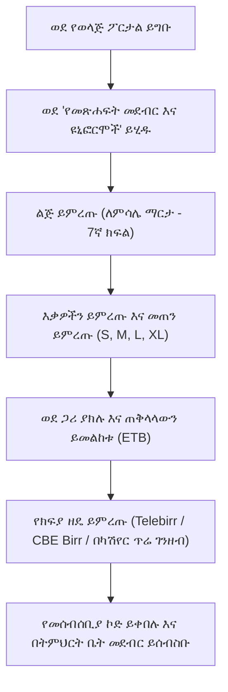

# የትምህርት ቤት መጽሐፍት መደብር እና የዩኒፎርም ትዕዛዞች

ወላጆች ኦፊሴላዊ የትምህርት ቤት ዩኒፎርሞችን፣ የአካዳሚክ መማሪያ መጽሐፍትን፣ የቢሮ እቃ ስብስቦችን እና የአካል ትምህርት መሳሪያዎችን በቀጥታ ከ**የወላጅ ፖርታል መጽሐፍት መደብር** (`/parent/store`) መግዛት ይችላሉ። ይህ ዲጂታል መደብር በዓመቱ መጀመሪያ በሚከሰተው ጥድፊያ ወቅት በግቢው ውስጥ ረጅም ወረፋዎችን ያስወግዳል እንዲሁም ተማሪዎች በትክክል የጸደቁ የትምህርት ቤት ቁሳቁሶችን እንዲያገኙ ያረጋግጣል።

---

## ወላጆች ምን መግዛት ይችላሉ

::u-page-grid
:::u-page-card
---
title: የትምህርት ቤት ዩኒፎርሞች
icon: i-lucide-shirt
---
ኦፊሴላዊ የትምህርት ቤት ሸሚዝ-ጃኬቶች (blazers)፣ ሹራቦች (sweaters)፣ ፖሎ ሸሚዞች፣ ሱሪዎች፣ ቀሚሶች፣ ኔክታይዎች እና የአካል ትምህርት (PE) ስፖርት ልብሶች፣ በክፍል ደረጃ እና በልጅ መጠን ተደራጅተው።
:::

:::u-page-card
---
title: የስርዓተ-ትምህርት መማሪያ መጽሐፍት
icon: i-lucide-book
---
የጸደቁ የኢትዮጵያ ትምህርት ሚኒስቴር ስርዓተ-ትምህርት መማሪያ መጽሐፍት፣ የተማሪ መስሪያ ደብተሮች እና ተጨማሪ የማመሳከሪያ ቁሳቁሶች።
:::

:::u-page-card
---
title: የቢሮ እቃ ስብስቦች
icon: i-lucide-package
---
ደረጃውን የጠበቁ የልምምድ ደብተሮች፣ የሂሳብ ጂኦሜትሪ መሳሪያ ስብስቦች፣ ሳይንሳዊ ካልኩሌተሮች እና የስዕል ቁሳቁሶች።
:::
::

---

## ደረጃ በደረጃ፡ ለልጅዎ ትዕዛዝ ማስቀመጥ

### 1. የተፈለገውን ልጅ መምረጥ
1. የግራ ምናሌውን ይክፈቱ እና **የመጽሐፍት መደብር እና ዩኒፎርሞች**ን ይጫኑ።
2. በYeneSchool ውስጥ ከአንድ በላይ ልጆች ከተመዘገቡ፣ ከራዕሱ አናት ላይ ካለው ተቆልቋይ ዝርዝር ልጁን ይምረጡ። ካታሎጉ ለዚያ ልጅ የክፍል ደረጃ ተስማሚ የሆኑትን እቃዎች በራስ-ሰር ያጣራል።

### 2. መጠን መምረጥ እና ወደ ጋሪ መጨመር
1. በእቃ ካርድ ላይ ይጫኑ (ለምሳሌ *የ7ኛ ክፍል ኦፊሴላዊ የትምህርት ቤት ዩኒፎርም ስብስብ*)።
2. የሚፈለገውን መጠን ይምረጡ፦
   - **ዩኒፎርሞች**፦ የደረት፣ የወገብ እና የቁመት መጠን ይምረጡ (*Size 28, 30, 32* ወይም *S, M, L, XL*)። የመጠን ሰንጠረዥ አገናኞች የመለኪያ መመሪያዎችን ይሰጣሉ።
   - **ብዛት**፦ ስንት ክፍል እንደሚፈልጉ ይምረጡ (ለምሳሌ 2 ፖሎ ሸሚዝ፣ 1 ሹራብ)።
3. **ወደ ጋሪ ያክሉ (Add to Cart)** ን ይጫኑ።
4. ለሚፈለጉ መማሪያ መጽሐፍት ወይም የቢሮ እቃ ስብስቦች ይህንን ይድገሙት።

### 3. ክፍያ ማጠናቀቅ እና መክፈል
1. ትዕዛዝዎን ለመገምገም ከላይ በቀኝ ያለውን **የግብይት ጋሪ (Shopping Cart)** አዶን ይጫኑ።
2. የሚመርጡትን የክፍያ ዘዴ ይምረጡ፦
   - **📱 Telebirr / CBE Birr**፦ ፈጣን ዲጂታል ክፍያ ከቅጽበት የማረጋገጫ ደረሰኝ ጋር።
   - **🏦 በቀጥታ የባንክ ማስተላለፍ**፦ የደረሰኝ ማስገቢያ ወረቀቶችን ለመስቀል የትምህርት ቤቱን የባንክ አካውንቶች (CBE፣ Awash፣ Dashen) ያሳያል።
   - **💵 በትምህርት ቤት ካሽየር ጥሬ ገንዘብ**፦ በግቢው የፋይናንስ ጠረጴዛ ላይ ለመፍታት ያልተከፈለ ቮቸር ያመነጫል።
3. **ትዕዛዝ ያረጋግጡ (Confirm Order)** ን ይጫኑ።

---

## የትዕዛዝ ክትትል እና በግቢው መሰብሰብ

ትዕዛዝ ካስቀመጡ በኋላ፦

1. ወደ **ትዕዛዞቼ (My Orders)** ትር ይሂዱ።
2. ትዕዛዝዎ ከሦስት የአፈጻጸም ሁኔታዎች አንዱን ያሳያል፦
   - 🟡 **በማረጋገጥ ላይ**፦ ትዕዛዝ ደርሷል፤ የክፍያ ማረጋገጫ በመካሄድ ላይ ነው።
   - 🔵 **ለመሰብሰብ ዝግጁ**፦ የትምህርት ቤቱ መጋዘን ጠባቂ የልጅዎን እቃዎች አሽጎታል።
   - 🟢 **ተጠናቋል**፦ እቃዎች ተቀብለው ተረጋግጠዋል።
3. **ለመሰብሰብ ዝግጁ** ተብሎ ሲምልክት፣ የታሸጉ ቁሳቁሶችን ለመሰብሰብ ዲጂታል **የትዕዛዝ ማረጋገጫ ኮድዎን** (ወይም የትዕዛዝ ስክሪኑን በስልክዎ ላይ ያሳዩ) በግቢው ውስጥ ወደ ትምህርት ቤቱ መጽሐፍት መደብር ይውሰዱ።

---

## ቀጣይ እርምጃዎች

- [የወላጅ ክፍያዎች እና ክፍያዎች](/am/finance/overview) — የክፍያ አወቃቀሮች፣ የትምህርት ክፍያ እና የፋይናንስ መግለጫዎች
- [የመጋዘን ጠባቂ የእቃ ክምችት አስተዳደር](/am/inventory/school-store) — ሰራተኞች ትዕዛዞችን የሚፈጽሙበት እና የሚልኩበት መንገድ
- [የወላጅ ፖርታል አጠቃላይ እይታ](/am/parent/overview) — የወላጅ ፖርታል ባህሪያት መመሪያ