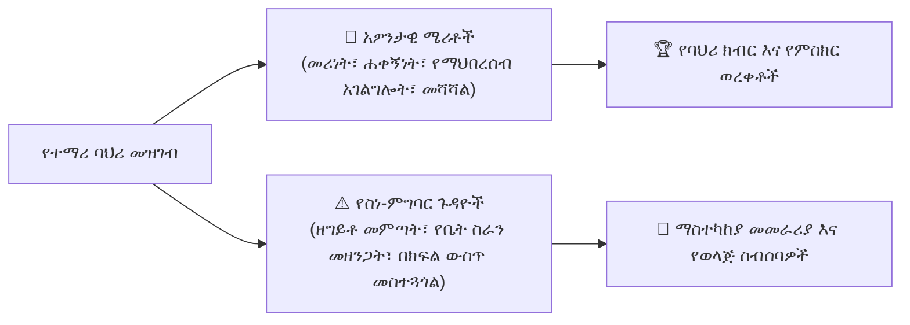

# ባህሪ፣ የሜሪት ሽልማቶች እና የተማሪ ደህንነት እንክብካቤ

YeneSchool አጠቃላይ የተማሪ ልማትን ያጎላል፣ የአካዳሚክ ጥብቅነትን ከአዎንታዊ የባህሪ ትምህርት ጋር በማመጣጠን። በ**የወላጅ ስነ-ምግባር እና የተማሪ ደህንነት ፖርታል** (`/parent/discipline`) በኩል፣ ቤተሰቦች ስለ ሁለቱም አዎንታዊ የባህሪ ስኬቶች (የሜሪት ነጥቦች) እና ማንኛውም የስነ-ምግባር ጉዳዮች (የስነ-ምግባር ማስታወቂያዎች) መረጃ ያገኛሉ፣ ይህም በቤት እና በትምህርት ቤት መካከል ቀደምት እና ትብብራዊ ድጋፍን ያስችላል።

---

## ባለሁለት የባህሪ ሞዴል፡ ሜሪቶች እና የነጥብ ቅነሳዎች

---

## የልጅዎን የባህሪ መዝገብ መመልከት

1. ወደ **የወላጅ ፖርታል** ይግቡ ወይም **የYeneSchool ሞባይል መተግበሪያ**ን ይክፈቱ።
2. ልጅዎን ይምረጡ እና **ባህሪ እና የተማሪ ደህንነት እንክብካቤ (Behavior & Pastoral Care)** የሚለውን ትር ይጫኑ።
3. ዳሽቦርዱ የሚከተሉትን ያሳያል፦
   - **ድምር የሜሪት ነጥቦች**፦ በመምህራን የተሰጡ ጠቅላላ የባህሪ አድናቆት ነጥቦች።
   - **ንቁ ማስታወቂያዎች**፦ ትኩረት የሚሹ ክፍት ክስተቶች ወይም ጥያቄዎች።
   - **የተፈቱ ጉዳዮች**፦ ከቀዳሚ የተማሪ ደህንነት ውይይቶች የተመዘገቡ ውጤቶች።

---

## የክስተት ከባድነት ደረጃዎችን መረዳት

በመምህር ወይም በአስተዳዳሪ አንድ ክስተት ሲመዘገብ፣ በከባድነቱ ይመደባል፦

| የከባድነት ደረጃ | ምሳሌዎች | የትምህርት ቤት እርምጃ እና የወላጅ ማሳወቂያ |
| :--- | :--- | :--- |
| **🔵 ዝቅተኛ (LOW)** | ቀላል የአለባበስ ደንብ ጥሰት፣ የተረሳ ማስታወሻ ደብተር፣ ቀላል በክፍል ውስጥ ማውራት | ለመምህር ምልከታ ይመዘገባል። በመተግበሪያ ውስጥ ለወላጆች የማሳወቂያ መልዕክት። |
| **🟡 መካከለኛ (MEDIUM)** | ተደጋጋሚ ያልተፈቀደ የቤት ስራ አለመስጠት፣ ለክፍል ጓደኞች አክብሮት ማጣት | የክፍል መምህር ምክር። የግፊት ማንቂያ እና የወላጅ ማረጋገጫ ጥያቄ። |
| **🟠 ከፍተኛ (HIGH)** | ትምህርት መዝለል፣ የአካዳሚክ ሐቀኝነት ጥሰት፣ ሆን ተብሎ የትምህርት ቤት ንብረት መጎዳት | የወላጅ-መምህር የስልክ ስብሰባ ይታቀዳል። ማስተካከያ እርምጃ ስምምነት። |
| **🔴 ወሳኝ (CRITICAL)** | ከባድ ጉልበተኝነት፣ አካላዊ ግጭት፣ የደህንነት ጥሰቶች | መደበኛ የስነ-ምግባር ኮሚቴ ችሎት በዳይሬክተር እና በአሳዳጊ ተገኝቶ። |

---

## ማስታወቂያዎችን መጠበቅ እና ስብሰባዎችን ማቀድ

አንድ የክስተት ሁኔታ **የወላጅ ማረጋገጫ ይፈልጋል** በሚል ሲታይ፦

1. ዝርዝሮችን ለማስፋት በክስተት ካርድ ላይ ይጫኑ፦
   - **የክስተት ማጠቃለያ**፦ በሪፖርት አድራጊው መምህር የተመዘገበ ትክክለኛ መግለጫ።
   - **ቦታ እና ሰዓት**፦ የመማሪያ ክፍል፣ ላቦራቶሪ፣ ካፍቴሪያ ወይም የመጫወቻ ቦታ።
   - **ማስተካከያ የመመሪያ እቅድ**፦ የሚመከሩ የድጋፍ እርምጃዎች (ለምሳሌ የእኩያ ሽምግልና ወይም የትምህርት ምክር)።
2. **እመሰክራለሁ እና እፈርማለሁ (Acknowledge & Sign)** ን ይጫኑ፦
   - የዲጂታል ማረጋገጫ ሳጥኑን ያመልክቱ።
   - ለክፍል መምህሩ የእርስዎን የወላጅ አስተያየቶች ወይም ማስታወሻዎች ያስገቡ።
3. ስብሰባ ከተጠየቀ፣ ከመምህሩ ወይም ከትምህርት ቤቱ አማካሪ ጋር በአካል ወይም በስልክ ለመገናኘት የሚመች ጊዜ ለመምረጥ **የስብሰባ ቀን ይምረጡ (Select Conference Date)** ን ይጫኑ።

---

## የባህሪ ወሳኝ ስኬቶችን ማክበር

ተማሪዎች የላቀ ባህሪ ሲያሳዩ፦

- **የሜሪት ባጆች**፦ ለእኩያ የትምህርት ድጋፍ (peer tutoring)፣ ለአካባቢ ጥበቃ ክለብ አመራር እና ለተሟላ ሰዓታዊነት ይሰጣሉ።
- **ኦፊሴላዊ የባህሪ አድናቆቶች**፦ በቴርም መጨረሻ የውጤት ካርዶች እና በምረቃ ግልባጮች (transcripts) ላይ ይታያሉ።

---

## ቀጣይ እርምጃዎች

- [የክፍል መምህር የስራ ቦታ](/am/teacher/homeroom-management) — መምህራን የተማሪ ደህንነት እንክብካቤን የሚያስተዳድሩበት መንገድ
- [የወላጅ የመግባቢያ ደብተር](/am/communication/communication-book) — ስለ ልጅዎ በቀጥታ ለመምህራን ይላኩ
- [የወላጅ ፖርታል አጠቃላይ እይታ](/am/parent/overview) — የሁሉም የወላጅ ፖርታል ባህሪያት መመሪያ