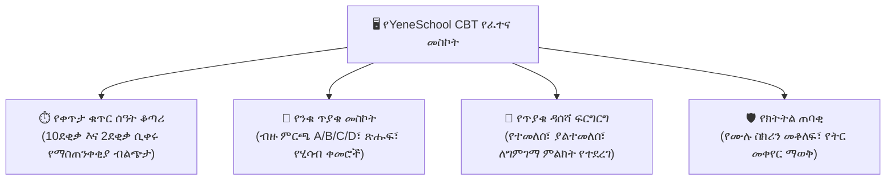

# በኮምፒውተር ላይ የተመሰረተ ፈተና (CBT) እና የፈተና ክትትል

YeneSchool ለቢራንድ ጥያቄዎች፣ ለመካከለኛ ፈተናዎች እና ለብሔራዊ ፈተና ልምምድ ማስመሰያዎች ዘመናዊ **በኮምፒውተር ላይ የተመሰረተ የፈተና (CBT)** መድረክ (`/student/online-examination`) ያቀርባል። በይነገጹ ለፍጥነት፣ ከመረበሽ ነጻ ለሆነ ትኩረት እና ራስ-ሰር ረቂቅ ቅጂ ለማስቀመጥ የተመቻቸ ነው፣ ይህም ተማሪዎች በአውታረ መረብ መቋረጥ ጊዜ እንኳን የፈተና ስራቸውን እንዳያጡ ያረጋግጣል።

---

## የCBT ፈተና በይነገጽ አጠቃላይ እይታ

---

## ደረጃ በደረጃ፡ የመስመር ላይ ፈተና መውሰድ

### 1. የፈተና ክፍለ ጊዜውን መጀመር
1. ወደ ተማሪ ፖርታሉ ይግቡ እና **የመስመር ላይ ፈተናዎች** ን ይጫኑ።
2. የታቀደ ፈተናዎን በ**ተገኙ ፈተናዎች** ስር ይፈልጉ።
3. የፈተና መለኪያዎቹን ይፈትሹ፦
   - **ጠቅላላ ጥያቄዎች እና ነጥቦች**
   - **የተፈቀደ ቆይታ** (ለምሳሌ *60 ደቂቃ*)
   - **የተፈቀዱ ሙከራዎች** (ለኦፊሴላዊ ግምገማዎች ብዙውን ጊዜ *1 ሙከራ*)
4. **ፈተና ይጀምሩ** ን ይጫኑ። የክብር ቃሉን ያንብቡ እና **የሙሉ ስክሪን ሁነታ ይግቡ** ን ይጫኑ።

### 2. ጥያቄዎችን ማሰስ እና መመለስ
- **አማራጭ ይምረጡ**፦ የመረጡትን መልስ (**A, B, C ወይም D**) ይጫኑ። አማራጩ በዋና ቀለም ይደምቃል።
- **ለግምገማ ምልክት ያድርጉ (Flag icon)**፦ ስለ አንድ ጥያቄ እርግጠኛ ካልሆኑ፣ **ባንዲራ (Flag)** ይጫኑ። በዳሰሻ ፍርግርጉ ውስጥ የጥያቄው ቁጥር ወደ ሐምራዊ ይቀየራል፣ ይህም ከማስገባቱ በፊት እንዲመለሱበት ያስታውስዎታል።
- **በቀጥታ የመመለሻ ፍርግርግ**፦ ወደዚያ ጥያቄ ለመዝለል በቀኝ በኩል ባለው **የጥያቄ ፓሌት** ውስጥ ማንኛውንም ቁጥር ይጫኑ።
- **ፈጣን ረቂቅ ማመሳሰል**፦ መልሶች በእያንዳንዱ ጠቅታ በአካባቢያዊ የብራውዘር ማከማቻ ውስጥ በራስ-ሰር ይቀመጣሉ። ኮምፒውተርዎ ቢበላሽ ወይም ኢንተርኔት ቢቋረጥ፣ ምንም እድገት ሳይጠፋ ወዲያውኑ ለመቀጠል ፈተናውን እንደገና ይክፈቱ።

---

## የፀረ-ማጭበርበር እና የክትትል ደንቦች

የአካዳሚክ ታማኝነትን ለማረጋገጥ፣ የCBT መድረኩ ራስ-ሰር **የፈተና ታማኝነት ጠባቂ (Exam Integrity Watchdog)** ያካትታል፦

| የተከታተለ ክስተት | የስርዓት እርምጃ | ቅጣት / ተጽእኖ |
| :--- | :--- | :--- |
| **ከሙሉ ስክሪን መውጣት** | ወዲያውኑ የማስጠንቀቂያ መስኮት ተማሪው ወደ ሙሉ ስክሪን እንዲገባ ያነሳሳል። | በፈተና ታማኝነት ኦዲት ውስጥ ይመዘገባል። |
| **ትር / መስኮት መቀየር** | ሌላ የብራውዘር ትር ወይም መተግበሪያ ሲከፍቱ ስርዓቱ የትኩረት መጥፋትን ይለያል። | የማስጠንቀቂያ ባነር (በሦስተኛው ማስጠንቀቂያ ፈተናው በራስ-ሰር ይቆለፋል)። |
| **የቀኝ-ጠቅታ እና ቅጂ-መለጠፍ** | በፈተናው ወቅት ክሊፕቦርድ ቅጂ፣ የቀኝ-ጠቅታ እና የጽሑፍ ምርጫ ይሰናከላሉ። | ቁልፍ መጫን በራስ-ሰር ይታገዳል። |
| **የጊዜ ገደብ ማብቃት** | ቁጥር ሰዓት ቆጣሪው `00:00` ላይ ሲደርስ ፈተናው ወዲያውኑ ይቀዘቅዛል። | በአሁኑ ጊዜ የተመለሱ ሁሉም ጥያቄዎች በራስ-ሰር ይገባሉ። |

---

## ፈተናዎን ማስገባት እና ውጤቶችን መገምገም

1. ሲጨርሱ **ገምግም እና አስገባ (Review & Submit)** ን ይጫኑ።
2. የግምገማ መሳቢያው ማጠቃለያዎን ያሳያል፦
   - 🟢 **የተመለሱ**፦ ለምሳሌ ከ50 ጥያቄዎች 48
   - 🔴 **ያልተመለሱ**፦ ለምሳሌ 0 ጥያቄዎች
   - 🟣 **ምልክት የተደረገባቸው**፦ ለምሳሌ 2 ጥያቄዎች
3. **የመጨረሻ ማስገቢያን ያረጋግጡ** ን ይጫኑ።
4. ለዓላማ ፈተናዎች (ብዙ ምርጫ)፣ ውጤትዎ እና የመቶኛ ክፍፍልዎ ወዲያውኑ ይሰላል እና ይታያል። በመምህርዎ ከነቃ፣ የደረጃ በደረጃ የችግር አፈታት ማብራሪያዎችን ለማየት ባመለጡዎት ጥያቄዎች ላይ **በAI ያብራሩ (Explain with AI)** ን ይጫኑ።

---

## ቀጣይ እርምጃዎች

- [የተማሪ ፖርታል አጠቃላይ እይታ](/am/student/overview) — የሁሉም የተማሪ ባህሪያት መመሪያ
- [ምደባዎች እና የቤት ስራ](/am/student/assignments) — የቤት ስራ እና ፕሮጀክቶችን ማስገባት
- [የተማሪ ውጤቶች እና ግልባጮች](/am/student/grades-report-cards) — የአካዳሚክ አፈጻጸምዎን ይመልከቱ