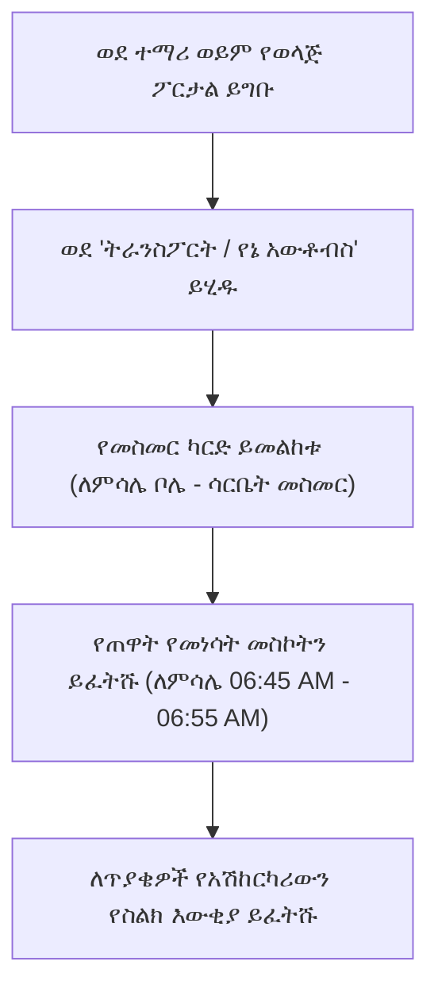

# የትምህርት ቤት አውቶብስ እና የትራንስፖርት ክትትል

በትምህርት ቤት አውቶብስ ትራንስፖርት የተመዘገቡ ተማሪዎች የተሟላ ዕለታዊ የመጓጓዣ መርሃ ግብራቸውን ከ**የኔ አውቶብስ ዳሽቦርድ** (`/student/transport`) መመልከት ይችላሉ። ፖርታሉ ስለ ተሽከርካሪ ታርጋ ቁጥሮች፣ የተመደቡ የመነሳት እና የመውረድ ሰዓቶች፣ ትክክለኛ የማቆሚያ መጋጠሚያዎች እና የአሽከርካሪ ቀጥተኛ የእውቂያ መረጃ ግልጽ ዝርዝሮችን ይሰጣል።

---

## በ'የኔ አውቶብስ' ዳሽቦርድ ላይ የሚታየው

::u-page-grid
:::u-page-card
---
title: መስመር እና መርሃ ግብር
icon: i-lucide-map-pin
---
ለተመደበው የአውቶብስ ማቆሚያዎ የተመደበው የጠዋት የመነሳት ሰዓት እና የከሰዓት የመውረድ ሰዓት።
:::

:::u-page-card
---
title: የአውቶብስ ተሽከርካሪ ዝርዝሮች
icon: i-lucide-bus
---
የአውቶብስ ኮድ (ለምሳሌ *አውቶብስ #4*)፣ የተሽከርካሪ ሞዴል፣ የታርጋ ቁጥር እና የመቀመጫ አቅም።
:::

:::u-page-card
---
title: አሽከርካሪ እና አጃቢ
icon: i-lucide-phone
---
የተመደበው የትምህርት ቤት አውቶብስ አሽከርካሪ እና የአውቶብስ ተቆጣጣሪ ስም እና ድንገተኛ ጊዜ የሞባይል ስልክ ቁጥር።
:::
::

---

## ደረጃ በደረጃ፡ የዕለታዊ የአውቶብስ ዝርዝሮችዎን መፈተሽ

1. የግራ ምናሌውን ይክፈቱ እና **ትራንስፖርት**ን (ወይም **የኔ አውቶብስ**ን) ይጫኑ።
2. የንቁ አውቶብስ ክፍፍል ካርዱ የሚከተሉትን ያሳያል፦
   - **የመስመር ስም**፦ ለምሳሌ፣ *መስመር 02 — ቦሌ መድኃኔዓለም በመገናኛ በኩል*።
   - **የተመደበዎት ማቆሚያ**፦ ትክክለኛ የአካባቢ ምልክት (ለምሳሌ *ከኤድና ሞል / ቴሌ ፖስት ፊት ለፊት*)።
   - **የጠዋት የመነሳት ሰዓት**፦ የዒላማ የመድረሻ ሰዓት (ለምሳሌ *06:50 AM*)። ከታቀደው መነሳት ቢያንስ 5 ደቂቃ በፊት ይድረሱ።
   - **የከሰዓት መነሻ ሰዓት**፦ ከትምህርት ቤት ግቢ የመነሻ ሰዓት (ለምሳሌ *03:45 PM*)።
   - **የተሽከርካሪ ታርጋ**፦ ለቀላል መለያ በአውቶብሱ የፊት ነፋስ መከላከያ ላይ ይታያል።
3. እየዘገዩ ከሆነ ወይም በተመደበው ማቆሚያዎ ላይ ተሽከርካሪውን ማግኘት ካልቻሉ፣ አሽከርካሪውን በቀጥታ ለማነጋገር የ**አሽከርካሪ ስልክ** አገናኝን ይጫኑ።

---

## ለተማሪዎች የደህንነት እና የመሳፈር መመሪያዎች

- **የQR መገኘት ቅኝት**፦ ሲሳፈሩ፣ መገኘትን ለመመዝገብ የተማሪ መታወቂያ ካርድዎን በአሽከርካሪው ወይም በአጃቢው ስካነር ፊት ይያዙ። ወላጆች ወዲያውኑ የመገኘት ማሳወቂያ ይደርሳቸዋል።
- **የተመደበ መቀመጫ ፕሮቶኮል**፦ ተሽከርካሪው በሚንቀሳቀስበት ጊዜ ተቀምጠው ይቆዩ እና የአውቶብስ ተቆጣጣሪውን መመሪያ ይከተሉ።
- **የመስመር ለውጥ ጥያቄዎች**፦ ቤተሰብዎ ቢዛወር ወይም ማቆሚያ መቀየር ከፈለጉ፣ ወላጅዎ መደበኛ የመስመር ማዘመኛ ጥያቄ በትምህርት ቤቱ የትራንስፖርት ቢሮ በኩል ቢያንስ 3 የስራ ቀናት ቀድሞ ማቅረብ አለበት።

---

## ቀጣይ እርምጃዎች

- [የዳይሬክተር የትራንስፖርት መርከብ አስተዳደር](/am/operations/transport) — መስመሮች እና ተሽከርካሪዎች የሚዋቀሩበት መንገድ
- [የQR መገኘት ቅኝት](/am/mobile/qr-attendance) — የመሳፈር ቅኝቶች ከትምህርት ቤት መገኘት ጋር የሚመሳሰሉበት መንገድ
- [የተማሪ ፖርታል አጠቃላይ እይታ](/am/student/overview) — የሁሉም የተማሪ ባህሪያት መመሪያ