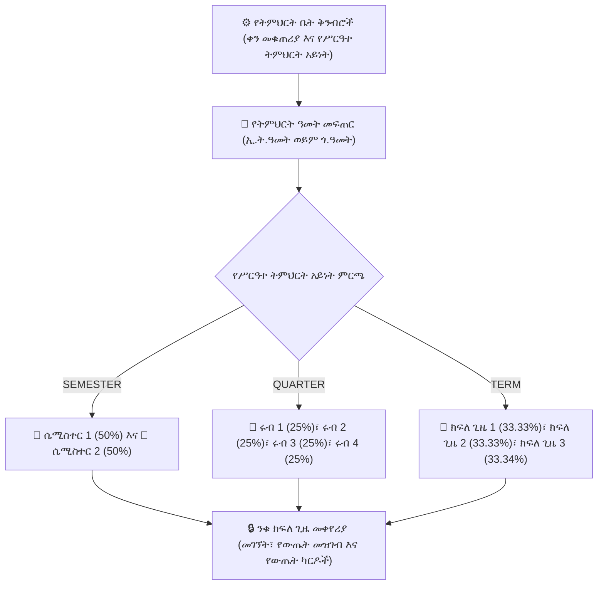

# የትምህርት ዓመታት፣ የቀን መቁጠሪያዎች እና የክፍለ ጊዜ ማዕቀፎች

**የትምህርት ዓመት እና ክፍለ ጊዜ ማዕቀፍ** (`AcademicYear`፣ `Term`፣ `buildPeriodDateRanges`) የYeneSchool መዋቅራዊ መሠረት ነው። እያንዳንዱ የተማሪ ምዝገባ፣ የክፍል የጊዜ ሰሌዳ፣ የመገኘት መዝገብ፣ ቀጣይነት ያለው ግምገማ ውጤት እና የመጨረሻ የውጤት ካርድ በስብስብ እጥር ለሚንቀሳቀስ የትምህርት ዓመት እና ክፍለ ጊዜ የተገደበ ነው።

---

## 1. ድርብ የቀን መቁጠሪያ ሞተር (ኢትዮጵያዊ እና ጎርጎርያን)

YeneSchool ሁለቱንም የቀን መቁጠሪያ ሥርዓቶች በተፈጥሮ ይደግፋል፦

| የቀን መቁጠሪያ ሞተር | የወር ዑደት | የትምህርት ቤት ምሳሌ ወቅት | የሚኒስቴር አሰላለፍ |
| :--- | :--- | :--- | :--- |
| **የኢትዮጵያ ቀን መቁጠሪያ (`ETHIOPIAN`)** | 13 ወራት (*መስከረም እስከ ጳጉሜ*) | *2017 ዓ.ም. (መስከረም 1 – ሰኔ 30)* | ለኢትዮጵያ ብሔራዊ ሥርዓተ ትምህርት ትምህርት ቤቶች ይፋዊ መስፈርት። |
| **የጎርጎርያን ቀን መቁጠሪያ (`GREGORIAN`)** | 12 ወራት (*መስከረም እስከ ሰኔ*) | *2024–2025 ዓ.ም.* | ለዓለም አቀፍ እና ካምብሪጅ/IB ትምህርት ቤቶች መስፈርት። |

---

## 2. የሥርዓተ ትምህርት ክፍለ ጊዜ አወቃቀሮች እና ራስ-ሰር ክብደት መመደብ

የትምህርት ቤትዎን የሥርዓተ ትምህርት አወቃቀር በ**ዳይሬክተር > የትምህርት ቤት ቅንብሮች > የአካዳሚክ ውቅር** ውስጥ ሲያዋቅሩ፣ መድረኩ በራስ-ሰር የክፍለ ጊዜዎችን አወቃቀር እና የክብደት ስርጭትን ያዘጋጃል፦

### 1. የሴሚስተር ሞዴል (`SEMESTER`)
- **ሴሚስተር 1**፦ 50% ድምር የውጤት ክብደት።
- **ሴሚስተር 2**፦ 50% ድምር የውጤት ክብደት።
- ለመደበኛ ሁለተኛ ደረጃ እና መሰናዶ ትምህርት ቤቶች ተስማሚ።

### 2. የሩብ ሞዴል (`QUARTER`)
- **ሩብ 1፣ ሩብ 2፣ ሩብ 3፣ ሩብ 4**፦ በእያንዳንዱ ሩብ 25% ክብደት።
- በዓለም አቀፍ እና ልዩ የመጀመሪያ ደረጃ አካዳሚዎች የተለመደ።

### 3. የክፍለ ጊዜ / ትሪሚስተር ሞዴል (`TERM`)
- **ክፍለ ጊዜ 1** (33.33%)፣ **ክፍለ ጊዜ 2** (33.33%)፣ **ክፍለ ጊዜ 3** (33.34%)።
- ለሶስት የክፍለ ጊዜ የመጀመሪያ እና መካከለኛ ደረጃ ትምህርት ቤቶች መስፈርት።

---

## 3. የትምህርት ዓመታትን መፍጠር እና ማስተዳደር

### የመፍጠር ደረጃ በደረጃ ሂደት
1. ወደ **የአካዳሚክ አስተዳደር > የትምህርት ዓመታት** (ወይም **ዳይሬክተር > የትምህርት ዓመታት**) ይሂዱ።
2. **+ የትምህርት ዓመት ፍጠር** የሚለውን ይጫኑ።
3. መለኪያዎቹን ይሙሉ፦
   - **የትምህርት ዓመት ስም**፦ ለምሳሌ `2017 ዓ.ም.` ወይም `2024/2025`።
   - **የቀን መቁጠሪያ ሥርዓት**፦ `የኢትዮጵያ ቀን መቁጠሪያ` ወይም `የጎርጎርያን ቀን መቁጠሪያ` ይምረጡ።
   - **የመጀመሪያ እና የመጨረሻ ቀን**፦ ይፋዊ የመጀመሪያ እና የመጨረሻ የስራ ቀናት።
   - **የንቁ ስራ ወቅት ምልክት**፦ ይህንን ዋና የስራ ዓመት ለማድረግ ወደ `ንቁ` ያብሩ።
4. **ክፍለ ጊዜዎችን አመንጭ** የሚለውን ይጫኑ፦
   - መድረኩ በትምህርት ቤትዎ `curriculum_type` ላይ በመመስረት ለእያንዳንዱ ክፍለ ጊዜ የመጀመሪያ እና የመጨረሻ ቀናትን ያሰላል።
5. **የትምህርት ዓመት አስቀምጥ** የሚለውን ይጫኑ።

---

## 4. የክፍለ ጊዜ የሕይወት ዑደት እና ታሪካዊ ማህደር

| የክፍለ ጊዜ ሁኔታ | የስርዓት የስራ ባህሪ |
| :--- | :--- |
| **`ACTIVE`** | አሁን ያለው የስራ ወቅት። መምህራን መገኘትን ይመዘግባሉ፣ ቀጣይነት ያላቸው ግምገማዎችን ያስገባሉ፣ እና የቤት ስራ ይመድባሉ። |
| **`UPCOMING`** | ወደፊት ያሉ ክፍለ ጊዜዎች። የጊዜ ሰሌዳዎች እና የፈተና መቀመጫ ዝግጅቶች አስቀድመው ሊታቀዱ ይችላሉ። |
| **`CLOSED`** | የተጠናቀቁ ክፍለ ጊዜዎች። ሁሉም ውጤቶች እና መዝገቦች በቋሚነት ተቆልፈው ለተነበበ ብቻ ታሪካዊ የውጤት ግልባጮች ተመዝግበው ይቀመጣሉ። |

> [!TIP]
> በማንኛውም ጊዜ አንድ ክፍለ ጊዜ ብቻ **ንቁ** ሊሆን ይችላል። አንድ ክፍለ ጊዜ ሲያልቅ፣ ዳይሬክተሩ የቀድሞ መዝገቦችን በመጠበቅ የአዲሱን ክፍለ ጊዜ የውጤት መዝገቦችን ወዲያውኑ በመክፈት በአንድ ጠቅታ ንቁውን ክፍለ ጊዜ ይቀይራል።

---

## ቀጣይ እርምጃዎች

- [ክፍሎች እና ክፍለ ክፍሎች](/am/academic/classes-sections) — የክፍል ደረጃዎችን እና ክፍለ ክፍሎችን በራስ-ሰር ማመንጨት
- [ትምህርቶች እና ትምህርቶች](/am/academic/subjects) — የትምህርት ጊዜዎችን እና የመምህራን ምደባን ማዋቀር
- [AI የጊዜ ሰሌዳ እና ራስ-ሰር ምደባ ሞተር](/am/operations/timetable-engine) — ከግጭት የጸዳ ሳምንታዊ መርሃ ግብሮችን ማመንጨት