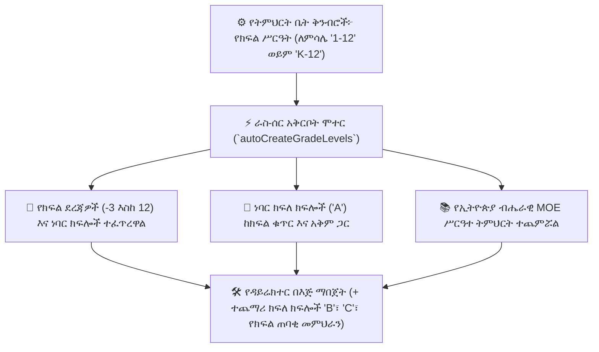

# ክፍሎች፣ ክፍለ ክፍሎች እና ራስ-ሰር አቅርቦት

በYeneSchool ውስጥ፣ የክፍል አወቃቀሮች ተማሪዎችን ለመገኘት፣ ለውጤት አሰጣጥ እና ለጊዜ ሰሌዳ ወደ ምቹ የትምህርት አሃዶች ያደራጃሉ (`Class`፣ `Section`፣ `GradeLevel`፣ `autoCreateGradeLevels`)። መድረኩ በአንድ ቅንብር መላውን የተቋም የክፍል አወቃቀር የሚገነባ ብልህ **ራስ-ሰር አቅርቦት ሞተር (Auto-Provisioning Engine)** ይዟል።



---

## 1. ራስ-ሰር የክፍል እና የክፍለ ክፍል አቅርቦት

የትምህርት ቤት ዳይሬክተር የትምህርት ቤቱን **የክፍል ሥርዓት (Grade System)** በ**ዳይሬክተር > የትምህርት ቤት ቅንብሮች** ውስጥ ሲያዋቅር፦

```
Supported Grade System Ranges:
- '1-8'          --> Grade 1 to Grade 8
- '1-10'         --> Grade 1 to Grade 10
- '1-12'         --> Grade 1 to Grade 12
- '9-12'         --> Grade 9 to Grade 12 (Secondary/Prep)
- 'K-12' / 'KG-12' --> Nursery (-3), KG 1 (-2), KG 2 (-1), KG 3 (0) + Grades 1–12
- 'KG-ONLY'      --> Nursery, KG 1, KG 2, KG 3
```

### YeneSchool በራስ-ሰር የሚያመነጨው፦
1. **የክፍል ደረጃ አካላት (GradeLevel)**፦ ከ`-3` (ቅድመ-መዋዕለ ሕጻናት) እስከ `12` (12ኛ ክፍል) የቁጥር ደረጃዎችን ያዘጋጃል።
2. **ነባር ክፍለ ክፍል A**፦ ለእያንዳንዱ ንቁ የክፍል ደረጃ ክፍለ ክፍል `A` በራስ-ሰር ይፈጥራል።
3. **የክፍል አቅም**፦ `DEFAULT_SECTION_CAPACITY` (ለምሳሌ `40` ተማሪዎች) ይተገበራል።
4. **የክፍል ቁጥር**፦ የክፍል ስሞችን በ`ROOM_NAMING_CONVENTION` መሰረት በራስ-ሰር ያመነጫል (ለምሳሌ `Room 101`፣ `Room G9-A`)።
5. **ብሔራዊ MOE ሥርዓተ ትምህርት**፦ ለእያንዳንዱ ክፍል መደበኛ የትምህርት ሚኒስቴር የትምህርት ዝርዝሮችን ያክላል።

---

## 2. ተጨማሪ ክፍለ ክፍሎች ማከል (ክፍለ ክፍሎች B፣ C፣ D)

የተማሪ ምዝገባ ከአንድ ክፍለ ክፍል አቅም በላይ ሲሰፋ፦

1. ወደ **የአካዳሚክ አስተዳደር > ክፍሎች እና ክፍለ ክፍሎች** ይሂዱ።
2. ዒላማውን የክፍል ደረጃ ይጫኑ (ለምሳሌ *9ኛ ክፍል*)።
3. **+ ክፍለ ክፍል አክል** የሚለውን ይጫኑ፦
   - **የክፍለ ክፍል ስም**፦ ለምሳሌ `ክፍለ ክፍል B`፣ `ክፍለ ክፍል C`፣ ወይም `የተፈጥሮ ሳይንስ ጅረት 1`።
   - **የተመደበ ክፍል / ክፍል ቁጥር**፦ ለምሳሌ `ብሎክ B - ክፍል 204`።
   - **የተማሪ አቅም ገደብ**፦ ስርዓቱ የምዝገባ ጥላቻ ማስጠንቀቂያ ከማስነሳቱ በፊት ያለው ከፍተኛ መቀመጫ ብዛት (ነባሪ፦ `40`)።
   - **የተመደበ የክፍል ጠባቂ መምህር**፦ የቀን ጠዋት መገኘት እና የወላጅ ግንኙነት ሀላፊነት ያለውን የፋኩልቲ አባል ይሾማሉ።
4. **ክፍለ ክፍል አስቀምጥ** የሚለውን ይጫኑ።

---

## 3. የክፍል ጠባቂ መምህራን እና የትምህርት ምደባዎች

እያንዳንዱ የክፍለ ክፍል ክፍል ሁለት የማስተማር ሀላፊነት ደረጃዎችን ይይዛል፦

1. **የክፍል ጠባቂ መምህር (`ClassHomeroom`)**፦
   - የዕለት ተዕለት የጠዋት መገኘትን እና አጠቃላይ የተማሪ ስርዓትን ያስተዳድራል።
   - የወላጅ-መምህር ምክክሮችን ያካሂዳል እና በውጤት ካርዶች ላይ የክፍለ ጊዜ መጨረሻ ጥራታዊ የባህሪ አስተያየቶችን ይጽፋል።
2. **የትምህርት-መምህር ምደባዎች (`TeacherSubjectAssignment`)**፦
   - ለዚያ ክፍለ ክፍል ሂሳብ፣ እንግሊዝኛ፣ ፊዚክስ ወዘተ የሚያስተምሩ የተለየ የትምህርት መምህራን።
   - የመምህሩን የግል የጊዜ ሰሌዳ በራስ-ሰር ያመነጫል እና የውጤት መዝገብ ምልክት ማድረግ ፈቃድ ይሰጣል።

---

## 4. የክፍል አቅም አስተዳደር እና ማመጣጠን

- **የቀጥታ አቅም መለኪያ ባሮሜትር**፦ የመቀመጫ ምልክት የሚያመለክቱ የቀለም ኮድ ባጆች (ለምሳሌ *36/40 የተመዘገቡ — 90%*)።
- **ራስ-ሰር የተማሪ ምደባ ማመጣጠን**፦ ተማሪዎችን በጅምላ CSV ሲያስገቡ፣ ሬጅስትራሩ በክፍለ ክፍሎች `A`፣ `B` እና `C` መካከል የወንድ/የሴት ምጣኔን እና የአካዳሚክ ውጤቶችን በእኩል ለማመጣጠን **ራስ-ሰር ክፍለ ክፍሎች ማከፋፈል** የሚለውን ማብሪያ ማጥፊያ ሊያበራ ይችላል።

---

## ቀጣይ እርምጃዎች

- [ትምህርቶች እና የሥርዓተ ትምህርት ማዕቀፍ](/am/academic/subjects) — የትምህርት ምደባዎችን እና ሳምንታዊ ጊዜዎችን ያስተዳድሩ
- [የጊዜ ሰሌዳ አስተዳደር](/am/academic/timetable) — ዋናውን ሳምንታዊ መርሃ ግብር ይገንቡ
- [የሬጅስትራር የተማሪ ምዝገባ](/am/registrar/enroll-student) — አዲስ ተማሪዎችን ለክፍሎች እና ክፍለ ክፍሎች ይመድቡ