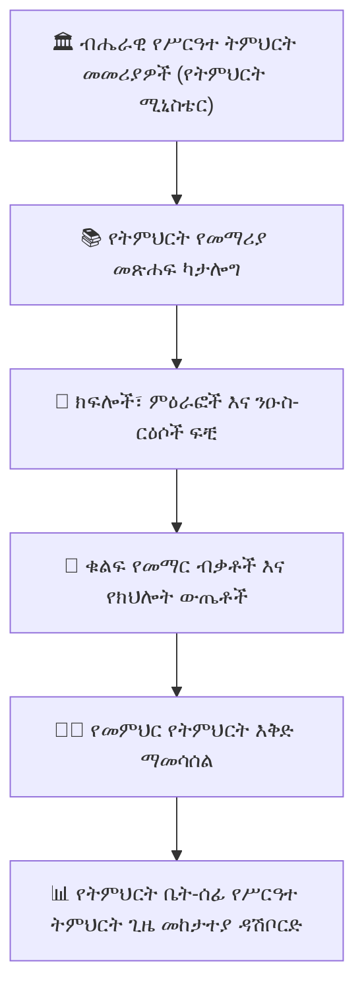

# የሥርዓተ ትምህርት ማዕቀፍ እና የመማሪያ መጽሐፍ ብቃቶች

**የሥርዓተ ትምህርት አስተዳደር ሞጁል** (`CurriculumTextbook`፣ `CurriculumTextbookUnit`፣ `SyllabusMapping`) የአካዳሚክ ዳይሬክተሮች እና የመምሪያ ኃላፊዎች ይፋዊ ብሔራዊ ሥርዓተ ትምህርቶችን እንዲያደራጁ፣ የጸደቁ የመማሪያ መጽሐፎችን እንዲያያይዙ፣ የመማር ብቃቶችን እንዲያዋቅሩ እና በሁሉም ክፍለ ክፍሎች ወጥ የሆነ የአካዳሚክ ጊዜ አከፋፈል እንዲጠብቁ ያስችላል።

---

## 1. የመማሪያ መጽሐፎችን እና ክፍሎችን ማደራጀት

1. ወደ **የአካዳሚክ አስተዳደር > ሥርዓተ ትምህርት > የመማሪያ መጽሐፎች** ይሂዱ።
2. **+ የሥርዓተ ትምህርት መማሪያ መጽሐፍ አክል** የሚለውን ይጫኑ፦
   - **ትምህርት እና የክፍል ደረጃ**፦ ለምሳሌ *10ኛ ክፍል ኬሚስትሪ*።
   - **የሥርዓተ ትምህርት እትም**፦ ለምሳሌ *አዲስ ብሔራዊ ሥርዓተ ትምህርት 2024 እትም*።
   - **ጠቅላላ ክፍሎች / ምዕራፎች**፦ በመማሪያ መጽሐፉ ውስጥ ያሉ ዋና ዋና ክፍሎች ብዛት።
3. ለእያንዳንዱ ክፍል የተዋቀረ ክፍፍል ይግለጹ፦
   - **የክፍል ቁጥር እና ስም**፦ ለምሳሌ *ክፍል 4፦ ኬሚካላዊ ትስስር እና ሞለኪውላዊ መዋቅር*።
   - **የተመደቡ የማስተማሪያ ጊዜዎች**፦ የሚፈለጉ ግምታዊ የክፍል ጊዜዎች (ለምሳሌ *14 ጊዜዎች*)።
   - **የማጠናቀቂያ ዒላማ ቀን**፦ ከፈተናዎች በፊት ክፍሉን ለማጠናቀቅ የቀን መቁጠሪያ ምዕራፍ።

---

## 2. ዋና ዋና የመማር ብቃቶችን መግለጽ

በእያንዳንዱ የመማሪያ መጽሐፍ ክፍል ስር፣ የአካዳሚክ መሪዎች የተወሰኑ የባህሪ የመማር ውጤቶችን መግለጽ ይችላሉ፦
- ለምሳሌ *"ተማሪዎች በቤተ ሙከራ የመተላለፊያ ሙከራዎች አማካኝነት በአዮኒክ እና በኮቫለንት ትስስር መካከል መለየት መቻል አለባቸው።"*
- መምህራን የትምህርት እቅዶችን እና ቀጣይነት ያላቸው የግምገማ ጥያቄዎችን ሲጽፉ እነዚህን ብቃቶች በቀጥታ መሰየም ይችላሉ።

---

## 3. የመምሪያ ጊዜ መከታተያ እና የጥራት ኦዲቶች

የአካዳሚክ ተቆጣጣሪዎች **የሥርዓተ ትምህርት ጊዜ መከታተያ**ን መመርመር ይችላሉ፦
- የእያንዳንዱን መምህር የሥርዓተ ትምህርት እድገት ከይፋዊ የአካዳሚክ ቀን መቁጠሪያ ምዕራፍ ቀናት ጋር ያነጻጽራል።
- በመካከለኛ እና በመጨረሻ ፈተናዎች በፊት ወቅታዊ የማካካሻ ትምህርት መርሐ ግብር ለማዘጋጀት የኋላ ቀር ክፍለ ክፍሎችን በአምበር እና በቀይ ጠቋሚዎች ያጎላል።

---

## ቀጣይ እርምጃዎች

- [የአካዳሚክ አጠቃላይ እይታ](/am/academic/academic-overview) — ማዕከላዊ የአካዳሚክ አስተዳደር ዳሽቦርድ
- [የጊዜ ሰሌዳ አስተዳደር](/am/academic/timetable) — ሳምንታዊ የትምህርት ጊዜ መርሐ ግብሮች
- [ፈተናዎች እና ግምገማዎች](/am/exams/exams-assessments) — የመካከለኛ እና የመጨረሻ ፈተናዎችን መርሐግብር ማያያዝ