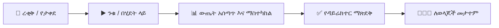

# ፈተናዎች እና ቀጣይነት ያላቸው ግምገማዎች

**የYeneSchool ፈተና እና ግምገማ ሞተር** የተማሪ ግምገማን ሙሉ የሕይወት ዑደት ያስተዳድራል — ከቀጣይነት ያላቸው የክፍል ፈተናዎች እና የቤት ስራ ምደባዎች ጀምሮ ከፍተኛ ጉርሻ እስካላቸው የሴሚስተር መካከለኛ ፈተናዎች፣ የመጨረሻ ፈተናዎች እና የብሔራዊ ፈተና ምዝገባዎች ድረስ።

---

## 1. የግምገማ አርክቴክቸር እና የአካል ክብደት

YeneSchool ከብሔራዊ ሥርዓተ ትምህርት መመሪያዎች ጋር የሚጣጣሙ ተለዋዋጭ የቀጣይነት ግምገማ ማዕቀፎችን ይደግፋል (ለምሳሌ የኢትዮጵያ የትምህርት ሚኒስቴር የግምገማ ደረጃዎች)። መደበኛ የትምህርት ውጤት አሰጣጥ መዋቅር የሚከተሉትን ያካትታል፦

| የአካል ምድብ | መደበኛ ክብደት | ድግግሞሽ | ማን ያስተዳድረዋል | መግለጫ እና ቀረጻ |
| :--- | :---: | :--- | :--- | :--- |
| **ቀጣይነት ያላቸው ፈተናዎች እና ሙከራዎች** | 20% | በየሁለት ሳምንቱ | የክፍል መምህር | አጫጭር የክፍል ፈተናዎች (እያንዳንዳቸው 10–20 ምልክቶች) በራስ-ሰር ይሰረዛሉ። |
| **የቤት ስራ እና ፕሮጀክቶች** | 15% | ሳምንታዊ / ወርሃዊ | የክፍል መምህር | ገለልተኛ ምደባዎች፣ የቡድን ፕሮጀክቶች እና የቤተ ሙከራ ተግባራዊ ሙከራዎች። |
| **የክፍል ተሳትፎ እና ባህሪ**| 5% | በቀጣይ | የክፍል ጠባቂ መምህር | ስርዓት፣ ጊዜ አክባሪነት እና ንቁ የክፍል ተሳትፎ ውጤት። |
| **የመካከለኛ ጊዜ ፈተና** | 20% | የሴሚስተር አጋማሽ | የፈተና ኮሚቴ / መምህር | የመጀመሪያውን ሩብ ሥርዓተ ትምህርት የሚሸፍን መደበኛ የጽሁፍ ወይም የኮምፒውተር ላይ የተመሰረተ ፈተና። |
| **የመጨረሻ የሴሚስተር ፈተና** | 40% | ክፍለ ጊዜ መጨረሻ | የትምህርት ቤት አስተዳደር | አጠቃላይ ደረጃውን የጠበቀ የመጨረሻ ፈተና። |
| **ጠቅላላ ድምር ውጤት** | **100%** | የሴሚስተር መጨረሻ | ራስ-ሰር የስርዓት ሞተር | የሁሉም ክብደት ያላቸው አካላት ድምር፤ የፊደል ውጤት እና የክፍል ደረጃ ያሰላል። |

---

## 2. ደረጃ በደረጃ፦ አዲስ መደበኛ ፈተና መፍጠር

1. በዋናው የጎን አሞሌ ውስጥ ወደ **ፈተናዎች → ግምገማዎች** ይሂዱ።
2. ከላይ-ቀኝ አርዕስት ላይ **+ ፈተና ፍጠር** የሚለውን ቁልፍ ይጫኑ።
3. የፈተና መገለጫ ቅጹን ይሙሉ፦
   - **የትምህርት ዓመት እና ክፍለ ጊዜ፦** ንቁውን ወቅት ይምረጡ (ለምሳሌ *2016 ዓ.ም. — ሴሚስተር 1*)።
   - **የፈተና ርዕስ፦** ገላጭ ስም ያስገቡ (ለምሳሌ *10ኛ ክፍል ሴሚስተር 1 የመጨረሻ ፈተና*)።
   - **ዒላማ የክፍል ደረጃዎች፦** የተወሰኑ ክፍሎችን ይምረጡ (ለምሳሌ *9ኛ ክፍል፣ 10ኛ ክፍል፣ 11ኛ ክፍል፣ 12ኛ ክፍል*) ወይም በትምህርት ቤት-ሰፊ ይተግብሩ።
   - **የፈተና መስኮት፦** የፈተና ወቅቱን ይፋዊ የመጀመሪያ እና የመጨረሻ ቀናትን ያዘጋጁ።
   - **የውጤት መለኪያ፦** *መደበኛ 100-ነጥብ የፊደል መለኪያ (A–F)*፣ *ከመቶኛ ብቻ* ወይም *የመዋዕለ ሕጻናት ገላጭ መለኪያ (ከልቅ ይበልጣል፣ ያሟላል፣ በማደግ ላይ)* ይምረጡ።
4. **ፍጠር እና ወደ የትምህርት ጊዜ ሰሌዳ ቀጥል** የሚለውን ይጫኑ።

---

## 3. የትምህርት ወረቀቶችን መርሐግብር ማያያዝ እና የአዳራሽ ምደባ

ፈተና ከተጀመረ በኋላ፣ የግለሰብ የትምህርት ወረቀቶችን መርሐግብር ያያይዙ፦

1. በፈተና ዝርዝር እይታ ውስጥ **የትምህርት ወረቀቶች እና መርሐ ግብር** የሚለውን ይምረጡ።
2. **+ የትምህርት ወረቀት አክል** የሚለውን ይጫኑ፦
   - **ትምህርት፦** (ለምሳሌ *ፊዚክስ፣ የአማርኛ ሥነ-ጽሑፍ፣ አጠቃላይ ሂሳብ*)።
   - **የወረቀት ቀን እና ፈረቃ፦** ቀን እና የሰዓት ክፍተት (ለምሳሌ *መስከረም 24፣ 2016 ዓ.ም. | 08:30 ጥዋት – 10:30 ጥዋት*)።
   - **ከፍተኛ ጥሬ ምልክቶች፦** (ለምሳሌ *100 ምልክቶች* ወይም *60 ምልክቶች* ወደ አካል ክብደት የሚቀየር)።
   - **የማለፊያ ምልክት፦** (ለምሳሌ *50%*)።
   - **የተመደበ ዋና ተቆጣጣሪ፦** ለአዳራሹ ሀላፊ የሆነውን መሪ ተቆጣጣሪ/መምህር ይምረጡ።
   - **የፈተና አዳራሽ / ክፍል፦** የፈተና ክፍሉን ወይም ኦዲቶሪየሙን ይሰይሙ።
3. **የትምህርት መርሐ ግብር አስቀምጥ** የሚለውን ይጫኑ።

---

## 4. ምልክት ማስገባት፣ ማስተካከል እና መቆለፍ

መምህራን የተማሪ ምልክቶችን በሶስት ተለዋዋጭ ዘዴዎች ማስገባት ይችላሉ፦

### ዘዴ A፦ በቀጥታ በአሳሽ ውስጥ የውጤት መዝገብ ማስገባት
1. **መምህር → ውጤት አሰጣጥ እና ግምገማዎች**ን ይክፈቱ።
2. ክፍልዎን፣ ክፍለ ክፍልዎን እና የፈተና ወረቀትዎን ይምረጡ።
3. ውጤቶችን በቀጥታ በተላላፊው የስፕሬድሼት ፍርግርግ ውስጥ ያስገቡ።
4. ስርዓቱ ግብዓቶችን በቅጽበት ያረጋግጣል፦ ከፍተኛውን የተፈቀደ ምልክት የሚያልፍ ማንኛውንም ውጤት በቀይ በመሰየም ድንገተኛ የጽሕፈት ስህተቶችን ይከላከላል።
5. በማንኛውም ጊዜ **ረቂቅ አስቀምጥ** የሚለውን ይጫኑ፣ ወይም ሲጠናቀቅ **ለማስተካከል አስገባ** የሚለውን ይጫኑ።

### ዘዴ B፦ ከመስመር ውጪ የስፕሬድሼት ኤክስፖርት እና የጅምላ ማስገባት
1. የተማሪ መለያዎችን፣ ስሞችን እና ተራ ቁጥሮችን የያዘ አስቀድሞ የተቀረጸ ዝርዝር ለማውረድ **የምልክት ሉህ ኤክስፖርት (CSV / Excel)** የሚለውን ይጫኑ።
2. የበይነመረብ ግንኙነት ሳያስፈልግ የተማሪ ምልክቶችን ከመስመር ውጪ ያስገቡ።
3. የተሞላውን ስፕሬድሼት በ**የጅምላ ምልክቶች ጭነት** አማካኝነት ይስቀሉ። ስርዓቱ ወዲያውኑ የስርዓተ-ቅርጽ ማረጋገጫ ያካሂዳል እና የውጤት መዝገቡን ያዘምናል።

### ዘዴ C፦ የመስመር ላይ የኮምፒውተር ላይ የተመሰረተ ፈተና (ራስ-ሰር ውጤት አሰጣጥ)
- በ[የመስመር ላይ CBT መግቢያ](/am/exams/online-exams-system) በኩል ለሚሰጡ ተጨባጭ ፈተናዎች፣ የብዙ ምርጫ እና እውነት/ሐሰት ውጤቶች በመላክ ላይ በራስ-ሰር ይሰላሉ እና በቀጥታ ወደ ውጤት መዝገብ ይተላለፋሉ።

---

## 5. የፈተና የሕይወት ዑደት እና የደህንነት የስራ ፍሰት

1. **ረቂቅ / የታቀደ፦** የጊዜ ሰሌዳ እና የመቀመጫ እቅዶች ተዋቅረዋል፤ ለተማሪዎች የማይታይ።
2. **ንቁ / በሂደት ላይ፦** ፈተናው በሂደት ላይ ነው፤ ተቆጣጣሪዎች መገኘትን ይመዘግባሉ እና ክስተቶችን ያሳውቃሉ።
3. **ውጤት አሰጣጥ እና ማስተካከል፦** መምህራን ምልክቶችን ያስገባሉ፤ የመምሪያ ኃላፊዎች እና የአካዳሚክ ተቆጣጣሪዎች የውጤት ስርጭቶችን በመገምገም ያልተለመዱ ነገሮችን ይፈትሻሉ።
4. **የዳይሬክተር ማጽደቅ እና መቆለፍ፦** የትምህርት ቤቱ ዳይሬክተር የትምህርት ቤት-ሰፊ የውጤት ስታቲስቲክስን ይገመግማል፣ ውጤቶቹን ያጸድቃል እና የውጤት መዝገቡን ከተጨማሪ ማስተካከያ ይቆልፋል።
5. **የታተመ፦** የመጨረሻ ምልክቶች እና የፊደል ውጤቶች በ[የተማሪ መግቢያ](/am/student/grades-report-cards) እና [የወላጅ መግቢያ](/am/parent/grades) ላይ ይታያሉ።

---

## 6. የፈተና መቀመጫ እና የአዳራሽ ምደባ

የአካዳሚክ ታማኝነትን ለመጠበቅ እና የፈተና ተንኮልን ለመከላከል፣ YeneSchool ብልህ የመቀመጫ መመደቢያ ያካትታል፦

1. ወደ **ፈተናዎች → የመቀመጫ እቅዶች** ይሂዱ።
2. **የፈተና አዳራሹን** ይምረጡ እና የክፍሉን አቀማመጥ ይግለጹ (ለምሳሌ *5 ረድፎች × 6 ዓምዶች = 30 ጠረጴዛዎች*)።
3. **የምደባ ስልቱን** ይምረጡ፦
   - **የተቀላቀሉ ክፍሎች (ይመከራል)፦** ከተለያዩ የክፍል ደረጃዎች የተውጣጡ ተማሪዎችን ያለዋውጣል (ለምሳሌ *የ9ኛ ክፍል ተማሪ ከ11ኛ ክፍል ተማሪ አጠገብ ይቀመጣል*) የእኩያ መገልበጥን ለማስወገድ።
   - **ፊደላዊ ተራ ቁጥር፦** ተማሪዎችን በምዝገባ ተራ ቁጥር ያስቀምጣል።
   - **በዘፈቀደ መቀመጫ፦** ተማሪዎችን በተመደቡ የፈተና ክፍሎች ውስጥ ያደባልቃል።
4. **የመቀመጫ እቅድ አመንጭ** የሚለውን ይጫኑ።
5. **የጠረጴዛ መለያ ካርዶቹን** (ከተማሪ ፎቶ እና QR ኮድ ጋር) እና **የአዳራሽ በር ማኒፌስቱን** ያትሙ።

---

## ቀጣይ እርምጃዎች እና ተዛማጅ መመሪያዎች

- [የመስመር ላይ CBT የፈተና ስርዓት](/am/exams/online-exams-system) — የኮምፒውተር ላይ የተመሰረቱ ፈተናዎችን፣ የጥያቄ ባንኮችን እና የሰዓት መቆጣጠሪያዎችን ማዘጋጀት።
- [የመምህር የውጤት መዝገብ መግባት መመሪያ](/am/teacher/gradebook-entry) — ለቀጣይነት ግምገማዎች ዝርዝር የመምህር አጠቃቀም መመሪያ።
- [የውጤት ካርድ ማመንጨት እና PDF ኤክስፖርት](/am/registrar/report-cards) — ለተማሪዎች እና ወላጆች የመጨረሻ የውጤት ካርዶችን ማተም።
- [የተማሪ ቅድመ-ማስጠንቀቂያ አደጋ ሞተር](/am/director/student-risk) — ከፈተናዎች በፊት በአካዳሚክ ደካማ የሆኑ ተማሪዎችን መለየት።