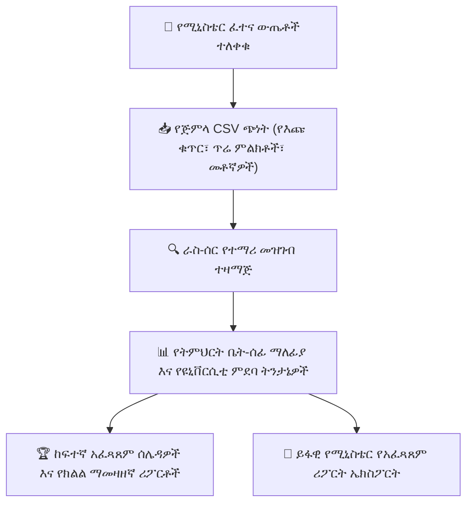

# ብሔራዊ እና ክልላዊ ፈተና ማመዛዘን

ከውስጥ የትምህርት ቤት ግምገማዎች በተጨማሪ፣ የኢትዮጵያ የትምህርት ተቋማት በደረጃው በተያዘው የክልል እና ብሔራዊ የማጠናቀቂያ ፈተናዎች ይሳተፋሉ (`NationalExamResult`፣ `NationalExamResultBatch`፣ `NationalExamSubjectResult`)። YeneSchool የብሔራዊ እጩ ቁጥሮችን ለመመዝገብ፣ የሚኒስቴር ውጤቶችን ለማስገባት፣ የዩኒቨርሲቲ ብቃት መጠኖችን ለመከታተል እና የትምህርት ቤት አፈጻጸምን ከክልላዊ አማካዮች ጋር ለማነጻጸር ልዩ መሣሪያዎችን ያቀርባል።

---

## 1. የሚደገፉ ደረጃውን የጠበቁ ፈተናዎች

| የፈተና ደረጃ | ዒላማ ቡድን | የሚከታተሉ ቁልፍ መለኪያዎች |
| :--- | :--- | :--- |
| **የሚኒስቴር የመጀመሪያ ደረጃ ማጠናቀቂያ ፈተና** | 6ኛ ክፍል | ወደ መካከለኛ ደረጃ ትምህርት ቤት (7ኛ ክፍል) ለመሸጋገር የማለፊያ መጠን። |
| **የክልል የመካከለኛ ደረጃ ትምህርት ቤት ማጠናቀቂያ ፈተና** | 8ኛ ክፍል | ወደ ሁለተኛ ደረጃ ትምህርት ቤት (9ኛ ክፍል) ለመግባት የእጩነት መነሻ ውጤቶች። |
| **የኢትዮጵያ ሁለተኛ ደረጃ ትምህርት ቤት ማጠናቀቂያ ሰርተፍኬት (ESSLCE)** | 12ኛ ክፍል | የተፈጥሮ እና የማኅበራዊ ሳይንስ ጅረት ድምር (ከ600/700)፣ የዩኒቨርሲቲ መግቢያ ብቃት መጠኖች። |

---

## 2. የብሔራዊ ፈተና ውጤቶችን በጅምላ መጫን

የትምህርት ሚኒስቴር ወይም የክልል የትምህርት ቢሮ ይፋዊ የፈተና ውጤት ሉሆችን ሲለቅ፦

1. ወደ **ፈተናዎች > ብሔራዊ ፈተናዎች > ቡድን ስቀል** ይሂዱ።
2. **የፈተና አይነቱን** (ለምሳሌ *12ኛ ክፍል ESSLCE*) እና **የትምህርት ዓመቱን** ይምረጡ።
3. የሚከተሉትን ዓምዶች የያዘ አስቀድሞ የተቀረጸ የCSV አብነት ያውርዱ፦
   - `candidate_number`፦ ይፋዊ ብሔራዊ ምዝገባ ቁጥር።
   - `student_code`፦ የውስጥ የትምህርት ቤት የተማሪ መለያ ኮድ።
   - የትምህርት ውጤት ዓምዶች (ለምሳሌ `english`፣ `mathematics`፣ `physics`፣ `chemistry`፣ `biology`፣ `civics`፣ `aptitude`)።
   - `total_score` እና `national_percentile`።
4. የተሞላውን CSV ፋይል ይስቀሉ።
5. ስርዓቱ የተማሪ ስሞችን እና የእጩ መለያዎችን ከተመዘገቡ የተማሪ መዝገቦች ጋር የሚያዛምድ ማረጋገጫ ያካሂዳል።
6. **አረጋግጥ እና ብሔራዊ ውጤቶች አትም** የሚለውን ይጫኑ።

---

## 3. የተቋም ትንታኔዎች እና የአፈጻጸም አዝማሚያዎች

ውጤቶቹ ከተጫኑ በኋላ ዳይሬክተሩ እና ተቆጣጣሪዎቹ ጥልቅ ግንዛቤዎችን ማግኘት ይችላሉ፦
- **የዩኒቨርሲቲ መግቢያ ማለፊያ መጠን**፦ ለህዝብ ዩኒቨርሲቲ መግቢያ ብሔራዊውን መነሻ የሚያገኙት የ12ኛ ክፍል ተማሪዎች መቶኛ።
- **በትምህርት-በ-ትምህርት የክፍተት ትንተና**፦ ተማሪዎች ከብሔራዊ አማካዮች ጋር ሲነጻጸሩ የበለጠ ወይም ያነሰ የተሳካላቸውን ትምህርቶች ይለያል (ለምሳሌ *ትምህርት ቤቱ በሂሳብ ከክልላዊ አማካይ 14% ከፍ ብሏል*)።
- **የብዙ-ዓመት ታሪካዊ አዝማሚያ**፦ የሥርዓተ ትምህርት መሻሻሎችን እና የአካዳሚክ እድገትን የሚያጎሉ የ5-ዓመት እድገት ግራፎች።
- **የክብር ዝርዝር እና ከፍተኛ አፈጻጸም አሳዳጊዎች**፦ ከፍተኛ የብሔራዊ ውጤት አስመዘዋሪዎችን የሚያከብሩ የማህበራዊ ሚዲያ ማስታወቂያዎች እና የምረቃ ሰርተፍኬቶች በአንድ ጠቅታ ማመንጨት።

---

## ቀጣይ እርምጃዎች

- [የፈተና መቀመጫ እና ፀረ-ማጭበርበር የአዳራሽ አመንጪ](/am/exams/exam-seating-halls) — ራስ-ሰር የዚግዛግ የአዳራሽ አቀማመጥ አመንጪ
- [የመስመር ላይ የኮምፒውተር ላይ የተመሰረተ የፈተና (CBT) ስርዓት](/am/exams/online-exams-system) — የውስጥ ዲጂታል የሙከራ ፈተናዎችን ማካሄድ
- [ፈተናዎች እና ቀጣይነት ያላቸው ግምገማዎች አጠቃላይ እይታ](/am/exams/exams-assessments) — የውስጥ የትምህርት ቤት ግምገማዎች አጠቃላይ እይታ