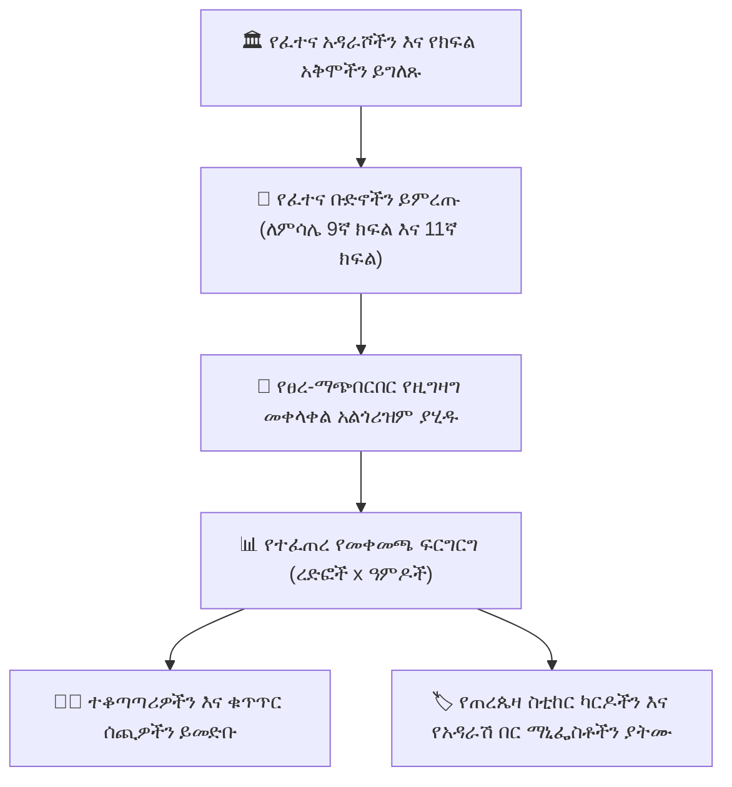

# የፈተና መቀመጫ እና ፀረ-ማጭበርበር የአዳራሽ አመንጪ

በመካከለኛ እና የመጨረሻ ፈተናዎች ጊዜ ጥብቅ የአካዳሚክ ታማኝነትን ማረጋገጥ በጥንቃቄ የጠረጴዛ አደረጃጀት ይጠይቃል። **የYeneSchool የፈተና መቀመጫ አመንጪ** (`ExamSeatingPlan`፣ `ExamSectionAssignment`፣ `ExamSectionStudent`) ከተለያዩ የክፍል ደረጃዎች ወይም ክፍለ ክፍሎች የተውጣጡ ተማሪዎችን የሚቀላቅሉ ምርጥ የመቀመጫ እቅዶችን በራስ-ሰር ይነድፋል፣ ይህም ያልተፈቀደ የጠረጴዛ መመልከትን በተግባር የማይቻል ያደርገዋል።

---

## 1. የፈተና አዳራሾችን እና የክፍል አቅሞችን መግለጽ

1. ወደ **ፈተናዎች > የመቀመጫ እቅዶች > የፈተና አዳራሾች** ይሂዱ።
2. **+ የፈተና አዳራሽ / ክፍል አክል** የሚለውን ይጫኑ፦
   - **የአዳራሽ / ክፍል ስም**፦ ለምሳሌ *ዋና ስፖርት አዳራሽ*፣ *ኦዲቶሪየም*፣ *ብሎክ C ክፍል 12*።
   - **የረድፎች እና ዓምዶች አቀማመጥ**፦ ለምሳሌ `6 ረድፎች x 5 ዓምዶች` (ጠቅላላ፦ 30 ጠረጴዛዎች)።
   - **የጠረጴዛ ቁጥር ቅድመ-ቅጥያ**፦ ለምሳሌ `GYM-D01` እስከ `GYM-D30`።
   - **የሚፈለጉ ተቆጣጣሪዎች ብዛት**፦ ለአዳራሹ መጠን የሚያስፈልጉ ተቆጣጣሪዎች (ለምሳሌ `2 ተቆጣጣሪዎች`)።
3. **የአዳራሽ አቀማመጥ አስቀምጥ** የሚለውን ይጫኑ።

---

## 2. የፀረ-ማጭበርበር የዚግዛግ የመቀመጫ ዝግጅት ማመንጨት

### መቀመጫ የማመንጨት ደረጃዎች
1. ወደ **ፈተናዎች > የመቀመጫ እቅዶች > + እቅድ አመንጭ** ይሂዱ።
2. **የፈተና ወቅቱን** ይምረጡ (ለምሳሌ *2ኛ ክፍለ ጊዜ የመጨረሻ ፈተናዎች — የጠዋት ወቅት*)።
3. **የሚቀላቀሉትን ቡድኖች** ይምረጡ፦
   - **የክፍል-አቋራጭ መቀላቀል (ይመከራል)፦** *ባዮሎጂ* የሚፈትነውን የ9ኛ ክፍል ተማሪ ከ*ታሪክ* የሚፈትነው የ11ኛ ክፍል ተማሪ ጋር ይቀላቅላል። ተጎራባች ጠረጴዛዎች ሙሉ በሙሉ የተለያዩ ትምህርቶችን ስለሚጽፉ፣ የፈተና ማጭበርበር በሂሳብ ደረጃ ገለልተኛ ይሆናል።
   - **የክፍለ ክፍል-አቋራጭ መቀላቀል፦** የ9A ክፍለ ክፍል ተማሪዎችን ከ9B ክፍለ ክፍል ተማሪዎች ጋር ያገናኛል።
4. **የሚሞሉትን ዒላማ አዳራሾች** ይምረጡ።
5. **የፀረ-ማጭበርበር የመቀመጫ ማትሪክስ አመንጭ** የሚለውን ይጫኑ።
6. አልጎሪዝሙ የጠረጴዛ ምደባዎችን በሚሊሰከንዶች ውስጥ ያሰላል እና በይነተገናኝ የእይታ የወለል እቅድን ያቀርባል።

---

## 3. የአዳራሽ በር ማኒፌስቶችን እና የጠረጴዛ መለያዎችን ማተም

በፈተና ጠዋት ሥርዓታማ የተማሪ መግቢያን ለማረጋገጥ፦

- **የሚታተሙ የጠረጴዛ ስቲከር ካርዶች**፦ የተማሪ ፎቶ፣ ሙሉ ስም፣ የተማሪ መለያ፣ የፈተና ተራ ቁጥር እና የጠረጴዛ ቁጥር የያዙ ተለጣፊ የጠረጴዛ መለያዎች በአንድ ጠቅታ PDF ማመንጨት።
- **የአዳራሽ በር ፊደላዊ ማኒፌስት**፦ ተማሪዎች ያለ አዳራሽ መጨናነቅ የተመደበበትን ክፍል እና ጠረጴዛ በፍጥነት እንዲያገኙ በእያንዳንዱ የፈተና አዳራሽ ውጭ የሚቀመጡ ፖስተሮች።
- **የተቆጣጣሪ ዝርዝር እና የመገኘት ሉሆች**፦ ተቆጣጣሪዎች በተንቀሳቃሽ መሣሪያቸው በቀጥታ የፈተና ክፍል መገኘትን እንዲመዘግቡ እና ማንኛውንም የታማኝነት ክስተት ሪፖርት እንዲያደርጉ የሚያስችሉ የቁጥጥር ሉሆች።

---

## ቀጣይ እርምጃዎች

- [ብሔራዊ እና ክልላዊ ፈተና ማመዛዘን](/am/exams/national-examinations) — ደረጃውን የጠበቁ የማጠናቀቂያ ፈተናዎችን ይከታተሉ
- [የመስመር ላይ የኮምፒውተር ላይ የተመሰረተ የፈተና (CBT) ስርዓት](/am/exams/online-exams-system) — በራስ-ሰር ውጤት አሰጣጥ ዲጂታል የሙከራ ፈተናዎችን ማካሄድ
- [የዳይሬክተር የፈተና መቀመጫ አጠቃላይ እይታ](/am/director/exam-seating) — በፈተና መቀመጫ ላይ የዳይሬክተር አስተዳደራዊ እይታ