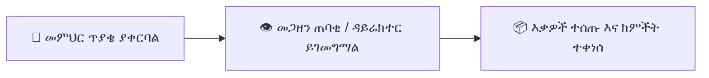

# የክምችት መግቢያ፣ የክምችት ውጪ እና ጥያቄዎች

የአቅርቦቶች እና ንብረቶች እንቅስቃሴ ወደ ትምህርት ቤት መጋዘኖች ውስጥ እና ውጭ በዲጂታል ደረሰኞች እና የኦዲት መዝገቦች ይከታተሉ።

---

## 1. የክምችት መግቢያን መመዝገብ (ግዢዎች እና አቅርቦቶች)

አዲስ ጭነቶች ወይም ግዢዎች ወደ ትምህርት ቤቱ ሲደርሱ፦

1. ወደ **እቃ ክምችት → ግብይቶች → የክምችት መግቢያ** ይሂዱ።
2. **+ አዲስ የክምችት መግቢያ ግቤት** የሚለውን ይጫኑ።
3. ይግቡ፦
   - **አቅራቢ / ሻጭ ስም፦** (ለምሳሌ *ብርሃን የመሥሪያ እቃ አጠቃላይ ሻጭ*)።
   - **የኢንቮይስ / የመላኪያ ማስታወሻ ቁጥር፦** የሻጭ ኢንቮይስ ማጣቀሻ።
   - **የተቀበለበት ቀን፦** እቃዎቹ የተቀበሉበት ቀን።
   - **እቃዎች እና ብዛቶች፦** እቃዎችን ይምረጡ፣ የተቀበሉትን ብዛቶች ይግለጹ እና የአሃድ የግዢ ዋጋዎችን ያስገቡ።
4. የተፈረመውን የመላኪያ ደረሰኝ ፎቶ ወይም PDF ስካን ይስቀሉ።
5. **አረጋግጥ እና ክምችት አዘምን** የሚለውን ይጫኑ። የአሁኑ የቀሪ ክምችት ሚዛኖች በራስ-ሰር ይጨምራሉ።

---

## 2. የመምህር የጥያቄ ፍሰት ሥራ

1. **አቀራረብ፦** መምህራን ወደ **የመደብር ጥያቄዎች** ይሄዳሉ እና ለክፍላቸው የሚያስፈልጉትን እቃዎች ይመርጣሉ (ለምሳሌ *የነጭ ሰሌዳ ማርከሮች፣ ኖራ፣ ግራፍ ወረቀት*)።
2. **ግምገማ፦** መጋዘን ጠባቂው ወይም ዳይሬክተሩ ማሳወቂያ ይቀበላል፣ የቀሪ ክምችቱን ይመረምራል እና **አጽድቅ** ወይም **በምክንያት ውድቅ** የሚለውን ይጫናል።
3. **አፈጻጸም፦** መምህሩ አቅርቦቶቹን ሲወስድ፣ መጋዘን ጠባቂው **የተሰጠ ምልክት አድርግ** የሚለውን ይጫናል፣ ይህም የእቃ ክምችት ደረጃዎችን በራስ-ሰር ይቀንሳል እና ግብይቱን በመምህሩ መገለጫ ላይ ይመዘግባል።

---

## 3. የተጎዱ እቃዎች እና ከመዝገብ ማስወገድ

እቃዎች ሲጎዱ፣ ጊዜያቸው ሲያበቃ ወይም ሲጠፉ፦
1. ወደ **እቃ ክምችት → ከመዝገብ ማስወገድ** ይሂዱ።
2. እቃውን፣ የሚወገደውን ብዛት እና ምክንያቱን (*የተጎዳ፣ ጊዜ ያለፈበት፣ በመጓጓዣ ወቅት የጠፋ*) ይምረጡ።
3. ከሚዛን ሉሆች ላይ በቋሚነት ከመቀነስ በፊት የዳይሬክተር ፈቃድ ያስፈልጋል።