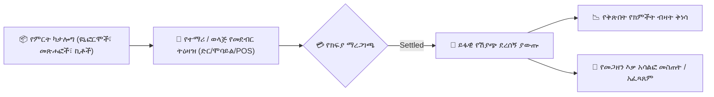

# የትምህርት ቤት የመጽሐፍ መደብር፣ ዩኒፎርሞች እና የሸቀጦች ሽያጭ

**የYeneSchool የመጽሐፍ መደብር እና የችርቻሮ ሞጁል** (`BookstoreProduct`፣ `BookstoreOrder`፣ `BookstoreOrderItem`) ይፋዊ የትምህርት ቤት ዩኒፎርሞችን፣ አካላዊ የመማሪያ መጽሐፎችን፣ የልምምድ መጽሐፎችን፣ የቤተ ሙከራ ኮቶችን እና የተማሪ መሥሪያ ዕቃ ፓኬጆችን በቀጥታ ከትምህርት ቤቱ መደብር መሸጥ እና ማከፋፈልን ቀላል ያደርጋል።

---

## 1. የመጽሐፍ መደብር ምርቶችን እና መጠኖችን ማዘጋጀት

መጋዘን ጠባቂዎች ሸቀጦችን በምድብ፣ በመጠን ተለዋጮች እና በክፍል ደረጃ ቅርቅቦች ማደራጀት ይችላሉ፦

### ምርቶችን ወደ ካታሎግ ማከል
1. ወደ **እቃ ክምችት እና መደብር > የመጽሐፍ መደብር > ምርቶች** ይሂዱ።
2. **+ የችርቻሮ ምርት አክል** የሚለውን ይጫኑ፦
   - **የምርት ስም**፦ ለምሳሌ *ይፋዊ የሁለተኛ ደረጃ ትምህርት ቤት የዩኒፎርም ስብስብ (ጥቁር ሰማያዊ)*፣ *የ9ኛ ክፍል የመማሪያ መጽሐፍ ቅርቅብ*፣ *የፊዚክስ ቤተ ሙከራ የደህንነት ኪት*።
   - **የምርት ምድብ**፦ `ዩኒፎርሞች እና የስፖርት ልብሶች`፣ `የመማሪያ መጽሐፎች እና መመሪያዎች`፣ `የመሥሪያ ዕቃዎች እና የልምምድ መጽሐፎች`፣ `የቤተ ሙከራ እና የሥነ-ጥበብ አቅርቦቶች`።
   - **የመጠን / ተለዋጭ አማራጮች**፦ ለምሳሌ `ትንሽ`፣ `መካከለኛ`፣ `ትልቅ`፣ `XL`፣ `XXL` ወይም `የ10ኛ ክፍል ስብስብ`።
   - **የመሸጫ ዋጋ (ብር)**፦ የአሃድ የመሸጫ ዋጋ (ለምሳሌ `1,450.00 ብር`)።
   - **የአሁኑ የቀሪ ክምችት**፦ በዋናው የማከማቻ ተቋም ውስጥ ያለ ብዛት።
   - **ዝቅተኛ ክምችት ማንቂያ ደረጃ**፦ የመሙላት ማስጠንቀቂያዎችን የሚቀሰቅስ ገደብ (ለምሳሌ `< 20 አሃዶች`)።
3. **ምርት አስቀምጥ** የሚለውን ይጫኑ።

---

## 2. የተማሪ ሽያጮችን እና የሽያጭ ነጥብ (POS) ክፍያዎችን ማካሄድ

ወላጅ ወይም ተማሪ የትምህርት ቤቱን መደብር ሲጎበኝ፦

1. ወደ **የመጽሐፍ መደብር > POS ክፍያ** ይሂዱ።
2. የተማሪውን የመለያ ካርድ ባርኮድ ይቃኙ (ወይም የተማሪውን ስም ይፈልጉ)።
3. ወደ ጋሪው ለመጨመር እቃዎችን እና ብዛቶችን ይምረጡ።
4. **የክፍያ ቻናሉን** ይምረጡ፦
   - **በመደብር መደርደሪያ ጥሬ ገንዘብ**፦ ካሽየሩ ክፍያውን ይሰበስባል እና የተረከበውን ጥሬ ገንዘብ ያስገባል።
   - **ወደ የተማሪ ክፍያ መለያ ጫን**፦ ከቅድመ-ክፍያ ሚዛን ይቀንሳል ወይም ወደ ወላጁ ወርሃዊ የትምህርት ቤት ማስታወሻ ይጨምራል።
   - **ቴሌብር / የባንክ ብር QR**፦ ደንበኛው በመደርደሪያው ላይ የዲጂታል ክፍያ QRን ይቃኛል።
5. **ሽያጩን አጠናቅቅ እና ደረሰኝ አትም** የሚለውን ይጫኑ።
6. ስርዓቱ በራስ-ሰር የምርት ስም የተቀረጸ የPOS ሙቅ ሉህ (thermal slip) ያትማል እና የእቃ ክምችት ደረጃዎችን በቅጽበት በቀጥታ ይቀንሳል።

---

## 3. ቅድመ-ትዕዛዞች እና የክፍለ ጊዜ መጀመሪያ የዩኒፎርም ስርጭት

በከፍተኛ የትምህርት ቤት ተመላሽ-ምዝገባ ወቅቶች፦
- ወላጆች በ**የወላጅ መግቢያ / የሞባይል መተግበሪያ** ላይ የመጽሐፍ መደብሩን ካታሎግ ማሰስ እና ክፍለ ጊዜው ከመጀመሩ በፊት ቅድመ-ትዕዛዞችን ማስቀመጥ ይችላሉ።
- መጋዘን ጠባቂዎች **የቅድመ-ትዕዛዝ አፈጻጸም ወረፋ**ን ይገመግማሉ፣ እቃዎችን በተሰየሙ የተማሪ እሽግ ከረጢቶች ውስጥ አስቀድመው ያሸጋግራሉ እና በመግቢያ ቀን ፈጣን ቃኝ-እና-አሳልፍ መረከብን ያከናውናሉ።

---

## ቀጣይ እርምጃዎች

- [የእቃ ክምችት አጠቃላይ እይታ](/am/inventory/overview) — አጠቃላይ የትምህርት ቤት ንብረት አስተዳደር
- [የክምችት መግቢያ እና የክምችት ውጪ ግብይቶች](/am/inventory/stock-transactions) — የሻጭ አቅርቦቶችን እና የመምሪያ አጠቃቀምን መመዝገብ
- [የፋይናንስ ክፍያ ደረሰኞች](/am/finance/receipts) — ከመጽሐፍ መደብር ሽያጮች የተዋሃደ ገቢን መመልከት