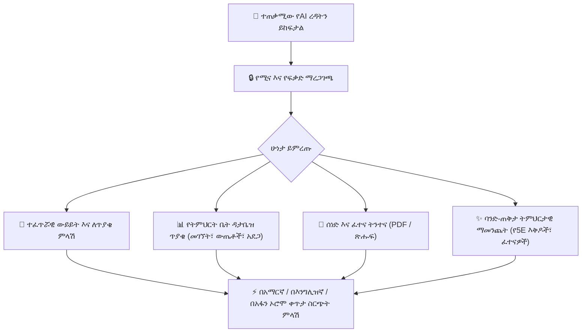

# የAI ረዳት እና ስነ-ምህዳር አጠቃላይ እይታ

የ**YeneSchool የAI ረዳት (AI Assistant)** በቀጥታ በፖርታሉ እያንዳንዱ ስክሪን ውስጥ የተሰራ ብልህ፣ አውድ-አዋቂ ረዳት (copilot) ነው። በተለይ ለኢትዮጵያ ኬ-12 ትምህርት የተነደፈው የAI ረዳት፣ በደህንነት ከእውነተኛ-ጊዜ የትምህርት ቤት መዝገቦች ጋር ይገናኛል፣ **የኢትዮጵያ ካሌንደር (EC)** ይረዳል፣ **5 ቋንቋዎችን** (አማርኛ፣ አፋን ኦሮሞ፣ ሶማሊኛ፣ ትግርኛ እና እንግሊዝኛ) ይደግፋል፣ እና ባህሪውን ከእያንዳንዱ ተጠቃሚ ልዩ ሚና ጋር ያስተካክላል።



---

## 1. የAI ረዳቱን መድረስ

የAI ረዳቱ በፕላትፎርሙ በማንኛውም ቦታ ተደራሽ ነው፦
- **የላይኛው ራስጌ አሞሌ፦** በዋናው የአሰሳ አሞሌ ውስጥ ያለውን **✨ AI ረዳት** አዶ ይጫኑ።
- **የቁልፍ ሰሌዳ አቋራጭ፦** `Cmd + K` (ማክ) ወይም `Ctrl + K` (ዊንዶውስ / ሊኑክስ) ይጫኑ እና ጥያቄዎን ይተይቡ።
- **የአውድ እርምጃ ቁልፎች፦** በተወሰኑ ገጾች (እንደ *የትምህርት እቅድ አዘጋጅ*፣ *የውጤት መዝገብ*፣ ወይም *የተማሪ መገለጫ*) ላይ አውዱን ወዲያውኑ ለመጫን **✨ በAI ይፍጠሩ** ወይም **ስለዚህ ተማሪ የAIን ይጠይቁ** የሚለውን ይጫኑ።

---

## 2. ዋና አቅሞች እና በይነተገናኝ መሳሪያዎች

| አቅም | በYeneSchool ውስጥ እንዴት ይሰራል |
| :--- | :--- |
| **የእውነተኛ-ጊዜ የትምህርት ቤት ዳታ መሳሪያዎች** | ኤአይው ከቻት መስኮቱ ሳይወጣ በደህንነት የተማሪዎችን የመገኘት መቶኛ፣ የውጤት አማካዮች፣ ያልተከፈሉ የክፍያ ደረሰኞች እና የክፍል ዝርዝሮችን መፈለግ ይችላል። |
| **ሚና-አዋቂ የደህንነት ድንበሮች** | መምህራን የተመደቡላቸውን ክፍሎች ብቻ ያገኛሉ፤ ወላጆች የራሳቸውን ልጆች ብቻ ያገኛሉ፤ ዳይሬክተሮች በትምህርት ቤት አቀፍ ትንታኔዎችን ያያሉ። የሱፐር አድሚን መብቶች በፍጹም አይለቀቁም። |
| **ሙሉ የብዙ ቋንቋ ቅልጥፍና** | በተፈጥሮ በ**አማርኛ (Amharic)**፣ **Afaan Oromo**፣ **ሶማሊኛ (Soomaali)**፣ **ትግርኛ (Tigrinya)** ወይም **እንግሊዝኛ (English)** ይወያዩ። ኤአይው በራስ-ሰር በተጠቀሙበት ቋንቋ ይመልሳል። |
| **ድርብ ካሌንደር ብልህነት** | ቀኖችን በቀላሉ በኢትዮጵያ ካሌንደር (ለምሳሌ፣ *መስከረም 15፣ 2017*) እና በጎርጎርዮስ ካሌንደር (*ሴፕቴምበር 25፣ 2024*) መካከል ይቀይራል። |
| **ሰነድ እና ሥርዓተ-ትምህርት ትንተና** | የሚኒስቴር ሥርዓተ-ትምህርት PDFዎችን፣ የትምህርት አውትላይኖችን ወይም ያለፉ የፈተና ወረቀቶችን ወደ ቻቱ ጎትተው ይጣሉ — ለፈጣን ማጠቃለያ፣ የጥያቄ ማውጣት ወይም የክፍተት ትንተና። |

---

## 3. በሚና-ልዩ የረዳት አቅሞች እና የጥያቄ ቤተ-መጻሕፍት

```
┌───────────────────────────────────────────────────────────────────────────────┐
│ 💬 Example Prompt Template                                                    │
│ "Analyze Grade 9B General Science quiz marks. Which 3 topics had the lowest   │
│ average scores, and generate 5 remedial practice questions in Amharic."       │
└───────────────────────────────────────────────────────────────────────────────┘
```

### 👨‍🏫 ለመምህራን እና ለትምህርት ባለሙያዎች
- **የ5E ትምህርት እቅድ ማመንጨት፦** በሚኒስቴር የመማሪያ መጻሕፍት ላይ በመመሥረት የጊዜ የተመደበለት የመማሪያ ክፍል እቅዶችን ያመንጫል (አሳትፍ፣ ዳስስ፣ አብራራ፣ አስፋፋ፣ ገምግም)።
- **የፈተና ጥያቄ አመንጪ፦** በብሉም ታክሶኖሚ የተመደቡ ከመልስ ቁልፎች ጋር ባለብዙ ምርጫ ጥያቄዎችን ይፈጥራል።
- **ገንቢ የተማሪ አስተያየት፦** ለምዕራፍ መጨረሻ የተማሪ ውጤት ካርዶች ርኅራኄ ያላቸው፣ አበረታች አስተያየቶችን ያዘጋጃል።
- **ልዩነትን የሚመለከት ትምህርት፦** ተጨማሪ ድጋፍ ለሚያስፈልጋቸው ተማሪዎች አስቸጋሪ የፊዚክስ ወይም የሒሳብ ጽንሰ-ሐሳብን ያስተካክላል።

### 🏫 ለትምህርት ቤት ዳይሬክተሮች እና አስተዳዳሪዎች
- **የተመራ የማለዳ ማጠቃለያ፦** የዕለታዊ የትምህርት ቤት መገኘት፣ የመምህራን መቅረት እና አስቸኳይ የአሠራር ማንቂያዎችን ያጠቃልላል።
- **የቅድመ ማስጠንቀቂያ ለአደጋ የተጋለጡ መለየት፦** ተከታታይ መቅረት ወይም እየወረደ የውጤት አዝማሚያ ያላቸውን ከፍተኛ 10 ተማሪዎችን ይጠይቁ።
- **ይፋዊ ማስታወቂያ እና መግለጫ ማዘጋጀት፦** ስለ ትምህርት ቤት ዝግጅቶች፣ በዓላት ወይም የክፍያ መርሃ ግብሮች ለወላጆች ሙያዊ የሁለት ቋንቋ ማስታወቂያዎችን ይጽፋል።

### 👨‍👩‍👧 ለወላጆች እና ለተማሪዎች
- **የጥናት ረዳት እና የቤት ሥራ አብራሪ፦** የመጨረሻውን መልስ በቀላሉ ሳይሰጥ የቤት ሥራ ጥያቄዎችን በደረጃ ይከፋፍላል።
- **የትምህርት እድገት ማጠቃለያ፦** የቴክኒክ ፈተና መቶኛ ቅንብሮችን ወደ ግልጽ እና ለመረዳት ቀላል የእድገት ዝማኔዎች ይቀይራል።
- **የማመካኛ ደብዳቤ ረዳት፦** ለክፍል መምህራን መደበኛ የህክምና መቅረት ማስታወቂያዎችን ያዘጋጃል።

---

## 4. ከፍተኛ ጥራት ላላቸው ጥያቄዎች ምርጥ አሠራሮች

> [!TIP] **የC-T-F የጥያቄ አቀራረብ ሕግን ይከተሉ**
> 1. **አውድ (C)፦** ክፍሉን፣ ትምህርቱን ወይም ክፍሉን ይጥቀሱ (*"ለ8ኛ ክፍል ማህበራዊ ጥናት፣ ክፍል 4..."*)።
> 2. **ተግባር (T)፦** የሚፈልጉትን በግልጽ ይግለጹ (*"3 የውይይት ክርክር ርዕሶች ይፍጠሩ..."*)።
> 3. **ቅርጸት (F)፦** ውጤቱ እንዴት እንዲቀርብ እንደሚፈልጉ ይግለጹ (*"ከተጠቆሙ የጊዜ ገደቦች እና የተማሪ የውጤት መስፈርቶች ጋር በማርክዳውን ሰንጠረዥ ቅርጸት ያቅርቡ።"*)።

---

## በAI ብልህነት ውስጥ ቀጣይ እርምጃዎች

- [ራሱን የቻለ የAI ሞተር እና የበስተመጋራ ኦቶፓይለቶች](/am/ai/autonomous-autopilot) — የበስተመጋራ ኤአይ አደጋን፣ መቅረትን እና የዕለት ማጠቃለያዎችን እንዴት እንደሚከታተል
- [የመርሃ ግብር መተኪያ ዎችዶግ (Timetable Watchdog)](/am/ai/timetable-watchdog) — አውቶማቲክ የመቅረት ማዛመድ እና የቴሌግራም ሰዓት ልውውጥ
- [ርኅራኄ ያለው የወላጅ ውይይት ሞተር (Parent Empathy Dialogue)](/am/ai/parent-empathy-dialogue) — አውቶማቲክ ርኅራኄ ያላቸው የSMS ማንቂያዎች እና የቤተሰብ ግንኙነት
- [የAI ቅንብር እና የሞዴል ቅንብሮች](/am/ai/ai-settings) — የAPI ቁልፎችን፣ የሞዴል ደረጃዎችን እና የባህሪ መቀየሪያዎችን ማዋቀር