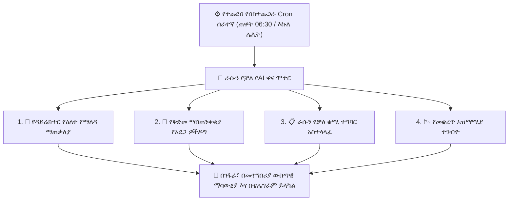

# ራሱን የቻለ የAI ሞተር እና የበስተመጋራ ኦቶፓይለቶች

ከበይነተገናኝ ቻትቦቶች ባሻገር፣ YeneSchool **ራሱን የቻለ የAI ወኪል ሞተር (Autonomous AI Agent Engine)** (`autonomous-ai.service.ts`, `ai-scheduler.service.ts`) ያቀርባል። በመርሃግብር የተደነገጉ ሰራተኞች በኩል በዝምታ በበስተመጋራ የሚሰሩት እነዚህ ራሳቸውን የቻሉ የAI ሰራተኞች፣ የትምህርት ቤት ዳታቤዞችን ንቀው ይመረምራሉ፣ የአሠራር እንቅፋቶችን ይለያሉ፣ የተማሪ መቋረጥ አደጋዎችን ይተነብያሉ፣ የሁለት ቋንቋ የማለዳ ማጠቃለያዎችን ያዘጋጃሉ፣ እና ጥቃቅን ጉዳዮች ወደ ቀውስ ከማደጋቸው በፊት ዳይሬክተሮችን ያስጠነቅቃሉ።



---

## 1. ራሱን የቻለ የAI ወኪል ስብስብ

### 🌅 ወኪል 1፦ የዳይሬክተር የዕለት የማለዳ ማጠቃለያ
በየትምህርት ቤቱ ጠዋት **06:30 AM** ላይ፣ ኤአይው የመገኘት ምዝገባዎችን፣ የክፍያ ስብስቦችን፣ የፈተና ቀነ-ገደቦችን እና የመምህራን የመቅረት ጥያቄዎችን ይቃኛል እና በቀጥታ በዳይሬክተሩ ዳሽቦርድ ላይ የተመሩ ማጠቃለያ ያዘጋጃል፦
- **የመገኘት ክትትል፦** ትናንት ያልተለመደ የመቅረት ጭማሪ የነበራቸው ክፍሎች።
- **የሰራተኛ ሽፋን፦** ዛሬ ፈቃድ የያዙ መምህራን እና የመተኪያ ምደባቸው ሁኔታ።
- **የትምህርት ቀነ-ገደቦች፦** ከመምሪያ ኃላፊዎች እየተጠበቁ ያሉ ቀጣይ ግምገማ ማቅረቢያዎች።
- **የፋይናንስ ምት፦** ባለፉት 24 ሰዓታት የተሰበሰቡ የክፍያ ማጠቃለያ።

---

### 🚨 ወኪል 2፦ የቅድመ ማስጠንቀቂያ እና የመቋረጥ አደጋ ዎችዶግ
የ**ቅድመ ማስጠንቀቂያ ኤአይ (Early Warning AI)** እያንዳንዱን የተመዘገበ ተማሪ በባለብዙ-ምክንያት የአደጋ ውጤት ሞዴል ለመገምገም ያለማቋረጥ ይሰራል፦
- **የመገኘት አዝማሚያ፦** በተከታታይ ሳምንታት እየቀነሰ የመገኘት አዝማሚያ ያላቸውን ተማሪዎች ይለያል (ለምሳሌ፣ ከ85% በታች መውረድ)።
- **የትምህርት ውጤት ልዩነቶች፦** በበርካታ ትምህርቶች ድንገተኛ የውጤት መውረድ ይለያል።
- **የተግሣጽ እና የባህሪ ክስተቶች፦** እየጨመሩ የሚሄዱ የቅጣት ነጥቦችን ይከታተላል።
- **የሚመከሩ ጣልቃ-ገብነቶች፦** በራስ-ሰር የተመጣጠኑ የማስተካከያ እርምጃዎችን ይጠቁማል (ለምሳሌ፣ *የወላጅ-መምህር ስብሰባ*፣ *የአቻ ማጠናከሪያ*፣ ወይም *የምክር ሪፈራል*)።

---

### 📋 ወኪል 3፦ ራሳቸውን የቻሉ ቋሚ ተግባራት
ዳይሬክተሮች በቀላል ቋንቋ የሚደጋገሙ አውቶማቲክ የክትትል ሕጎችን ማዋቀር ይችላሉ፦
- *"በየዓርቡ ከሰዓት 4 ላይ፣ ሁሉንም የ9-12ኛ ክፍል የትምህርት እቅድ ማጠናቀቂያዎችን ገምግሙ እና ያልተገቡ ክፍሎችን ለመምሪያ ኃላፊዎች አመልክቱ።"*
- *"በአንድ ክፍል ውስጥ ከ15 በላይ ተማሪዎች ከ30 ቀናት በላይ ያልተከፈለ ደረሰኝ ሲኖራቸው የፋይናንስ ቡድኑን ያሳውቁ።"*

---

## 2. ራሳቸውን የቻሉ የAI ኦቶፓይለቶችን ማስተዳደር

የትምህርት ቤት ዳይሬክተሮች የበስተመጋራ ወኪሎችን ከ**ዳይሬክተር ፖርታል > የትምህርት ቤት ቅንብሮች > ራሱን የቻለ AI** ማዋቀር እና መከታተል ይችላሉ፦

```
┌────────────────────────────────────────────────────────────────────────┐
│ 🤖 Autonomous AI Control Center                                       │
├────────────────────────────────────────────────────────────────────────┤
│ [✓] Director Daily Morning Briefing (Cron: 06:30 AM)         [Active]  │
│ [✓] Proactive Early Warning Risk Watchdog                    [Active]  │
│ [✓] Timetable Substitution Auto-Negotiator                   [Active]  │
│ [✓] Midnight Promotion Queue Engine                          [Active]  │
└────────────────────────────────────────────────────────────────────────┘
```

1. **ወኪሎችን ማንቃት / ማጥፋት፦** መደበኛውን የሥርዓት ባህሪያት ሳይነካ ግለሰባዊ የበስተመጋራ ኦቶፓይለቶችን ያብሩ / ያጥፉ።
2. **የማሳወቂያ ቻናሎች፦** የAI ማጠቃለያ ማንቂያዎች የሚደርሱበትን ቦታ ይምረጡ (የመተግበሪያ ውስጣዊ የማሳወቂያ ማዕከል፣ የሞባይል ገፋፊ፣ ወይም የቴሌግራም ቦት)።
3. **የኦዲት መዝገብ እና ግልጽነት፦** ትክክለኛውን የAI የሥራ ታሪክ፣ የተቃኙ ዳታዎች እና የተፈጠሩ ምክሮችን በሥርዓቱ የኦዲት መዝገብ ውስጥ ይመልከቱ።

---

## በAI ብልህነት ውስጥ ቀጣይ እርምጃዎች

- [በይነተገናኝ የAI ረዳት እና ኮፓይለት](/am/ai/overview) — የእውነተኛ-ጊዜ ቻት ረዳት እና የ5E ትምህርት አመንጪ
- [የመርሃ ግብር መተኪያ ዎችዶግ](/am/ai/timetable-watchdog) — አውቶማቲክ የመቅረት ማዛመድ እና የቴሌግራም ሰዓት ልውውጥ
- [ርኅራኄ ያለው የወላጅ ውይይት ሞተር](/am/ai/parent-empathy-dialogue) — አውቶማቲክ ርኅራኄ ያላቸው የSMS ማንቂያዎች እና የቤተሰብ ግንኙነት
- [የAI ቅንብር እና የሞዴል ቅንብሮች](/am/ai/ai-settings) — የAPI ቁልፎችን እና የአገልግሎት ሰጪ ሞዴሎችን ማዋቀር