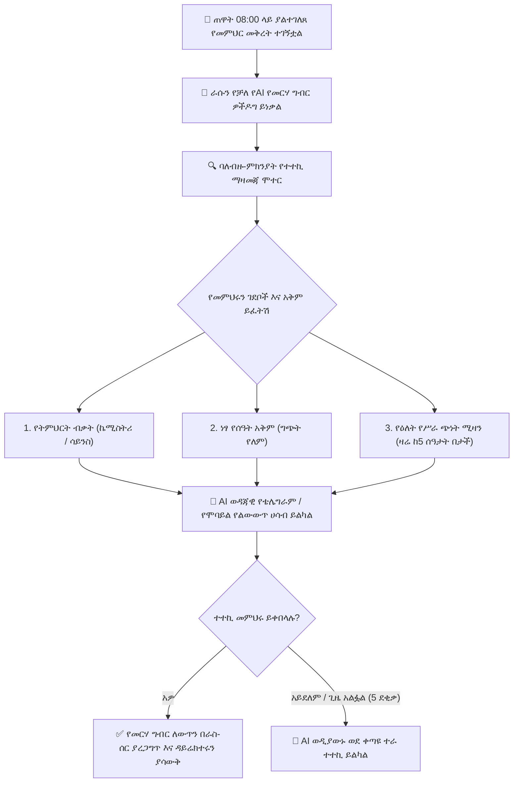

# ራሱን የቻለ የAI የመርሃ ግብር ዎችዶግ እና የመተካት ሞተር

በህመም፣ በመጓጓዣ መዘግየት ወይም በድንገተኛ ሁኔታዎች የሚከሰት ድንገተኛ የመምህራን መቅረት ብዙ ጊዜ የመማሪያ ክፍሎችን ያለ ቁጥጥር ይተዋል እና ለትምህርት ቤት አስተዳዳሪዎች የአስተዳደር ጫና ይፈጥራል። የYeneSchool **ራሱን የቻለ የAI የመርሃ ግብር ዎችዶግ (Autonomous AI Timetable Watchdog)** (`AI_PROACTIVE_TIMETABLE_WATCHDOG`, `ai-timetable.service.ts`) የሰራተኞችን መገኘት ምዝገባ በእውነተኛ ጊዜ ንቆ ይከታተላል እና ያለ አስተዳደራዊ ድንጋጤ ብቁ ተተኪዎችን በራስ-ሰር ያገኛል፣ ያደራድራል እና ያረጋግጣል።



---

## 1. የመቅረት ዎችዶግ እንዴት ይሰራል

1. **የመቅረት ቀስቅሴ፦**
   - **በእጅ የሚደረግ ጥያቄ፦** መምህሩ በሞባይል ፖርታላቸው የህመም ፈቃድ ወይም የግል መቅረት ምልክት ያደርጋሉ።
   - **ብልህ ሃርድዌር ቀስቅሴ፦** መምህሩ በጠዋት 08:00 ቀበቶ ውስጥ የRFID/NFC የሰራተኛ ካርዳቸውን ያላነኩ ወይም በባዮሜትሪክ ተርሚናል ያልገቡ ከሆነ።
2. **የተጽዕኖ ትንተና፦** ኤአይው ወዲያውኑ የቀረውን መምህር የዕለት መርሃ ግብር ያወጣል (ለምሳሌ፣ *ሰዓት 2፦ 10ኛ ክፍል A ፊዚክስ*፣ *ሰዓት 4፦ 11ኛ ክፍል B ሒሳብ*)።
3. **ባለብዙ-ምክንያት እጩ ደረጃ አሰጣጥ፦**
   - **የትምህርት ብቃት፦** በተመሳሳይ መምሪያ ወይም ተዛማጅ ዘርፍ የተረጋገጠ ብቃት ያላቸው መምህራን።
   - **የመርሃ ግብር አቅም፦** በዚያ ትክክለኛ ሰዓት ነፃ የዝግጅት ሰዓት ያላቸው መምህራን።
   - **የሥራ ጭነት ፍትሕ፦** ድካምን ለመከላከል በዚያ ሳምንት ጥቂት ሰዓታት ያስተማሩ ሰራተኞችን ቅድሚያ ይሰጣል።

---

## 2. አውቶማቲክ የቴሌግራም እና የመተግበሪያ ድርድር

ዳይሬክተሩ በእጅ ለብዙ ሰራተኞች እንዲደውል ከመጠየቅ ይልቅ፣ ኤአይው በ**ቴሌግራም ቦት** እና በ**ገፋፊ ማሳወቂያ** አማካኝነት አውቶማቲክ ግንኙነት ያደርጋል፦

```
┌────────────────────────────────────────────────────────────────────────┐
│ 🤖 YeneSchool Timetable Bot                                            │
│ "Hi Teacher Abebe! 👋 Teacher Almaz is on sudden medical leave today.  │
│ Would you be able to cover Grade 10A Physics during Period 2 (09:15)? │
│ You currently have a free period. Replying [Accept] adds 1 sub credit. │
│ [✅ Accept Substitution]      [❌ Decline]                             │
└────────────────────────────────────────────────────────────────────────┘
```

- **በይነተገናኝ ቁልፎች፦** እጩ መምህሩ በቴሌግራም ወይም በሞባይል መተግበሪያው ውስጥ በቀጥታ **ተቀበል** ወይም **አትቀበል** ብለው ይጫናሉ።
- **የ5-ደቂቃ የማለቂያ ጊዜ፦** የመጀመሪያው እጩ በ5 ደቂቃ ውስጥ ምላሽ ካልሰጠ፣ ኤአይው በአክብሮት እድሉን ለቀጣዩ ከፍተኛ ደረጃ ላለው ነፃ መምህር ያስተላልፋል።
- **ፈጣን የመርሃ ግብር ዝማኔ፦** ሲቀበሉ፣ የመርሃ ግብር ሰንጠረዡ በራስ-ሰር ይዘምናል፣ የክፍል ተቆጣጣሪዎችን እና የትምህርት ቤቱን ዳይሬክተር ያሳውቃል።

---

## 3. የዳይሬክተር ቁጥጥር እና የራስ-ሰር ማጽደቅ መቆጣጠሪያዎች

በ**ዳይሬክተር ፖርታል > የትምህርት ቤት ቅንብሮች > የመርሃ ግብር AI** ውስጥ፦
- **የራስ-ሰር ማረጋገጫ ሁነታ (`AI_TIMETABLE_AUTO_APPROVE = true`)፦** ብቁ ተተኪ እንደተቀበለ ኤአይው ልውውጡን ያጠናቅቃል እና ወዲያውኑ የማረጋገጫ ማንቂያዎችን ይልካል።
- **የዳይሬክተር ማረጋገጫ ሁነታ (`AI_TIMETABLE_AUTO_APPROVE = false`)፦** ኤአይው ፈቃደኛ የሆነውን ምርጥ ተተኪ ይሰበስባል እና በዳይሬክተሩ የማለዳ ዳሽቦርድ ላይ የ1-ጠቅታ ማረጋገጫ ካርድ ያቀርባል።

---

## በAI ብልህነት ውስጥ ቀጣይ እርምጃዎች

- [የመምህራን የሰዓት ልውውጥ እና የመተካት መመሪያ](/am/teacher/period-swaps) — መምህራን የልውውጥ ሀሳቦችን እንዴት እንደሚጀምሩ እና እንደሚቀበሉ
- [በይነተገናኝ የAI ረዳት እና ኮፓይለት](/am/ai/overview) — የእውነተኛ-ጊዜ ቻት ረዳት እና የጥያቄ ቤተ-መጻሕፍት
- [ራሳቸውን የቻሉ የበስተመጋራ ኦቶፓይለቶች](/am/ai/autonomous-autopilot) — የአደጋ መለየት እና የዕለት ማጠቃለያዎች
- [የAI ቅንብር እና የሞዴል ቅንብሮች](/am/ai/ai-settings) — የAPI ቁልፎችን እና የባህሪ መቀየሪያዎችን ማዋቀር