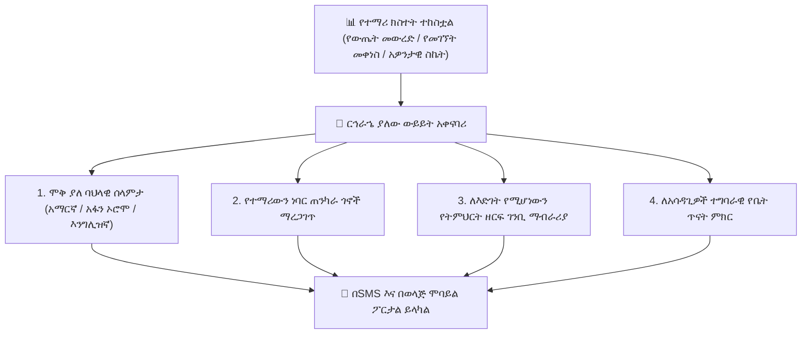
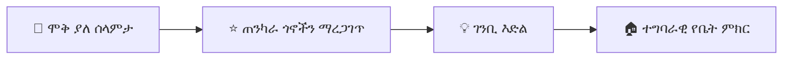

# ራሱን የቻለ የAI ወላጅ ውይይት እና ርኅራኄ ያለው ተሳትፎ

የወላጅ ተሳትፎ የተማሪ ትምህርታዊ ስኬት በጣም ጠንካራ ትንበያዎች አንዱ ነው። ሆኖም፣ አውቶማቲክ የትምህርት ቤት የSMS ማሳወቂያዎች ብዙ ጊዜ ቀዝቃዛ፣ ሜካኒካል ወይም አስደንጋጭ ይመስላሉ። የ**YeneSchool ርኅራኄ ያለው የወላጅ ውይይት ሞተር (Empathetic Parent Dialogue Engine)** (`ai-parent-dialogue.service.ts`, `ai-academic-outreach.service.ts`) ቤተሰቦችን እንዲያውቁ የሚያደርጉ፣ ጭንቀትን የሚያስታግሱ እና በወላጆችና በአስተማሪዎች መካከል እምነት የሚገነቡ ሞቅ ያሉ፣ ባህላዊ አክብሮት ያላቸው ባለብዙ ቋንቋ መልዕክቶችን ያቀርባል።

---

## 1. ርኅራኄ ያለው የግንኙነት መርሆዎች

ስለ ትምህርታዊ ችግሮች ወይም የመገኘት መቀነስ ወላጆችን ሲያሳውቅ፣ ኤአይው ጥብቅ የስነ-ልቦና እና የትምህርት መመሪያዎችን ይከተላል፦

| ባህላዊ ቀዝቃዛ መልዕክት (የሚወገድ) | የYeneSchool ርኅራኄ ያለው የAI አቀራረብ (የሚቀርብ) |
| :--- | :--- |
| *"ልጅዎ በሒሳብ ፈተና 2 42% አስመዝግቧል። እያለቀ ነው።"* | *"ሰላም አቶ ዳዊት! በረከት በዚህ ሳምንት በአልጀብራ ፋክተሪንግ እጅግ ጥሩ ጥረት አሳይቷል። ማክሰኞ በተደረገው የጂኦሜትሪ ፈተና፣ የሶስት ማዕዘን ማረጋገጫዎች ለእሱ አስቸጋሪ ሆነው ተገኝተዋል (42%)። ዛሬ ማታ ለ15 ደቂቃ ከእሱ ጋር የመማሪያ መጽሐፍ ገጾች 45–48ን መገመገም ለዓርብ ዳግም ፈተና ትልቅ በራስ መተማመን ይሰጠዋል!"* |
| *"ልጅዎ ዛሬ ያለ ምክንያት ቀርቷል።"* | *"ውድ እማዬ ትግስት፣ ዛሬ ሰላምን በክፍል ናፍቀናታል! በቤት ሁሉም ነገር ጥሩ እንደሆነ ተስፋ እናደርጋለን። ስለታመመች ከሆነ እባክዎ ያሳውቁን — የክፍል መምህሯ የዛሬውን የባዮሎጂ ማስታወሻዎች እንዲያጋሯት።"* |

---

## 2. በፖርታል ውስጥ በወላጅ የተጀመረ የAI ውይይት

ወላጆች ከኤአይው ጋር በቀጥታ በ**የወላጅ ሞባይል መተግበሪያ** ወይም በዌብ ፖርታል ውስጥ መገናኘት ይችላሉ፦

1. **የቤት ሥራ በአካባቢያዊ ቋንቋዎች ማብራራት፦**
   - እንግሊዝኛ የማያውቁ ወላጆች የልጃቸውን የሳይንስ የቤት ሥራ ወይም የሒሳብ ሥራ ለማብራራት ኤአይውን በ**አማርኛ** ወይም በ**አፋን ኦሮሞ** መጠየቅ ይችላሉ።
2. **የህክምና ማመካኛ ማቅረብ፦**
   - ወላጆች የልጃቸውን ህመም የሚገልጽ ፈጣን የድምጽ ማስታወሻ ወይም አጭር መልዕክት መጻፍ ይችላሉ። ኤአይው መደበኛ የመቅረት ጥያቄ ይቀርጻል እና ለሬጅስትራር እና ለክፍል መምህሩ ያሳውቃል።
3. **የእድገት ጥያቄዎች፦**
   - ወላጆች መጠየቅ ይችላሉ፦ *"ናትናኤል ከባለፈው ወር ጋር ሲነጻጸር በኬሚስትሪ እንዴት እያለ ነው?"* ኤአይው አበረታች፣ በዳታ የተደገፈ ማጠቃለያ ያቀርባል።

---

## 3. ግላዊነት እና የመምህር የጥበቃ መስመሮች

- **ዜሮ ያልተፈቀደ ዳታ ማጋራት፦** ኤአይው የሚጠቅሰው በተረጋገጠው ወላጅ የተመዘገቡ ልጆች መዝገቦችን ብቻ ነው።
- **የመምህር ማጽደቅ ሁነታ፦** መምህራን በኤአይ የተፈጠሩ የግንኙነት መልዕክቶች ለወላጆች ከመሰራጨታቸው በፊት እንዲመለከቷቸው እና እንዲያጸድቋቸው መምረጥ ይችላሉ።

---

## በAI ብልህነት ውስጥ ቀጣይ እርምጃዎች

- [የወላጅ ዳሽቦርድ እና የልጅ ክትትል መመሪያ](/am/parent/overview) — ወላጆች የተማሪ መገኘትን እና ውጤቶችን እንዴት እንደሚመለከቱ
- [በይነተገናኝ የAI ረዳት እና ኮፓይለት](/am/ai/overview) — የእውነተኛ-ጊዜ ቻት ረዳት እና የጥያቄ ቤተ-መጻሕፍት
- [ራሳቸውን የቻሉ የበስተመጋራ ኦቶፓይለቶች](/am/ai/autonomous-autopilot) — የአደጋ መለየት እና የዕለት ማጠቃለያዎች
- [የAI ቅንብር እና የሞዴል ቅንብሮች](/am/ai/ai-settings) — የAPI ቁልፎችን እና የአገልግሎት ሰጪ ሞዴሎችን ማዋቀር