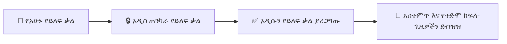

# የተጠቃሚ መገለጫ፣ 2FA እና የመለያ ደህንነት

በYeneSchool ውስጥ ያለ እያንዳንዱ ተጠቃሚ — ዳይሬክተሮች፣ መምህራን፣ ሬጅስትራሮች፣ የፋይናንስ ሰራተኞች፣ ወላጆች እና ተማሪዎች — ማዕከላዊ የሆነ **My Profile & Security (የእኔ መገለጫ እና ደህንነት)** ገጽ (`/profile`) አለው። ይህ መመሪያ የግል ዝርዝሮችዎን እንዴት ማዘመን፣ የይለፍ ቃሎችን በአስተማማኝ ሁኔታ መቀየር፣ ባለ ሁለት-ደረጃ ማረጋገጫ (Two-Factor Authentication - 2FA) ማዋቀር፣ ንቁ የመግቢያ ክፍለ-ጊዜዎችን መመርመር እና የተገናኙ መሣሪያዎችን ማስተዳደር እንደሚችሉ ያስረዳል።

---

## 1. የግል መረጃ እና አምሳያ (Avatar) ማዘመን

1. በላይኛው-ቀኝ ናቭባር ላይ ያለውን **የተጠቃሚ መገለጫ አምሳያ / ስም** ይጫኑ እና **My Profile (የእኔ መገለጫ)** (`/profile`) ይምረጡ።
2. በ **Personal Details (የግል ዝርዝሮች)** ካርድ ውስጥ፦
   - **Profile Picture (የመገለጫ ምስል):** ሙያዊ ፎቶ ለመስቀል (JPG፣ PNG እስከ 5MB) በአምሳያዎ ላይ ያለውን የካሜራ አዶ ይጫኑ።
   - **Full Legal Name (ሙሉ ህጋዊ ስም):** በትራንስክሪፕት (transcript)፣ በውጤት ካርዶች እና በይፋዊ ፊርማዎች ላይ ይታያል።
   - **Official Email & Phone Number (ይፋዊ ኢሜይል እና የስልክ ቁጥር):** ለይለፍ ቃል ዳግም ማስጀመሪያ OTPዎች እና አስቸኳይ የስርዓት ማሳወቂያዎች ዋና መስመሮች።
   - **Short Biography & Department (አጭር የህይወት ታሪክ እና ክፍል):** የማስተማር ስፔሻላይዜሽን (specialization)፣ የክፍል አስተዳዳሪነት (homeroom) ወይም የአስተዳደር ክፍል።
3. **Save Profile Changes (የመገለጫ ለውጦችን አስቀምጥ)** ይጫኑ።

---

## 2. የይለፍ ቃልዎን መቀየር እና የደህንነት ፖሊሲዎች

YeneSchool የተማሪ ግላዊነትን እና የትምህርት ቤት የፋይናንስ መዝገቦችን ለመጠበቅ ጥብቅ የይለፍ ቃል ንጽህና (password hygiene) ያስፈጽማል፦

### የይለፍ ቃል መስፈርቶች፦
- ቢያንስ **8 ቁምፊዎች** ርዝመት ይኑረው (ለአስተዳደራዊ ሚናዎች 12+ ቁምፊዎች ይመከራል)።
- ቢያንስ **አንድ አቢይ (uppercase) ፊደል**፣ **አንድ ትንሽ (lowercase) ፊደል**፣ **አንድ አሃዝ (number)** እና **አንድ ልዩ ቁምፊ (special character)** (`!@#$%^&*`) ማካተት አለበት።
- ካለፉት 3 የይለፍ ቃሎችዎ ጋር ሊመሳሰል አይችልም።

### የይለፍ ቃል ለውጥ ደረጃ በደረጃ፦
1. በመገለጫዎ ውስጥ ወደ **Security & Password (ደህንነት እና የይለፍ ቃል)** ትር (tab) ይሂዱ።
2. የ**አሁኑን የይለፍ ቃል (Current Password)** ያስገቡ።
3. **አዲስ የይለፍ ቃልዎን (New Password)** ይተይቡ (የእውነተኛ-ጊዜ የይለፍ ቃል ጥንካሬ መለኪያ (strength meter) ውስብስብነቱን ይገመግማል)።
4. አዲሱን የይለፍ ቃል በ **Confirm New Password (አዲስ የይለፍ ቃል አረጋግጥ)** ውስጥ እንደገና ያስገቡ።
5. **Update Password (የይለፍ ቃል አዘምን)** ይጫኑ።
6. የክሬደንሻል ማዘመንን የሚያረጋግጥ አፋጣኝ የማረጋገጫ ኢሜይል/ኤስኤምኤስ ይደርስዎታል።

---

## 3. ባለ ሁለት-ደረጃ ማረጋገጫ (2FA / MFA) ማዋቀር

ባለ ሁለት-ደረጃ ማረጋገጫ በመግባትዎ ጊዜ ሁሉ ከስማርትፎንዎ ባለ 6-አሃዝ ጊዜ-ላይ-የተመሰረተ የአንድ-ጊዜ የይለፍ ቃል (Time-Based One-Time Password - TOTP) ኮድ በመጠየቅ አስፈላጊ የሆነ ሁለተኛ የመከላከያ ሽፋን ይጨምራል።

| የ2FA ደረጃ | የሚፈለግ እርምጃ |
| :--- | :--- |
| **Step 1: Install Authenticator (ማረጋገጫ መተግበሪያ ጫን)** | በስማርትፎንዎ ላይ የማረጋገጫ (authenticator) መተግበሪያ ያውርዱ (*Google Authenticator፣ Microsoft Authenticator፣ Apple Passwords፣ ወይም Authy*)። |
| **Step 2: Initialize 2FA (2FA ን አስጀምር)** | በ **Profile → Security (መገለጫ → ደህንነት)** ውስጥ **Enable Two-Factor Authentication (ባለ ሁለት-ደረጃ ማረጋገጫን አንቃ)** የሚለውን ያብሩ። |
| **Step 3: Scan QR Code (QR ኮድ ቃኝ)** | የማረጋገጫ መተግበሪያዎን ይክፈቱ፣ **Scan QR Code (QR ኮድ ቃኝ)** ይንኩ እና በማያ ገጽዎ ላይ የሚታየውን QR ይቃኙ። *(ካሜራዎ ከሌለ፣ የቀረበውን ባለ 32-ቁምፊ ሚስጥራዊ ቁልፍ (secret key) በእጅ ያስገቡ)።* |
| **Step 4: Verify OTP Code (OTP ኮድ ያረጋግጡ)** | ትክክለኛ ማመሳሰልን ለማረጋገጥ በማረጋገጫ መተግበሪያዎ ውስጥ በአሁኑ ጊዜ የሚታየውን ባለ 6-አሃዝ ኮድ ያስገቡ። |
| **Step 5: Save Backup Codes (የመጠባበቂያ ኮዶችን አስቀምጡ)** | ስርዓቱ **10 የአንድ-ጊዜ የመጠባበቂያ መልሶ-ማግኛ ኮዶች (Backup Recovery Codes)** ያመነጫል። በአስተማማኝ ቦታ (ለምሳሌ፣ የይለፍ ቃል አስተዳዳሪ) ይቅዱ እና ያከማቹ። ስልክዎን ካጡ፣ እነዚህ ኮዶች ብቸኛው የራስ-አገልግሎት የመልሶ-ማግኛ አማራጭዎ ናቸው። |

> [!IMPORTANT]
> የትምህርት ቤት ዳይሬክተሮች፣ ሱፐር አድሚኖች እና የፋይናንስ ሰራተኞች ሚስጥራዊ የፋይናንስ መዝገቦችን እና የተማሪ ግላዊ ውሂብን ከተፈቀደ ያልሆነ መዳረሻ ለመከላከል በመለያዎቻቸው ላይ 2FA ን እንዲያስገድዱ በጥብቅ ይመከራል።

---

## 4. ንቁ ክፍለ-ጊዜዎች እና የርቀት መሣሪያ ውጪ-መውጫ

በህዝባዊ የትምህርት ቤት ኮምፒውተሮች ላይ ከተጎዱ (compromised) ክሬደንሻሎች ወይም ከተረሱ መግቢያዎች ለመከላከል፦

1. በደህንነት ቅንብሮችዎ ውስጥ ወደ **Active Devices & Sessions (ንቁ መሣሪያዎች እና ክፍለ-ጊዜዎች)** ፓነል ወደታች ይሸብልሉ።
2. ዝርዝሩ እያንዳንዱን ንቁ የአሳሽ እና የሞባይል መተግበሪያ ክፍለ-ጊዜ ያሳያል፦
   - **Device Type (የመሣሪያ አይነት):** (ለምሳሌ፣ *Windows Laptop — Chrome Browser*፣ *Android Phone — Mobile PWA*)።
   - **IP Address & Location (የIP አድራሻ እና አካባቢ):** ግምታዊ የአውታረ መረብ መነሻ።
   - **Last Active Timestamp (የመጨረሻ ንቅነት ጊዜ):** የእውነተኛ-ጊዜ የእንቅስቃሴ አመላካች።
   - **Current Session Badge (የአሁኑ ክፍለ-ጊዜ ባጅ):** በአሁኑ ጊዜ የሚጠቀሙበትን መሣሪያ ይለያል።
3. ያልታወቀ መሣሪያ ካስተዋሉ ወይም በጋራ ከሚጠቀሙበት የሰራተኛ ክፍል ኮምፒውተር መውጣትን ከረሱ፣ ከዚያ መሣሪያ አጠገብ ያለውን **Revoke Session (ክፍለ-ጊዜ ሰርዝ)** ይጫኑ፣ ወይም ሁሉንም የርቀት ቶከኖች ወዲያውኑ ለማቋረጥ **Log Out of All Other Devices (ከሌሎች ሁሉም መሣሪያዎች ውጣ)** የሚለውን ይጫኑ።

---

## 5. ለፈጣን የገፋ ማሳወቂያዎች ቴሌግራምን ማገናኘት

1. በ **Telegram Integration (የቴሌግራም ውህደት)** ካርድ ውስጥ **Connect Telegram Account (የቴሌግራም መለያ ያገናኙ)** ይጫኑ።
2. የቀረበውን ቀጥተኛ ጥልቅ አገናኝ (deep link) (`https://t.me/YeneSchoolBot?start=YOUR_TOKEN`) ይጫኑ ወይም ከሞባይል ቴሌግራም መተግበሪያዎ ጋር የQR ኮዱን ይቃኙ።
3. ለቦቱ (bot) `/start` ይላኩ።
4. የሚፈልጓቸውን የማንቂያ ምድቦች ያብሩ፦
   - **Emergency Announcements (የአስቸኳይ ማስታወቂያዎች):** አፋጣኝ የመላ-ትምህርት-ቤት ስርጭቶች።
   - **Attendance Alerts (የመገኘት ማንቂያዎች):** ልጅ እንዳልተገኘ ምልክት ሲደረግ የቀጥታ ማሳወቂያዎች።
   - **Grade Postings (የውጤት መለጠፊያዎች):** የፈተና ውጤቶች ወይም ቀጣይ ውጤቶች ሲገቡ ማንቂያዎች።
   - **Fee Payment Confirmations (የክፍያ ማረጋገጫዎች):** ዲጂታል ደረሰኞች እና የቀሪ ሂሳብ ማጠቃለያዎች።

---

## ቀጣይ እርምጃዎች እና ተዛማጅ መመሪያዎች

- [Platform Settings & Branding (የመድረክ ቅንብሮች እና የምርት ስም)](/am/director/school-settings) — የመላ-ትምህርት-ቤት የመግቢያ ነባሪዎችን ማዋቀር።
- [Notification Gateways (የማሳወቂያ አገናኞች)](/am/platform/notifications) — የSMS፣ ቴሌግራም እና የPush መስመሮችን ማዋቀር።
- [Reporting Issues & Contacting Support (ችግሮችን ማሳወቅ እና ድጋፍን ማነጋገር)](/am/guides/support-error-reporting) — የድጋፍ ትኬቶችን ማስገባት።