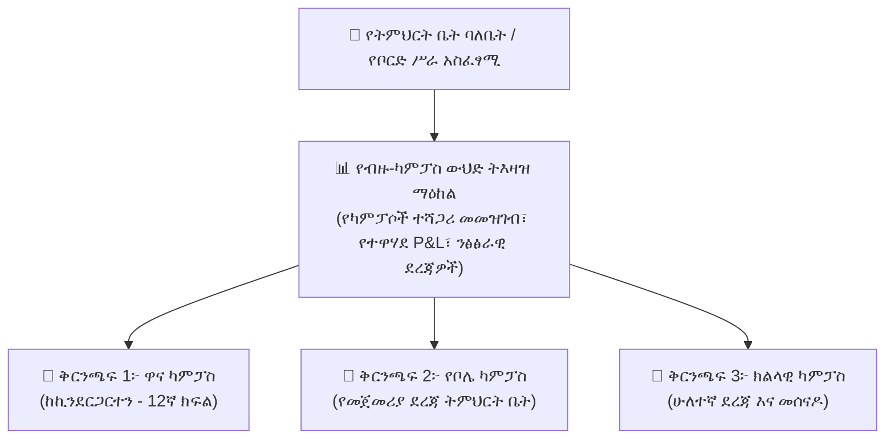
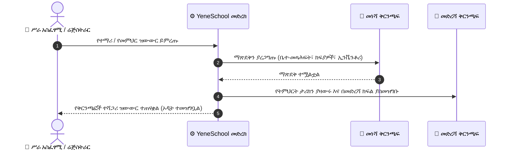

# የቅርንጫፎች ተሻጋሪ ስራዎች እና ማጠቃለያ

በተለያዩ ከተሞች ወይም የአስተዳደር ዞኖች ላይ በርካታ ካምፓሶችን ለሚያካሂዱ የትምህርት ቡድኖች እና ተቋማት (ለምሳሌ፣ *Main Campus*፣ *Bole Branch*፣ *Hawassa Branch*)፣ YeneSchool የድርጅት-ደረጃ **Multi-Branch Governance (የብዙ-ቅርንጫፍ አስተዳደር)** (`/settings/branches` እና `/owner`) ይሰጣል። የትምህርት ቤት ባለቤቶች እና ሥራ አስፈፃሚ ዳይሬክተሮች ለቅርንጫፍ ዳይሬክተሮች የተነጠሉ የዕለት ተዕለት የስራ ቦታዎችን እየጠበቁ ከአንድ ወጥ ዋና ዳሽቦርድ ላይ ስራዎችን መከታተል ይችላሉ።

---

## የብዙ-ቅርንጫፍ አርክቴክቸር ሞዴል

---

## ደረጃ በደረጃ፦ የካምፓስ ቅርንጫፎችን ማስተዳደር

### 1. አዲስ የካምፓስ ቅርንጫፍ መጨመር እና ማዋቀር
1. በ**School Owner (የትምህርት ቤት ባለቤት)** ወይም **Executive Director (ሥራ አስፈፃሚ ዳይሬክተር)** መብቶች ይግቡ።
2. ወደ **Settings > Branches (ቅንብሮች > ቅርንጫፎች)** (`/settings/branches`) ይሂዱ።
3. የ**+ Add Branch (+ ቅርንጫፍ አክል)** አዝራሩን ይጫኑ።
4. የካምፓስ መገለጫውን ይሙሉ፦
   - **Branch Name & Code (የቅርንጫፍ ስም እና ኮድ):** ለምሳሌ፣ *"YeneSchool Bole Campus (BOLE-01)"*።
   - **Physical Location (አካላዊ አካባቢ):** ክልል፣ ንዑስ ከተማ (Sub-city)፣ ወረዳ እና የመንገድ አድራሻ።
   - **Contact Information (የግንኙነት መረጃ):** የተሰጠው የካምፓስ ስልክ፣ ኢሜይል እና የአደጋ ጊዜ ግንኙነት።
   - **Offerings (አገልግሎቶች):** የሚደገፉትን የክፍል ደረጃዎች ይግለጹ (ለምሳሌ፣ *ከኪንደርጋርተን እስከ 8ኛ ክፍል*)።
5. **Create Branch (ቅርንጫፍ ፍጠር)** ይጫኑ። እንደአማራጭ **Generate Default Classes (ነባሪ ክፍሎችን ፍጠር)** የሚለውን ጠቅ በማድረግ ከ1ኛ እስከ 8ኛ ክፍል ክፍሎችን በአንድ ጠቅታ በራስ-ሰር መፍጠር ይችላሉ።

---

## የቅርንጫፎች ተሻጋሪ የተማሪ እና የሰራተኛ ዝውውር

ቤተሰቦች በሚዛወሩበት ወይም መምህራን በካምፓሶች መካከል በሚሾሙበት ጊዜ፦

1. በቅርንጫፍ አስተዳደር ፓነል ውስጥ **Inter-Branch Transfers (የቅርንጫፎች ተሻጋሪ ዝውውሮች)** ይምረጡ።
2. የዝውውር አይነት ይምረጡ፦ **Student Transfer (የተማሪ ዝውውር)** ወይም **Faculty Reassignment (የመምህራን ዳግም ምደባ)**።
3. የመነሻ ካምፓሱን እና የመድረሻ ቅርንጫፉን ይምረጡ።
4. ስርዓቱ የክፍል ማጽደቅን ያረጋግጣል (በመነሻ ካምፓስ ላይ ያለጊዜያቸው ያለፉ የቤተ-መጻሕፍት መጻሕፍት ወይም ያልተከፈለ የትምህርት ክፍያ ዕዳ አለመኖሩን ያረጋግጣል)።
5. ዝውውሩን ያረጋግጡ። የተማሪው ታሪካዊ ትራንስክሪፕቶች፣ የመገኘት መዝገቦች እና የክፍያ ደረሰኞች ያለ በእጅ ዳግም ግቤት ያለችግር ይዛወራሉ።

---

## የተዋሃደ የፋይናንስ እና የትምህርት ደረጃ መስጫ

በ**Owner Executive Dashboard (የባለቤት ሥራ አስፈፃሚ ዳሽቦርድ)** (`/owner`) ውስጥ፦

| ስልታዊ KPI | የትንታኔ ወሰን | የንግድ ግንዛቤ |
| :--- | :--- | :--- |
| **Consolidated Enrollment (የተዋሃደ መመዝገብ)** | መላ አውታር | በሁሉም ቅርንጫፎች ላይ ንቁ የሆኑ ጠቅላላ ተማሪዎች ከአቅም ገደቦች ጋር ሲነፃፀሩ። |
| **Branch Revenue Yield (የቅርንጫፍ ገቢ ምርታማነት)** | በቅርንጫፍ | ወርሃዊ የትምህርት ክፍያ መሰብሰቢያዎች፣ ያልከፈሉ ክፍያዎች የዕድሜ መለኪያ (aging) እና የመሰብሰቢያ ቅልጥፍና መቶኛ በእያንዳንዱ ካምፓስ። |
| **Academic Benchmark Index (የትምህርት ደረጃ መረጃ ጠቋሚ)** | በቅርንጫፍ | በካምፓሶች መካከል ንፅፅራዊ የማለፊያ መጠኖች እና የብሄራዊ ፈተና ውጤቶች። |
| **Faculty Retention & Load (የመምህራን ማቆያ እና ሸክም)** | በቅርንጫፍ | የመምህር-ወደ-ተማሪ ሬሾዎች እና የመማሪያ ሰዓት ክፍፍል በቅርንጫፍ። |

---

## ቀጣይ እርምጃዎች

- [School Owner Overview (የትምህርት ቤት ባለቤት አጠቃላይ እይታ)](/am/owner/overview) — የሥራ አስፈፃሚ ትእዛዝ ማዕከል አጠቃላይ እይታ
- [Multi-Branch Dashboard (የብዙ-ቅርንጫፍ ዳሽቦርድ)](/am/owner/multi-branch) — የቅርንጫፎች ተሻጋሪ የአፈፃፀም መግብሮች
- [Director Subscription & Billing (የዳይሬክተር ደንበኝነት እና ክፍያ)](/am/director/subscription-billing) — የአውታረ-ሰፊ የተማሪ አቅምን ማስተዳደር