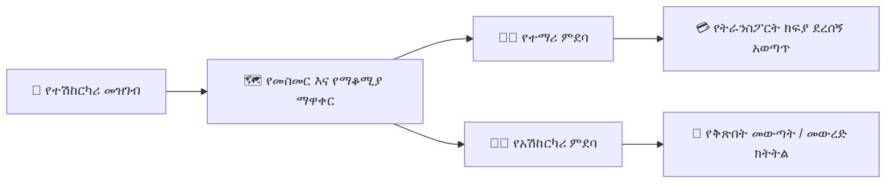

# የትራንስፖርት እና የመርከቦች (Fleet) አስተዳደር

የYeneSchool ትራንስፖርት ሞጁል የትምህርት ቤት ዳይሬክተሮችን እና የአስተዳደር ሰራተኞችን የትምህርት ቤት ተሽከርካሪዎችን ማስተዳደር፣ የዕለት ተዕለት የመጓጓዣ መስመሮችን መግለጽ፣ የመውጣት እና የመውረድ ማቆሚያዎችን ካርታ መስራት፣ ተማሪዎችን እና አሽከርካሪዎችን መመደብ እና የትራንስፖርት ፋይናንስን መከታተል እንዲችሉ ያስችላል።

---

## 1. የተሽከርካሪ ምዝገባ እና የመርከቦች ክትትል

በትምህርት ቤቱ መርከቦች (fleet) ውስጥ ያለ እያንዳንዱ ተሽከርካሪ በቴክኒካዊ ዝርዝሮቹ፣ በአቅም ገደቦቹ እና በተገዢነት (compliance) ሰነዶቹ መመዝገብ አለበት።

### ተሽከርካሪ እንዴት መመዝገብ እንደሚቻል
1. ወደ **School Operations > Transport > Vehicles (የትምህርት ቤት ስራዎች > ትራንስፖርት > ተሽከርካሪዎች)** ይሂዱ።
2. በላይኛው-ቀኝ ራስጌ ላይ **+ Add Vehicle (+ ተሽከርካሪ አክል)** ይጫኑ።
3. የተሽከርካሪ መገለጫ ዝርዝሮችን ያቅርቡ፦
   - **Vehicle Plate / Registration Number (የተሽከርካሪ ሰሌዳ / የምዝገባ ቁጥር):** ልዩ የታርጋ ቁጥር (ለምሳሌ፣ `ET-AA-3-98421`)።
   - **Vehicle Model & Make (የተሽከርካሪ ሞዴል እና ሰሪ):** (ለምሳሌ፣ *Toyota Coaster 30-Seater*፣ *Isuzu NPR 45-Seater*)።
   - **Total Passenger Capacity (ጠቅላላ የመንገደኞች አቅም):** ከፍተኛው ህጋዊ የመቀመጫ ብዛት (ለምሳሌ፣ `32`)።
   - **Vehicle Status (የተሽከርካሪ ሁኔታ):** `Active`, `Under Maintenance`, ወይም `Decommissioned`.
   - **Fuel Type & Mileage Tracking (የነዳጅ አይነት እና የኪሎሜትር ክትትል):** ናፍጣ (Diesel)/ቤንዚን (Petrol) እና የአሁኑ የኦዶሜትር (odometer) ንባብ።
   - **Insurance & Inspection Renewal Dates (የኢንሹራንስ እና የፍተሻ እድሳት ቀናት):** ራስ-ሰር የማለቂያ ማሳሰቢያ ማንቂያዎችን ያዘጋጁ።
4. **Save Vehicle Profile (የተሽከርካሪ መገለጫ አስቀምጥ)** ይጫኑ።

> [!NOTE]
> ስርዓቱ ከተሽከርካሪው ከተወሰነው የመንገደኞች አቅም ገደብ በላይ ተማሪዎችን ከመመደብ ይከላከላል። አንድ መስመር 100% አቅም ላይ ከደረሰ፣ YeneSchool መስመሩን በቢጫ የአቅም ማስጠንቀቂያ ምልክት ያደርጋል።

---

## 2. የመጓጓዣ መስመሮችን እና የአውቶቡስ ማቆሚያዎችን ማዋቀር

መስመሮች በጠዋት (መውጣት) እና ከሰዓት በኋላ (መውረድ) በትምህርት ቤት አውቶቡሶች የሚከተሉትን ጂኦግራፊያዊ መንገድ ያደራጃሉ።

### መስመር ለመፍጠር እና ማቆሚያዎችን ለማስተካከል ደረጃዎች
1. ወደ **Transport > Routes & Stops (ትራንስፖርት > መስመሮች እና ማቆሚያዎች)** ይሂዱ።
2. **+ Create Route (+ መስመር ፍጠር)** ይጫኑ (ለምሳሌ፣ *Route 04 — ከቦሌ መድሀኒዓለም እስከ CMC ክብ*)።
3. የተሰየመውን ዋና ተሽከርካሪ እና የመጠባበቂያ ተሽከርካሪ ይመድቡ።
4. ለእያንዳንዱ የታቀደ የመውጣት/የመውረድ ነጥብ **+ Add Stop (+ ማቆሚያ አክል)** ይጫኑ፦

| የማቆሚያ ስም | የጠዋት መውጣት ሰዓት | የከሰዓት መውረድ ሰዓት | ወርሃዊ የዞን ክፍያ (ETB) |
| :--- | :--- | :--- | :--- |
| **Bole Atlas Junction** | 06:45 AM | 04:15 PM | 1,800 ETB |
| **Edna Mall / Medhanialem** | 07:05 AM | 03:55 PM | 1,800 ETB |
| **Gerji Imperial** | 07:20 AM | 03:40 PM | 2,200 ETB |
| **CMC Michael Square** | 07:35 AM | 03:25 PM | 2,500 ETB |

5. ምርጥ የመስመር ቅደም ተከተል እና አነስተኛ የመንዳት ጊዜን ለማረጋገጥ ማቆሚያዎችን ይጎትቱ (drag) እና እንደገና ያዝዙ።
6. **Publish Route (መስመር አትም)** ይጫኑ።

---

## 3. የተማሪ መስመር ምደባ

ተማሪዎች ለክብ-ጉዞ (ሁለቱም ጠዋት እና ከሰዓት) ወይም ለአንድ-መንገድ አገልግሎት ሊመደቡ ይችላሉ።

### ተማሪን ለአውቶቡስ መስመር መመደብ
1. ወደ **Transport > Student Assignments (ትራንስፖርት > የተማሪ ምደባዎች)** ይሂዱ።
2. ተማሪውን በስም ወይም በተማሪ መለያ (Student ID) ይፈልጉ።
3. **Route (መስመር)** እና የተወሰነውን **Pickup/Drop-off Stop (የመውጣት/የመውረድ ማቆሚያ)** ይምረጡ።
4. **Commute Type (የመጓጓዣ አይነት)** ይምረጡ፦
   - `Two-Way (Morning & Afternoon)`
   - `Morning Only`
   - `Afternoon Only`
5. **Sync with Finance Module (ከፋይናንስ ሞጁል ጋር አመሳስል)** ምልክት ያድርጉ፦
   - ተጓዳኝ የዞን ትራንስፖርት ክፍያውን በራስ-ሰር ለተማሪው ወርሃዊ ክፍያ መግለጫ ያያይዛል።
6. **Confirm Allocation (ምደባ አረጋግጥ)** ይጫኑ።

---

## 4. የአሽከርካሪ እና የአውቶቡስ አጃቢ አስተዳደር

1. ወደ **Transport > Drivers & Attendants (ትራንስፖርት > አሽከርካሪዎች እና አጃቢዎች)** ይሂዱ።
2. የአሽከርካሪ መገለጫዎችን የመንዳት ፍቃድ ምድብ (Driving License Category)፣ የአደጋ ጊዜ ግንኙነት ስልክ እና የበስተመጋራ ምርመራ (background check) ማረጋገጫን ጨምሮ ይመዝግቡ።
3. ለእያንዳንዱ ተሽከርካሪ **Primary Driver (ዋና አሽከርካሪ)** እና **Bus Attendant (Conductor) (የአውቶቡስ አጃቢ / ኮንዳክተር)** ይመድቡ።
4. አሽከርካሪዎች እና አጃቢዎች የጠዋት መዝገባቸውን (manifest) ለመመልከት፣ የተማሪ መሳፈርን ምልክት ለማድረግ እና ወደ ማቆሚያዎች ሲቃረቡ ወላጆችን ለማስጠንቀቅ የYeneSchool ሞባይል መተግበሪያን መጠቀም ይችላሉ።

---

## 5. የትራንስፖርት መገኘት እና የወላጅ የገፋ ማሳወቂያዎች

ተማሪዎች አውቶቡሱን ሲሳፈሩ ወይም ሲወርዱ፦
- የአውቶቡስ አጃቢው የሞባይል መተግበሪያውን በመጠቀም የተማሪውን ስም ይነካል ወይም የተማሪ መታወቂያ ካርድ ባርኮድ ይቃኛል።
- ወላጆች ወዲያውኑ ራስ-ሰር የኤስኤምኤስ / ቴሌግራም ገፋ ማሳወቂያ ይቀበላሉ፦
  > *"ሰላም! ናሆም ዑስማን በ06:48 AM በቦሌ አትላስ ማቆሚያ በ#4 አውቶቡስ በደህና ተሳፍረዋል።"*

---

## ቀጣይ እርምጃዎች

- [School Events & Calendar Planner (የትምህርት ቤት ክስተቶች እና የካሌንደር ዕቅድ አዘጋጅ)](/am/operations/events-calendar) — የጊዜ ቀናትን፣ በዓላትን እና ስብሰባዎችን ያዘጋጁ
- [Data Quality & Auditing (የውሂብ ጥራት እና ኦዲት)](/am/operations/data-quality-audit) — የተማሪ መዝገቦችን እና የጎደሉ የግንኙነት ዝርዝሮችን ይመርምሩ
- [Finance Fee Structures (የፋይናንስ ክፍያ መዋቅሮች)](/am/finance/fee-structures) — ተደጋጋሚ የትራንስፖርት ክፍያ እቃዎችን ያዋቅሩ