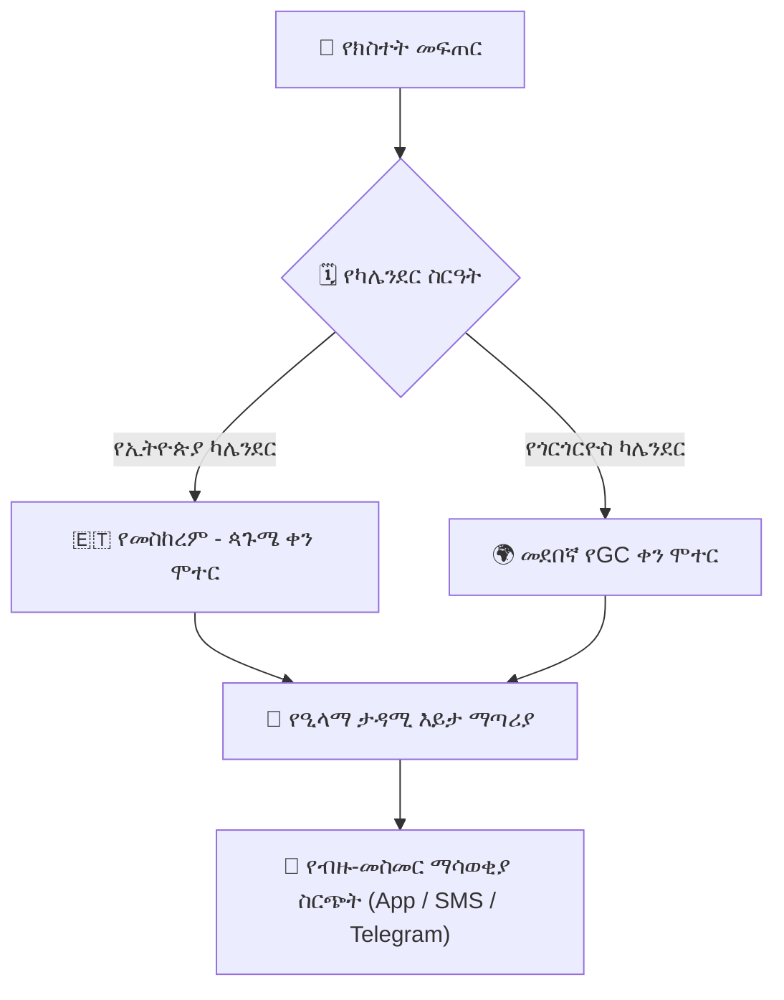

# የትምህርት ቤት ክስተቶች እና ባለ-ብዙ-ካሌንደር ዕቅድ አዘጋጅ

YeneSchool ሁለቱንም **የኢትዮጵያ ካሌንደር (EC)** እና **የጎርጎርዮስ ካሌንደር (GC)** የሚደግፍ የተዋሃደ ባለ-ብዙ-ካሌንደር የትምህርት ቤት ክስተት ዕቅድ አዘጋጅ አለው። ዳይሬክተሮች እና አስተዳዳሪዎች የትምህርት ቤት በዓላትን፣ የስፖርት ውድድሮችን፣ የወላጅ-መምህር ኮንፈረንሶችን እና የፈተና ምዕራፎችን (milestones) ማሰራጨት ይችላሉ።

---

## 1. የትምህርት ቤት ክስተት መፍጠር

### ደረጃ በደረጃ መመሪያዎች
1. ወደ **School Operations > Events & Calendar (የትምህርት ቤት ስራዎች > ክስተቶች እና ካሌንደር)** ይሂዱ (ወይም በዳይሬክተር ዳሽቦርድ ላይ የካሌንደር መግብሩን (widget) ይጫኑ)።
2. **+ New Event (+ አዲስ ክስተት)** ይጫኑ።
3. የክስተት መለኪያዎችን ይሙሉ፦
   - **Event Title (የክስተት ርዕስ):** ለምሳሌ፣ *የ1ኛ ጊዜ የወላጅ-መምህር ምክክር ቀን*፣ *ዓመታዊ የትምህርት ቤቶች መካከል የስፖርት ቀን*።
   - **Category (ምድብ):**
     - `Academic Milestone` (የጊዜ መጀመሪያ፣ የግማሽ ዓመት ፈተና፣ የመጨረሻ ፈተና ሳምንት)
     - `Public & Religious Holiday` (እንቁጣጣሽ፣ መስቀል፣ ኢድ አል-ፊጥር፣ ገና፣ ጥምቀት ወዘተ.)
     - `Parent-Teacher Meeting (PTM)` (የወላጅ-መምህር ስብሰባ)
     - `Extracurricular / Sports / Cultural Day` (ከመደበኛ ትምህርት ውጪ / ስፖርት / የባህል ቀን)
     - `Staff Training & In-Service Day` (የሰራተኛ ስልጠና እና በአገልግሎት ቀን)
   - **Date & Time Range (የቀን እና ሰዓት ክልል):** የመጀመሪያ ቀን/ሰዓት እና የመጨረሻ ቀን/ሰዓት ያዘጋጁ። ቀኖች በEC (*ለምሳሌ፣ ጥቅምት 14፣ 2017*) ወይም በGC (*ለምሳሌ፣ ጥቅምት 24፣ 2024*) ሊገቡ ይችላሉ።
   - **Campus Location (የካምፓስ ቦታ):** ኦዲቶሪየም፣ የእግር ኳስ ሜዳ፣ ዋና አዳራሽ ወይም ምናባዊ (virtual) Zoom አገናኝ።
   - **Audience Visibility (የታዳሚ እይታ):**
     - `Whole School (Public)` (መላ ትምህርት ቤት - ህዝባዊ)
     - `Teachers & Staff Only` (መምህራን እና ሰራተኞች ብቻ)
     - `Parents & Guardians Only` (ወላጆች እና አሳዳጊዎች ብቻ)
     - `Specific Grade Levels (e.g., Grade 8 & 12 only)` (የተወሰኑ የክፍል ደረጃዎች - ለምሳሌ፣ 8ኛ እና 12ኛ ክፍል ብቻ)
4. **Send Event Reminder Notifications (የክስተት ማስታወሻ ማሳወቂያዎችን ላክ)** የሚለውን ያብሩ (ክስተቱ ከመከሰቱ 24 ሰዓት እና 2 ሰዓት በፊት ይላካል)።
5. **Publish Event (ክስተት አትም)** ይጫኑ።

---

## 2. የኢትዮጵያ እና የጎርጎርዮስ ባለ-ሁለት ካሌንደር ማመሳሰል

የYeneSchool መሰረታዊ የቀን ሞተር በኢትዮጵያ እና በጎርጎርዮስ ቀኖች መካከል በራስ-ሰር ይቀይራል፦

| የኢትዮጵያ ቀን (EC) | የጎርጎርዮስ ቀን (GC) | መደበኛ የትምህርት ቤት ክስተት |
| :--- | :--- | :--- |
| **መስከረም 1** | September 11 (ወይም 12 በመዝለያ ዓመት) | እንቁጣጣሽ (የኢትዮጵያ አዲስ ዓመት) |
| **መስከረም 17** | September 27 (ወይም 28 በመዝለያ ዓመት) | መስቀል (የእውነተኛው መስቀል መገኘት) |
| **ታህሳስ 29** | January 7 | የኢትዮጵያ ገና (Genna) |
| **ጥር 11** | January 19 (ወይም 20 በመዝለያ ዓመት) | ጥምቀት (Epiphany) |
| **የካቲት 23** | March 2 | የዓድዋ ድል መታሰቢያ ቀን |
| **ሚያዝያ 27** | May 5 | የአርበኞች ድል ቀን |

በዓል ሲቀጠር፣ ለዚያ ቀን የመገኘት ምልክት ማድረግ በራስ-ሰር ይሰናከላል፣ ይህም የውሸት የማይገኝ መዝገቦችን ይከላከላል።

---

## 3. የወላጅ-መምህር ስብሰባ (PTM) ቀጠሮ ቦታ ማስያዝ

ለወላጅ-መምህር ምክክር ቀናት፦
1. የPTM ክስተት ሲታተም፣ ወላጆች በሞባይል መተግበሪያቸው እና በድር መግቢያቸው (web portal) ማሳወቂያ ይቀበላሉ።
2. ወላጆች ከልጃቸው የክፍል አስተዳዳሪ (homeroom) ወይም የትምህርት አስተማሪዎች ጋር **የ15-ደቂቃ የጊዜ ክፍተት (Time Slot)** መምረጥ ይችላሉ።
3. መምህራን ከስብሰባው በፊት የተዘጋጁ የተማሪ አፈፃፀም ማጠቃለያዎችን ጨምሮ የተደራጀ የምክክር መርሃ ግብር ይቀበላሉ።

---

## ቀጣይ እርምጃዎች

- [Data Quality & Auditing (የውሂብ ጥራት እና ኦዲት)](/am/operations/data-quality-audit) — የስርዓት ትክክለኛነት እና የጤና መለኪያዎችን ይመርምሩ
- [AI Timetable & Auto-Assignment Engine (የAI ጊዜ ሰሌዳ እና ራስ-ሰር ምደባ ሞተር)](/am/operations/timetable-engine) — ክፍሎችን እና የመማሪያ ሰዓቶችን በራስ-ሰር ያዘጋጁ
- [Announcements & Messaging (ማስታወቂያዎች እና መልዕክት)](/am/communication/announcements) — ለወላጆች ይፋዊ የትምህርት ቤት ማስታወቂያዎችን ያሰራጩ