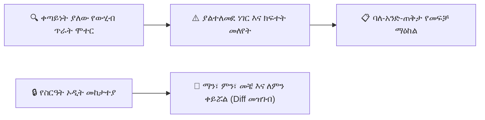

# የውሂብ ጥራት፣ የጤና ኦዲቶች እና የደህንነት መዝገቦች

ንጹህ የተቋም ውሂብን መጠበቅ ለትክክለኛ የውጤት ካርዶች፣ ለትምህርት ሚኒስቴር ማቅረቢያዎች እና ለክፍያ ሂሳብ ትክክለኛነት ወሳኝ ነው። የውሂብ ጥራት እና የደህንነት ኦዲት ሞጁል የእውነተኛ-ጊዜ የጤና ምርመራዎችን፣ ያልተለመደ ነገር (anomaly) መለየትን እና ለእያንዳንዱ የተጠቃሚ እርምጃ የማይቀየር-ማስረጃ (tamper-evident) ኦዲት መከታተያ ይሰጣል።

---

## 1. የትምህርት ቤት የውሂብ ጥራት የጤና ውጤት

በዳይሬክተር ዳሽቦርድ እና በሬጅስትራር መግቢያ (Registrar Portal) ላይ ያለው **Data Quality Widget (የውሂብ ጥራት መግብር)** በአምስት ዋና ልኬቶች ላይ የሚሰላ አጠቃላይ የጤና ውጤት (0% – 100%) ያሳያል፦

| የጤና ምርመራ ምድብ | ስርዓቱ የሚፈልገው | ካልተስተካከለ የሚደርሰው ተጽዕኖ |
| :--- | :--- | :--- |
| **Incomplete Student Profiles (ያልተሟሉ የተማሪ መገለጫዎች)** | የተወለድበት ቀን፣ ጾታ፣ የደም አይነት ወይም የተማሪ ፎቶ የጎደለ። | የውጤት ካርድ መፈጠር ስህተቶች እና የመታወቂያ ካርድ ማተም መከልከሎች። |
| **Missing Guardian Links (የጎደሉ አሳዳጊ ግንኙነቶች)** | የተመዘገበ የወላጅ ስልክ ወይም የአደጋ ጊዜ ግንኙነት የሌላቸው ተማሪዎች። | ያልተሳኩ የSMS/ቴሌግራም የመገኘት ማሳወቂያዎች እና የክፍያ ማሳሰቢያዎች። |
| **Duplicate Records (ድግግሞሽ መዝገቦች)** | የተመሳሳይ ስም/የአባት ስም ከተመሳሳይ የተወለድበት ቀን ወይም ስልክ ጋር። | ድርብ የክፍያ ደረሰኝ አወጣጥ እና የተዛቡ የመመዝገቢያ ቆጠራዎች። |
| **Unassigned Students (ያልተመደቡ ተማሪዎች)** | ወደ ትምህርት ክፍል ወይም ክፍል (section) ያልተመደቡ ንቁ ተማሪዎች። | መገኘት መውሰድ ወይም የውጤት መዝገብ (gradebook) ውጤቶችን መመዝገብ አለመቻል። |
| **Orphaned Entities (ወላጅ-አልባ አካላት)** | የተመደበ መምህር ወይም ክፍል መደራረብ (room overlap) ያላቸው የጊዜ ሰሌዳዎች የሌላቸው ትምህርቶች። | የተሰበሩ የተማሪ መርሃ ግብር እይታዎች እና ያልተከታተሉ የክፍል ጊዜያት። |

### የውሂብ ጤና ቅኝት (Scan) ማስኬድ
1. ወደ **School Operations > Data Quality (የትምህርት ቤት ስራዎች > የውሂብ ጥራት)** ይሂዱ።
2. **Run Full School Health Scan (ሙሉ የትምህርት ቤት የጤና ቅኝት አስኪድ)** ይጫኑ።
3. ሞተሩ ሁሉንም ንቁ ሰንጠረዦችን በሰከንዶች ውስጥ ይተነትናል እና ሊታረሙ የሚችሉ የአለመጣጣም ካርዶችን ዝርዝር ያመነጫል።
4. ከማንኛውም እቃ አጠገብ ያለውን **Resolve (ፍታ)** ይጫኑ — በቅድመ-የተሞሉ ምክሮች በቀጥታ ወደ የማስተካከያ (edit) መገናኛ ለመሄድ።

---

## 2. የስርዓት-ሰፊ ኦዲት መከታተያዎች እና የለውጥ መዝገቦች

በYeneSchool ውስጥ ያለ እያንዳንዱ የአስተዳደር፣ የትምህርት እና የፋይናንስ እርምጃ ሙሉ የተቋም ተጠያቂነትን እና የማጭበርበር መከላከልን ለማረጋገጥ በቋሚነት ይመዘገባል።

### የኦዲት መዝገቦች አይነቶች
1. **System Audit Trail (`SystemAuditLog`) (የስርዓት ኦዲት መከታተያ):**
   - የተጠቃሚ መግቢያዎችን፣ የይለፍ ቃል ዳግም ማስጀመሮችን፣ የሚና ለውጦችን እና የተማሪ መዝገብ ማሻሻያዎችን ከIP አድራሻዎች እና ከተጠቃሚ-ወኪል (user-agent) ሕብረቁምፊዎች ጋር ይመዘግባል።
2. **Finance Audit Trail (`FinanceAuditLog`) (የፋይናንስ ኦዲት መከታተያ):**
   - የክፍያ መዋቅር አርትዖቶችን፣ በእጅ ቅናሾችን፣ የደረሰኝ ሰረዝን እና የጥሬ ገንዘብ ቀሪ ሂሳብ ማስተካከያዎችን ከትክክለኛው የBefore vs After እሴት ልዩነቶች (diffs) ጋር ይከታተላል።
3. **Grade Change Audit Trail (`GradeChangeLog`) (የውጤት ለውጥ ኦዲት መከታተያ):**
   - ኦፊሴላዊው የውጤት ጊዜ ከተዘጋ በኋላ የተቀየረ ማንኛውንም የውጤት ነጥብ ይመዘግባል፣ ይህም የግዴታ የለውጥ ምክንያት ኮድ (change reason code) እና የተቆጣጣሪ (supervisor) ፊርማ ይጠይቃል።

### የኦዲት መከታተያዎችን መመርመር
1. ወደ **School Operations > Audit Logs (የትምህርት ቤት ስራዎች > የኦዲት መዝገቦች)** ይሂዱ።
2. መዝገቦችን በሚከተሉት ያጣሩ፦
   - **Date Range (የቀን ክልል)** (EC ወይም GC)
   - **User / Operator (ተጠቃሚ / ኦፕሬተር)** (ለምሳሌ፣ *Registrar Usman*)
   - **Action Type (የእርምጃ አይነት)** (`CREATE`, `UPDATE`, `DELETE`, `LOGIN_FAILED`)
   - **Target Entity (ዒላማ አካል)** (`Student`, `PaymentReceipt`, `GradeScore`)
3. የቀድሞ እሴቶችን በቀይ እና አዲስ እሴቶችን በአረንጓዴ የሚያሳየውን **JSON Side-by-Side Diff** ለመመልከት ማንኛውንም የመዝገብ ግቤት ይጫኑ።
4. ለቦርድ ቁጥጥር ወይም ለውጭ ሚኒስቴር ኦዲት **Export Audit Log (CSV/PDF)** (የኦዲት መዝገብ አላቅ እንደ CSV/PDF) ይጫኑ።

---

## ቀጣይ እርምጃዎች

- [AI Timetable & Auto-Assignment Engine (የAI ጊዜ ሰሌዳ እና ራስ-ሰር ምደባ ሞተር)](/am/operations/timetable-engine) — ራስ-ሰር መርሃ ግብር እና የግጭት አፈታት
- [Transport & Fleet Management (የትራንስፖርት እና የመርከቦች አስተዳደር)](/am/operations/transport) — የትምህርት ቤት የትራንስፖርት አቅርቦትን (logistics) ያስተዳድሩ
- [Director User Profile & Security (የዳይሬክተር ተጠቃሚ መገለጫ እና ደህንነት)](/am/platform/user-profile-security) — ባለ ሁለት-ደረጃ ማረጋገጫ እና የክፍለ-ጊዜ መቆጣጠሪያዎችን ያዋቅሩ