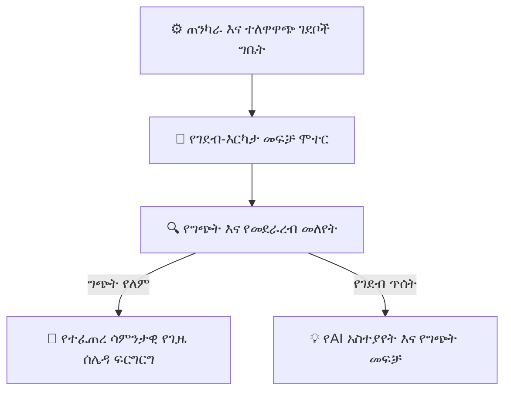

# የAI ጊዜ ሰሌዳ እና ራስ-ሰር ምደባ ሞተር

ለብዙ አስር መምህራን፣ ለበመቶዎች የሚቆጠሩ ክፍሎች እና ውስን የላብራቶሪ/አዳራሽ መገልገያዎች ከግጭት ነጻ የሆኑ ሳምንታዊ መርሃ ግብሮችን መፍጠር በጣም ጊዜ የሚወስዱ የአስተዳደር ተግባራት አንዱ ነው። የYeneSchool ራስ-ሰር ምደባ እና የጊዜ ሰሌዳ ሞተር ይህንን የገደብ-እርካታ (constraint-satisfaction) ፈተና በሰከንዶች ውስጥ ይፈታል።

---

## 1. የገደብ ሞተሩ እንዴት ይሰራል

መርሃ ግብር አዘጋጁ (scheduler) ሁለት ደረጃ ያላቸውን የአሰራር ህጎች ይገመግማል፦

### ጠንካራ ገደቦች (በፍፁም ሊጣሱ የማይገባ)
- **Teacher Double-Booking (የመምህር ድርብ ቀጠሮ):** አንድ መምህር በተመሳሳይ የመማሪያ ሰዓት በሁለት የተለያዩ ክፍሎች ውስጥ ሊቀጠር አይችልም።
- **Room Collisions (የክፍል መደራረብ):** አካላዊ ክፍል ወይም የሳይንስ ላብራቶሪ በአንድ ጊዜ ሁለት ክፍሎችን ማስተናገድ አይችልም።
- **Section Single-Subject (የክፍል ነጠላ-ትምህርት):** አንድ ክፍል (section) በተመሳሳይ የመማሪያ ሰዓት ሁለት የተለያዩ ትምህርቶች ሊኖሩት አይችልም።
- **School Bell Windows (የትምህርት ቤት ደወል ጊዜያት):** የመማሪያ ሰዓቶች በዳይሬክተሩ የተዋቀረውን የሳይረን ደወል መርሃ ግብር በጥብቅ መከተል አለባቸው።

### ተለዋዋጭ ገደቦች (ለምቾት እና ለትምህርታዊ ጥራት የተመቻቹ)
- **Teacher Workload Balancing (የመምህር ስራ ሸክም ሚዛን):** የመምህር ድካምን ለመከላከል የማስተማሪያ ጊዜያትን በሰኞ–አርብ በእኩል ያከፋፍላል (ለምሳሌ፣ በቀን በአንድ መምህር ከፍተኛ 5 ጊዜያት)።
- **Subject Spacing (የትምህርት ክፍተት):** ከፍተኛ የአእምሮ ጫና ያላቸውን ትምህርቶች (ለምሳሌ፣ ሂሳብ (Mathematics)፣ ፊዚክስ (Physics)፣ ኬሚስትሪ (Chemistry)) ከተከታታይ የከሰዓት በኋላ ቦታዎች ይልቅ በጠዋት ጊዜያት ያሰራጫል።
- **Double-Period Grouping (የድርብ-ጊዜ ቡድን መፈጠር):** የተግባራዊ ሳይንስ ላብራቶሪዎችን እና የስነ-ጥበብ ክፍሎችን ወደ ተከታታይ ድርብ ጊዜያት በራስ-ሰር ያጣምራል።
- **Part-Time Teacher Availability (የትዕይንት-ክፍል መምህር እድል):** የውጭ መምህራንን የእድል ጊዜያት ያከብራል (ለምሳሌ፣ *በማክሰኞ እና ሐሙስ ብቻ ይገኛል*)።

---

## 2. ራስ-ሰር የጊዜ ሰሌዳ መፈጠርን ማስኬድ

### ደረጃ በደረጃ የመፈጠር የስራ ሂደት
1. ወደ **Academic Management > Timetables > Auto-Generate Schedule (የትምህርት አስተዳደር > የጊዜ ሰሌዳዎች > ራስ-ሰር መርሃ ግብር ፍጠር)** ይሂዱ።
2. **Academic Year (የትምህርት ዘመን)** እና **Term (የትምህርት ጊዜ)** ይምረጡ።
3. የመፈጠር ወሰንን ይምረጡ፦
   - `All Grades & Sections (Full School)` (ሁሉም ክፍሎች እና ክፍሎች — ሙሉ ትምህርት ቤት)
   - `Primary Section (Grades 1–6)` (የመጀመሪያ ደረጃ ክፍል — ከ1–6ኛ ክፍል)
   - `Secondary / Preparatory Section (Grades 7–12)` (ሁለተኛ ደረጃ / መሰናዶ ክፍል — ከ7–12ኛ ክፍል)
4. **Constraint Weights (የገደብ ክብደቶች)** ይገምግሙ፦
   - በቀን በአንድ መምህር ከፍተኛ የመማሪያ ሰዓት ብዛት (ነባሪ፦ `5`)
   - ያለ እረፍት ከፍተኛ ተከታታይ ጊዜያት (ነባሪ፦ `3`)
   - ለላብራቶሪ ትምህርቶች የድርብ ጊዜ ፍቃድ (`Enabled`)
5. **Run AI Timetable Solver (የAI ጊዜ ሰሌዳ መፍቻ አስኪድ)** ይጫኑ።
6. ሞተሩ ተደጋጋሚ የኋላ-መመለሻ (iterative backtracking) ስልተ-ቀመሮችን ያስፈጽማል እና የተፈጠረውን ዋና ፍርግርግ ከ10 ሰከንድ ባነሰ ጊዜ ውስጥ ያሳያል።

---

## 3. የግጭት አፈታት እና በእጅ ማጣራት (Fine-Tuning)

መርሃ ግብሩ ከተፈጠረ በኋላ፣ አስተዳዳሪዎች በይነተገናኝ (interactive) ፍርግርጉን መመርመር ይችላሉ፦

- **Green Slot (አረንጓዴ ቦታ):** ፍጹም በሆነ ሁኔታ የተመደበ፣ ምንም ግጭት የሌለ።
- **Amber Slot (አምበር/ቢጫ ቦታ):** ተለዋዋጭ የገደብ ማስጠንቀቂያ (ለምሳሌ፣ መምህሩ 4 ተከታታይ ጊዜያት አሉት)።
- **Drag-and-Drop Adjustment (የጎትት-እና-ጣል ማስተካከያ):** ማንኛውንም የመማሪያ ሰዓት ካርድ ወደ አዲስ የጊዜ ቦታ ይጎትቱ። ሲጎትቱ፣ የሚሰሩ የመጣል ቦታዎች አረንጓዴ ሲያበሩ፣ የማይሰሩ/የሚጋጩ ቦታዎች ቀይ ያበራሉ።
- **Click to Swap (በጠቅታ መለዋወጥ):** የመማሪያ ሰዓት ይጫኑ እና የመምህር ምደባዎችን በራስ-ሰር ለመለዋወጥ ሌላ ቦታ ይምረጡ።

---

## 4. የጊዜ ሰሌዳዎችን ማተም እና ማመሳሰል

ከጸደቀ በኋላ፦
1. **Publish Master Timetable (ዋና የጊዜ ሰሌዳ አትም)** ይጫኑ።
2. የጊዜ ሰሌዳው ወዲያውኑ ከሚከተሉት ጋር ይመሳሰላል፦
   - **Teacher Portals & Mobile Apps (የመምህር መግቢያዎች እና ሞባይል መተግበሪያዎች)** (ግላዊ የግል መርሃ ግብር እይታ)።
   - **Student & Parent Portals (የተማሪ እና የወላጅ መግቢያዎች)** (የክፍል ሳምንታዊ መርሃ ግብር)።
   - **Hardware Siren / School Bell (የሃርድዌር ሳይረን / የትምህርት ቤት ደወል)** (ራስ-ሰር የመማሪያ ሰዓት ለውጥ ቃጭል ይቀሰቅሳል)።

---

## ቀጣይ እርምጃዎች

- [School Siren & Automated Bell (የትምህርት ቤት ሳይረን እና ራስ-ሰር ደወል)](/am/director/siren-management) — የመማሪያ ሰዓት መርሃ ግብሮችን ከአካላዊ የደወል ሪሌይዎች (bell relays) ጋር ያገናኙ
- [Director Academic Timetable (የዳይሬክተር የትምህርት ጊዜ ሰሌዳ)](/am/academic/timetable) — የመላ-ትምህርት-ቤት ሳምንታዊ የጊዜ ሰሌዳ ፍርግርጎችን ይመልከቱ
- [Mobile App Teacher Workflows (የሞባይል መተግበሪያ የመምህር የስራ ሂደቶች)](/am/mobile/teacher-mobile) — መምህራን የዕለት ተዕለት የጊዜ ሰሌዳቸውን በሞባይል እንዴት እንደሚያገኙ