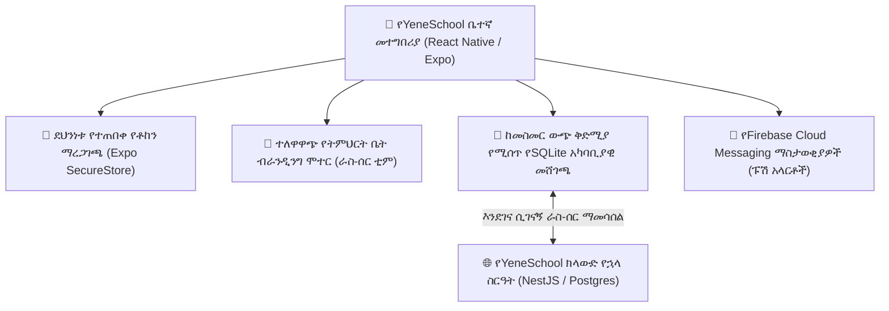

# የሞባይል መተግበሪያ አጠቃላይ እይታ እና አርክቴክቸር

የYeneSchool ሞባይል መተግበሪያ ለመምህራን፣ ለወላጆች፣ ለተቆጣጣሪዎች እና ለተማሪዎች በሁለቱም **Android** እና **iOS** መሣሪያዎች ላይ ቤተኛ (native)፣ ባለከፍተኛ አፈጻጸም የሞባይል ተሞክሮ ይሰጣል። በReact Native እና Expo ላይ የተገነባው መተግበሪያው ከመስመር ውጭ ቅድሚያ የሚሰጥ አርክቴክቸር (offline-first architecture)፣ የአካባቢያዊ SQLite የውሂብ ጎታ ማከማቻ፣ ተለዋዋጭ የትምህርት ቤት ብራንዲንግ እና ቅጽበታዊ የባዮሜትሪክ ማረጋገጫ ይዟል።

---

## 1. ዋና የሞባይል ተግባራት

- **ራስ-ሰር የትምህርት ቤት ብራንዲንግ**: ተጠቃሚው ሲገባ፣ መተግበሪያው የትምህርት ቤቱን አርማ፣ ዋና የብራንድ ቀለም እና የፖርታል ቅጥ (styling) በራስ-ሰር ያመጣል፣ በዚህም የተቋሙን ነጭ-መለያ (white-label) ተሞክሮ ይሰጣል።
- **ከመስመር ውጭ ቀጣይነት**: ከኢንተርኔት ሲቋረጥም የመገኘት ምዝገባን፣ የተማሪ ዝርዝሮችን መመልከትን እና የቀጣይ ግምገማ ውጤቶችን ማስገባትን ሙሉ በሙሉ ይደግፋል።
- **የብዙ ቋንቋ ድጋፍ**: በመሣሪያው ላይ በቅጽበት በ**አማርኛ**፣ በ**አፋን ኦሮሞ**፣ በ**ትግርኛ**፣ በ**ሶማሊ**፣ በ**ዓረብኛ** እና በ**እንግሊዝኛ** መቀየር ይቻላል።
- **ባዮሜትሪክ ደህንነት**: በመሣሪያው ሃርድዌር ቁልፍ ሰንሰለት (keychain) አማካኝነት የአሻራ / Face ID በመጠቀም ፈጣን እና ደህንነቱ የተጠበቀ መግቢያ (`Expo SecureStore`)።
- **በእውነተኛ ጊዜ የፑሽ ማስታወቂያዎች**: ለተማሪ መቅረት፣ በአውቶቡስ መሳፈር፣ የድንገተኛ አደጋ ስርጭት እና የክፍያ ደረሰኝ ትውልድ ቅጽበታዊ የቤተኛ ማሳወቂያዎች።

---

## 2. የሚደገፉ ኦፕሬቲንግ ሲስተሞች እና ጭነት

| መድረክ | ዝቅተኛው የOS ስሪት | የስርጭት መንገድ |
| :--- | :--- | :--- |
| **Android** | Android 8.0 (Oreo) ወይም ከዚያ በላይ | የGoogle Play መደብር እና ቀጥታ የAPK ማውረድ |
| **iOS / iPadOS** | iOS 14.0 ወይም ከዚያ በላይ | የApple App መደብር እና TestFlight |

### ለመጀመሪያ ጊዜ መተግበሪያውን መክፈት እና መግባት
1. በስማርትፎንዎ ወይም ታብሌትዎ ላይ **የYeneSchool መተግበሪያን** ይክፈቱ።
2. **የተጠቃሚ ስምዎን፣ ኢሜይልዎን ወይም የተማሪ/መምህር መለያ ኮድዎን** እና **የይለፍ ቃልዎን** ያስገቡ።
   - *ማስታወሻ*: የትምህርት ቤት መለያ ኮድን በእጅ ማስገባት አያስፈልግም — የYeneSchool የኋላ ስርዓት ከልዩ ማስረጃዎችዎ የትምህርት ቤቶ ግንኙነትን በራስ-ሰር ይለያል።
3. በመጀመሪያ መግቢያ ላይ ከተጠየቀ፣ በቅጽበት የይለፍ ቃል ጥንካሬ መለኪያ አማካኝነት አዲስ ደህንነቱ የተጠበቀ የይለፍ ቃል ያዘጋጁ።
4. ለፈጣን መዳረሻ **የባዮሜትሪክ ፈጣን መግቢያ**ን (የአሻራ / የፊት ማንቃት) ያንቁ።

---

## 3. ጨለማ ሞድ እና የቲም ማበጀት

የሞባይል መተግበሪያው የስርዓቱን ጨለማ ሞድ ሙሉ በሙሉ ይደግፋል፡
- **የብርሃን ቲም**: ለውጭ ፀሀይ ብርሃን ተነባቢነት የተነደፈ ንጹህ፣ ዘመናዊ እና ከፍተኛ ንፅፅር ያለው በይነገጽ።
- **ጥልቅ የከሰል ጠቆር ቲም**: ለOLED/AMOLED ስክሪኖች የባትሪ ቁጠባ የተመቻቸ፣ (`#111111` ዳራ፣ `#1A1A1A` ካርዶች እና ከፍተኛ ንፅፅር ያለው ጽሑፍ)።
- **ራስ-ሰር / ስርዓቱን መከተል**: በስልክዎ ኦፕሬቲንግ ሲስተም መርሃ ግብር መሰረት በራስ-ሰር ይቀየራል።

---

## ቀጣይ እርምጃዎች

- [የመምህር የሞባይል ተሞክሮ](/am/mobile/teacher-mobile) — ከመስመር ውጭ የመገኘት ምዝገባ፣ የውጤት ማስገቢያ እና ዲጂታል ግንኙነት
- [የወላጅ የሞባይል ተሞክሮ](/am/mobile/parent-mobile) — በእውነተኛ ጊዜ የመገኘት ማስታወቂያዎች፣ የውጤት ካርዶች እና የክፍያ ክፍያዎች
- [QR መገኘት እና የመታወቂያ ስካን](/am/mobile/qr-attendance) — ለሮል-ኮል እና ለበር ደህንነት ፈጣን የካሜራ ባርኮድ ቅኝት