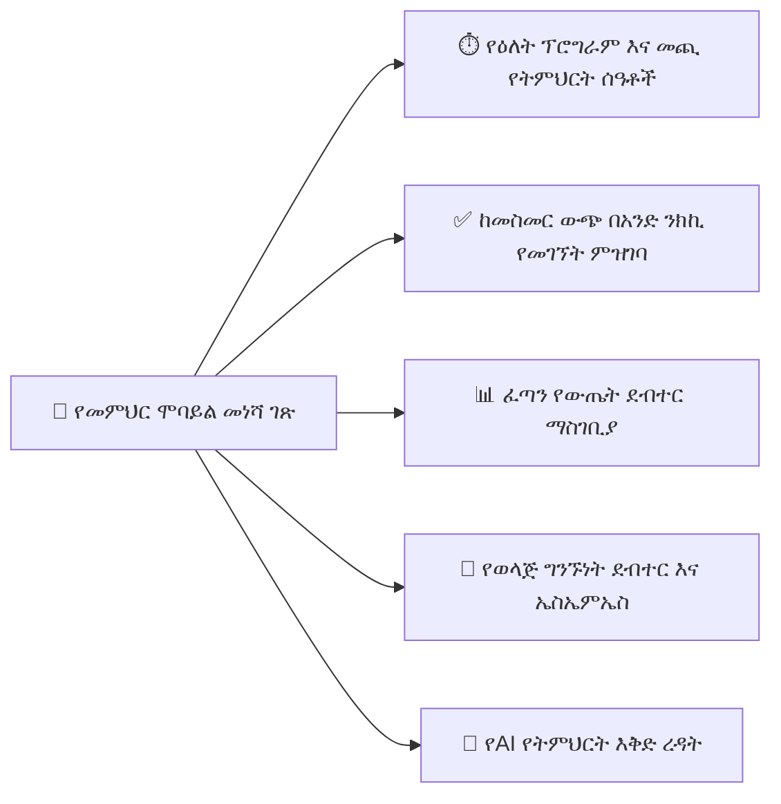

# የመምህር የሞባይል ተሞክሮ

የYeneSchool ሞባይል መተግበሪያ መምህራንን በስማርትፎናቸው ላይ ፈጣን እና ቀላል የክፍል ረዳት (classroom copilot) ያደርጋቸዋል። መምህራን የዕለት መገኘት ምዝገባን በ30 ሰከንድ ውስጥ ማከናወን፣ በክፍሉ ውስጥ ሲዘዋወሩ ውጤት ማስገባት፣ የዕለት ፕሮግራማቸውን መመልከት እና የግል ስልክ ቁጥራቸውን ሳያጋሩ ከወላጆች ጋር መገናኘት ይችላሉ።

---

## 1. የዕለት ፕሮግራም እና መጪ የትምህርት ሰዓቶች መግብር

መምህሩ የሞባይል መተግበሪያውን ሲከፍት፡
- የላይኛው ራስጌ **የአሁኑን ንቁ የትምህርት ሰዓት** ከክፍል ቁጥር፣ ከትምህርት እና ከተማሪ ብዛት ጋር ያመላክታል።
- **መገኘትን አሁን ይመዝግቡ** ላይ አንድ ጊዜ መታ በማድረግ ያንን ልዩ ንቁ ክፍል የመገኘት ምዝገባ በቀጥታ ይጀምራል።
- የ**የዛሬ ፕሮግራም** ትር የሙሉ ቀን የትምህርት ሰዓት መስመሩን፣ የእረፍት ጊዜዎችን እና ነፃ የእቅድ ሰዓቶችን ያሳያል።

---

## 2. በሞባይል መገኘት ምዝገባ ማድረግ (በመስመር እና ከመስመር ውጭ)

መምህራን የክፍል መገኘት ምዝገባን በ**ዝርዝር ሞድ** (List Mode) ወይም በ**ፈጣን የመንሸራተት ሞድ** (Speed Swipe Mode) ማድረግ ይችላሉ፡

### የዝርዝር ሞድ
1. ንቁውን ክፍል ይንኩ (ለምሳሌ፣ *9ኛ ክፍል B — ሒሳብ*)።
2. ከእያንዳንዱ ተማሪ ስም አጠገብ ያለውን የሁኔታ ባጅ ይንኩ፡
   - **አረንጓዴ (P)**: ተገኝቷል *(ለሁሉም ተማሪዎች ነባሪ)*።
   - **ቀይ (A)**: አልተገኘም።
   - **ቢጫ (L)**: ዘግይቷል / ማርገዝ *(የዘገየበትን ደቂቃ ይጠይቃል)*።
   - **ሰማያዊ (E)**: በምክንያት አልተገኘም / የህክምና ክፍል።
3. ከፍተኛ የመገኘት ቀናት ላይ ለፈጣን የቡድን ምዝገባ **ሁሉም ተገኝተዋል ምልክት ያድርጉ**ን ይንኩ።
4. **መገኘት ያስገቡ**ን ይንኩ።

> [!TIP]
> **በክፍል ውስጥ ኢንተርኔት የለም?** መገኘትን ሙሉ በሙሉ ከመስመር ውጭ መዝግበው ይችላሉ። መተግበሪያው ሁሉንም መዝገቦች በአካባቢያዊ SQLite ማከማቻ ውስጥ ያከማቻል እና ወደ Wi-Fi ወይም ወደ ሞባይል ውሂብ ሲገናኙ ለትምህርት ቤቱ ሰርቨር በራስ-ሰር ይልካቸዋል።

---

## 3. ፈጣን ቀጣይ ግምገማ እና የውጤት ደብተር ማስገቢያ

1. ወደ **ውጤት ደብተር** (Gradebook) ትር ይሂዱ።
2. **ክፍሉን**፣ **ትምህርቱን** እና **የግምገማውን ንጥል** ይምረጡ (ለምሳሌ፣ *ኩዊዝ 2 / 10 ነጥብ*)።
3. ማንኛውንም የተማሪ ረድፍ ይንኩ እና ውጤቱን በብጁ የቁጥር ቁልፍ ሰሌዳ አማካኝነት ያስገቡ።
4. ስርዓቱ የማይፈቀዱ ውጤቶችን በአጋጣሚ እንዳይገቡ በእውነተኛ ጊዜ ከፍተኛውን የተቻለ ነጥብ ያረጋግጣል (ለምሳሌ፣ በ10 ነጥብ ኩዊዝ ላይ 20 ማስገባት)።
5. **ውጤቶችን አስቀምጥ**ን ይንኩ።

---

## 4. ዲጂታል የመገናኛ ደብተር እና ቀጥተኛ የወላጅ መልዕክት

መምህራን የክፍል ዝማኔዎችን፣ የቤት ስራ አስታዋሾችን እና የግለሰብ ተማሪ ግብረመልስን ማስተላለፍ ይችላሉ፡
- **የክፍል ስርጭት**: ለዚያ ክፍል ለሁሉም ወላጆች የሚታዩ ማስታወቂያዎችን ማሰራጨት።
- **ቀጥተኛ የተማሪ ማስታወሻ**: ለአንድ የተወሰነ ተማሪ ወላጆች የግል የባህሪ ወይም የትምህርት ማስታወሻ መጻፍ።
- **ግላዊነት የተረጋገጠ**: የመምህሩ የግል የስልክ ቁጥር በጭራሽ አይጋለጥም — ሁሉም ግንኙነቶች በደህንነት በYeneSchool ማሳወቂያ መግቢያ (gateway) በኩል ያልፋሉ።

---

## ቀጣይ እርምጃዎች

- [የወላጅ የሞባይል ተሞክሮ](/am/mobile/parent-mobile) — ወላጆች የተማሪ እድገትን እንዴት እንደሚመለከቱ እና ማስታወቂያዎችን እንደሚቀበሉ
- [QR መገኘት እና የመታወቂያ ስካን](/am/mobile/qr-attendance) — መገኘትን በባርኮድ እና QR ቅኝት ያፋጥኑ
- [የሞባይል ከመስመር ውጭ ማመሳሰል ሞተር](/am/mobile/offline-sync) — ከመስመር ውጭ የSQLite የውሂብ ጎታ መባዛት እንዴት እንደሚሰራ