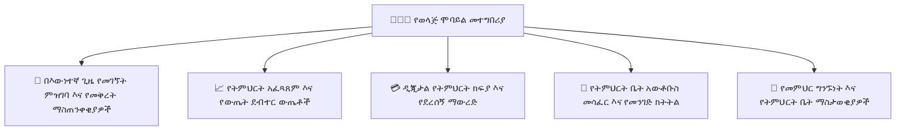

# የወላጅ የሞባይል ተሞክሮ

የYeneSchool የወላጅ ሞባይል መተግበሪያ ቤተሰቦችን ከልጆቻቸው የዕለት ትምህርታዊ ጉዞ ጋር በቅርበት ያቆራኛል። ወላጆች የቀጥታ መገኘትን መከታተል፣ የፈተና ውጤቶችን ሲመዘገቡ ወዲያውኑ ማየት፣ ዲጂታል የውጤት ካርዶችን መመርመር፣ የትምህርት ቤት አውቶቡስ አካባቢን መከታተል እና የትምህርት ክፍያን በደህንነት መክፈል ይችላሉ።

---

## 1. የብዙ ልጆች መገለጫ መቀየሪያ

በተመሳሳይ ትምህርት ቤት ውስጥ ከአንድ በላይ ልጆች ለተመዘገቡ ወላጆች (ለምሳሌ፣ አንድ ልጅ በ4ኛ ክፍል እና ሌላኛው በ9ኛ ክፍል)፡
- የላይኛው የመተግበሪያ ራስጌ ንቁ **የልጅ መቀየሪያ መገርሰሻ** (Child Switcher Carousel) ያሳያል።
- የማንኛውንም ልጅ አቫታር መታ በማድረግ ሳይወጡ የመተግበሪያውን አጠቃላይ እይታ (መገኘት፣ ውጤቶች፣ ፕሮግራም፣ የክፍያ ቀሪ ሂሳብ) በቅጽበት ይቀይራሉ።

---

## 2. የእውነተኛ ጊዜ መገኘት እና የደህንነት ማስጠንቀቂያዎች

- **የጠዋት መድረስ ማረጋገጫ**: የክፍል መምህሩ ልጅዎን ተገኝቷል ሲያደርግ ወይም የመታወቂያ ካርዳቸው በትምህርት ቤቱ በር ሲቃኝ ቅጽበታዊ የፑሽ ማሳወቂያ ይደርስዎታል።
- **ያለምክንያት መቅረት ማስጠንቀቂያ**: ልጅዎ አልተገኘም ከተባለ፣ መተግበሪያው ፈጣን ማረጋገጫ ወይም የምክንያት ማስታወሻ የሚጠይቅ ቅድሚያ ያለው ማሳወቂያ ወዲያውኑ ይልካል።
- **የወርሃዊ የመገኘት ካሌንደር**: የመገኘት ቀናትን (አረንጓዴ)፣ የዘገየ መድረስን (ቢጫ) እና በምክንያት አለመገኘትን (ሰማያዊ) የሚያሳይ በቀለም የተከፋፈለ የካሌንደር ዝርዝር።

---

## 3. የቀጥታ የትምህርት አፈጻጸም እና ዲጂታል የውጤት ካርዶች

- **የቅጽበት ግምገማ ግብረመልስ**: የኩዊዝ፣ የፈተና እና የቤት ስራ ውጤቶችን ከመምህር አስተያየቶች ጋር ወደ ውጤት ደብተሩ እንደገቡ ማየት።
- **የአፈጻጸም አዝማሚያ ግራፎች**: የልጅዎ ውጤቶች እየጨመሩ መሆናቸውን ወይም በተወሰኑ ትምህርቶች ተጨማሪ ድጋፍ እንደሚያስፈልጋቸው መከታተል።
- **የPDF የውጤት ካርድ ማውረድ**: በእያንዳንዱ የትምህርት ዘመን መጨረሻ ላይ በይፋ የተፈረሙና ማህተም የተደረገባቸው ዲጂታል የውጤት ካርዶችን በቀጥታ ወደ ስልክዎ ማከማቻ ማውረድ።

---

## 4. የሞባይል ክፍያ ክፍያዎች እና ዲጂታል ደረሰኞች

1. ከታችኛው የመጠቀሚያ አሞሌ ላይ **ፋይናንስ** ትሩን ይንኩ።
2. የአሁኑን ቀሪ ሂሳብ፣ መጪ የክፍያ ክፍልፋይ ቀናት እና የክፍያ ዝርዝር (የትምህርት ክፍያ፣ መጓጓዣ፣ የላብራቶሪ ክፍያ) ይመልከቱ።
3. **በመስመር ይክፈሉ**ን ይንኩ (የዲጂታል ክፍያ መግቢያ ውህደት በነቃበት) ወይም የትምህርት ቤቱን የባንክ ሂሳብ ቁጥሮች ይመልከቱ እና የባንክ ማስተላለፊያ ተቀማጭ ወረቀት ይስቀሉ።
4. በይፋ ማህተም የተደረገባቸውን **የክፍያ ደረሰኞች** ለግብር እና ለቤተሰብ መዝገብ በቅጽበት ይመልከቱ፣ ያውርዱ ወይም ያጋሩ።

---

## ቀጣይ እርምጃዎች

- [QR መገኘት እና የመታወቂያ ስካን](/am/mobile/qr-attendance) — የተማሪ መታወቂያ ባጆች በትምህርት ቤት በሮች ላይ እንዴት እንደሚቃኙ
- [የሞባይል ከመስመር ውጭ ማመሳሰል ሞተር](/am/mobile/offline-sync) — የአካባቢያዊ መሸጎጫ እና ማመሳሰል አርክቴክቸር
- [የወላጅ እና የተማሪ ድር ፖርታል መመሪያ](/am/parent/overview) — የዴስክቶፕ የወላጅ ፖርታል ሙሉ አጠቃላይ እይታ