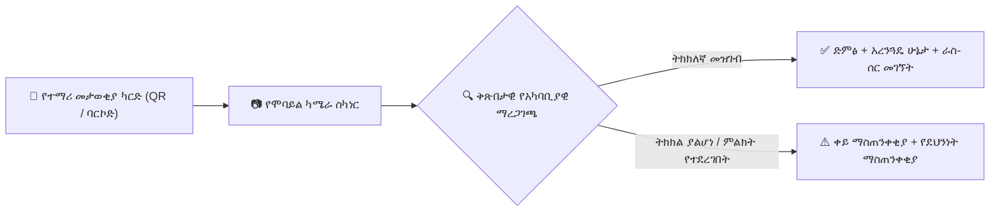

# የQR ኮድ እና ባርኮድ መገኘት ስካን

YeneSchool ማንኛውንም የAndroid ወይም iOS ስማርትፎን ከፍተኛ ፍጥነት ያለው የኦፕቲካል ባርኮድ ስካነር ያደርገዋል። የመሣሪያውን ቤተኛ ካሜራ በመጠቀም መምህራን፣ የአውቶቡስ አጃቢዎች እና የደህንነት ጠባቂዎች ያለ ልዩ ውጫዊ ሃርድዌር ማንነትን ማረጋገጥ እና ክስተቶችን በሚሊሰከንዶች ውስጥ መመዝገብ ይችላሉ።

---

## 1. የሚደገፉ የስካን አጠቃቀም ጉዳዮች

| የስራ ሂደት | አካሂዶ የሚያከናውኑ ሰራተኞች | በስካን የሚቀሰቀስ ተግባር |
| :--- | :--- | :--- |
| **የጠዋት ዋና መግቢያ በር** | የካምፓስ ደህንነት ጠባቂዎች | ተማሪው ላይ `Arrived on Campus` ምልክት ያደርጋል፣ የአሁኑን ምዝገባ ያረጋግጣል እና ለወላጅ የመድረስ ኤስኤምኤስ ይልካል። |
| **የክፍል መገኘት ምዝገባ** | የክፍል መምህራን | ለትልቅ ክፍሎች ፈጣን መገኘት ምዝገባ (እስከ 40 ተማሪዎች በ90 ሰከንድ ውስጥ)። |
| **የትምህርት ቤት አውቶቡስ መሳፈር** | የመጓጓዣ አጃቢዎች | ተማሪው በተመደበለት ትክክለኛ መንገድ እና ማቆሚያ እየሳፈረ መሆኑን ያረጋግጣል። |
| **ካፍቴሪያ / የመመገቢያ አዳራሽ** | የምግብ አቅራቢ ሰራተኞች | የምግብ እቅድ መብትን ያረጋግጣል እና የተደጋገመ የምግብ ጥያቄን ይከላከላል። |
| **የፈተና አዳራሽ መግቢያ ምዝገባ** | የፈተና ተቆጣጣሪዎች | የተማሪውን የፈተና መግቢያ ትኬት እና የመቀመጫ ምደባ ቁጥር ያረጋግጣል። |

---

## 2. የሞባይል ስካነሩን መጠቀም

### የስካን ክፍለ ጊዜ እንዴት እንደሚጀመር
1. **የYeneSchool ሞባይል መተግበሪያን** ይክፈቱ።
2. በላይኛው የመጠቀሚያ አሞሌ ላይ የሚንሳፈፈውን **የስካነር አዶ** ይንኩ።
3. የስካን ሞዱን ይምረጡ፡
   - `Campus Gate Attendance`
   - `Classroom Roll-Call`
   - `Bus Manifest Check`
4. የካሜራውን እይታ በተማሪው አካላዊ መታወቂያ ካርድ ላይ በተታተመው QR ኮድ ወይም ባርኮድ ላይ ያነጣጥሩ።
5. **ቅጽበታዊ ግብረመልስ**፡
   - ስልኩ የተለየ የድምፅ ምልክት (beep) እና የመንቀጥቀጥ (haptic) ኮምፕቶን ይሰጣል።
   - የተማሪው ፎቶ፣ ስም፣ ክፍል እና የድንገተኛ ጊዜ ግንኙነት በስክሪኑ ላይ ይታያሉ።
   - አረንጓዴ ምልክት (checkmark) የተሳካ የመገኘት ምዝገባን ያረጋግጣል።

> [!TIP]
> **ቀጣይ ፈጣን የስካን ሞድ**: በስካኖች መካከል ሳይነኩ ካሜራውን ንቁ ለማድረግ በቅንብሮች ውስጥ *ቀጣይ ስካን*ን ያንቁ። አንድን ሙሉ የተማሪ ወረፋ ያለ ምንም መዘግየት አንድ በአንድ መቃኘት ይችላሉ።

---

## 3. ከፍተኛ-ደህንነት ፀረ-ማጭበርበር ባህሪያት

- **የፎቶ ማንነት ማረጋገጫ**: በሰርቨሩ ላይ የተከማቸው ባለከፍተኛ ጥራት የተማሪ ፎቶ በስካን ጊዜ በቅጽበት ይታያል፣ ይህም ተማሪዎች ካርድ ከጓደኞቻቸው ጋር እንዳይለዋወጡ ይከላከላል።
- **የተደጋገመ ስካን ማገድ**: ካርዱ በተመሳሳይ የጠዋት መስኮት ውስጥ ሁለት ጊዜ ከተቃኘ፣ መተግበሪያው *"በ07:14 AM ቀድሞ ተቃኝቷል"* በማለት ያስጠነቅቃል።
- **የመስመር ውጭ ስካን መሸጎጫ**: የትምህርት ቤቱ Wi-Fi ለጊዜው ቢወጣም የበር ስካኖች ያለችግር ይቀጥላሉ። ስካኖች በአካባቢያዊ SQLite ውስጥ በደህንነት ይከማቻሉ እና ግንኙነት ሲመለስ ይመሳሰላሉ።

---

## ቀጣይ እርምጃዎች

- [የሞባይል ከመስመር ውጭ ማመሳሰል ሞተር](/am/mobile/offline-sync) — የአካባቢያዊ SQLite የመስመር ውጭ ወረፋ እንዴት እንደሚሰራ ይማሩ
- [የሬጅስትራር የተማሪ መታወቂያ ካርዶች](/am/registrar/id-cards) — ሊቃኙ የሚችሉ የተማሪ መታወቂያ ካርዶችን እንዴት ማመንጨት እና ማተም
- [የመጓጓዣ አስተዳደር](/am/operations/transport) — በእውነተኛ ጊዜ የአውቶቡስ መሳፈር ማኒፌስቶች