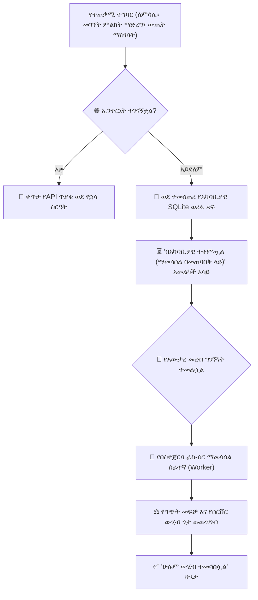

# የሞባይል ከመስመር ውጭ ማመሳሰል ሞተር እና አርክቴክቸር

አስተማማኝ ያልሆነ ወይም የሚወዛወዝ የኢንተርኔት ግንኙነት በትምህርት ተቋማት ውስጥ የተለመደ ፈተና ነው። YeneSchool የተገነባው በ**ከመስመር ውጭ ቅድሚያ የሚሰጥ ፍልስፍና** (offline-first philosophy) ነው፡ የሞባይል መተግበሪያው የኢንተርኔት ግንኙነት ሲወድቅ የተጠቃሚውን ምርታማነት በጭራሽ አያደናቅፍም።

---

## 1. በሞባይል ላይ ሙሉ በሙሉ ከመስመር ውጭ የሚሰሩ ነገሮች

የሞባይል መተግበሪያው የቅርብ ጊዜውን የትምህርት ቤት ሁኔታ በመሣሪያ ማከማቻ ላይ ያሸግጣል፡

- **ሙሉ የተማሪ ዝርዝሮች እና ፎቶዎች**: ያለ ንቁ ግንኙነት የክፍል ዝርዝሮችን እና የተማሪ መገለጫዎችን ማሰስ።
- **የመገኘት ምዝገባ**: የዕለት፣ የሰዓት እና የአውቶቡስ መገኘትን ከመስመር ውጭ ማድረግ።
- **ቀጣይ ግምገማ እና የውጤት ማስገቢያ**: የፈተና፣ የኩዊዝ እና የሙከራ ውጤቶችን ማስገባት።
- **ከመስመር ውጭ ፕሮግራም እና የክፍል መርሃ ግብሮች**: የክፍል ምደባዎችን እና የሰዓት መርሃ ግብሮችን መመልከት።
- **የዲሲፕሊን ክስተት መመዝገቢያ**: የተማሪ የባህሪ ማስታወሻዎችን በቦታው መመዝገብ።

---

## 2. የአካባቢያዊ SQLite ማመሳሰል ወረፋ

ከመስመር ውጭ ሆኖ ሳለ አንድ ተግባር ሲከናወን፡
1. መተግበሪያው ይዘቱን (payload) (ለምሳሌ፣ `attendance_records_batch`) በአካባቢያዊ ልዩ UUID፣ በሞኖቶኒክ ታይምስታምፕ እና በክሪፕቶግራፊክ ሃሽ ይሰነዝራል።
2. ይዘቱ በመሣሪያው የአካባቢያዊ **SQLite ውሂብ ጎታ** ውስጥ ይጻፋል።
3. በላይኛው የመጠቀሚያ አሞሌ ላይ የሚታይ ስውር የአምበር ክላውድ አመልካች የሚያሳየው፡ *"3 ያልተመሳሰሉ ተግባራት በአካባቢያዊ ተከማችተዋል"*።
4. ተጠቃሚው ያለ ምንም መዘግየት ወይም ስፒነር ማገጃ መስራቱን ይቀጥላል።

---

## 3. የበስተጀርባ ማመሳሰል እና የግጭት መፍቻ ስልቶች

የአውታረ መረብ ግንኙነት (በWi-Fi ወይም በሴሉላር ውሂብ) ወዲያውኑ ሲመለስ፡
1. **የአውታረ መረብ ማዳመጫ ቀስቅሴ**: መተግበሪያው የ`online` ሁኔታ ለውጥን ይለያል።
2. **በቅደም ተከተል የባች ማፍሰሻ**: የማመሳሰል ሰራተኛው በSQLite ወረፋ ውስጥ በጥብቅ የጊዜ ቅደም ተከተል ያካሂዳል እና ጥያቄዎችን ወደ የኋላ ስርዓት የማመሳሰያ ነጥብ (endpoint) ይልካል (`POST /sync/batch`)።
3. **የግጭት መፍቻ ስልት**፡
   - **የአካል ታይምስታምፕ ያለው Last-Write-Wins**: ለውጤት አርትዖቶች፣ በጣም የቅርብ ጊዜው የተረጋገጠ ታይምስታምፕ ያሸንፋል።
   - **ለመገኘት የሰርቨር ውህደት**: ስንጥቅ-አእምሮ (split-brain) ሲከሰት መገኘት በሁለቱም ሞባይል እና ድር ላይ ከተመዘገበ፣ መዝገቦቹ በእያንዳንዱ የተማሪ መዝገብ ይዋሃዳሉ።
4. **የወረፋ ቁርጥነት**: በተሳካ ሁኔታ የተፈጸሙ ግብይቶች የመሣሪያ ማከማቻ አሻራ አነስተኛ እንዲሆን (< 25 MB) ከአካባቢያዊ ማከማቻ ይጸዳሉ።
5. የመጠቀሚያ አሞሌው የክላውድ አዶ አረንጓዴ እና የማረጋገጫ ምልክት ይይዛል፡ *"ሁሉም ለውጦች ተመሳስለዋል"*።

---

## ቀጣይ እርምጃዎች

- [የመድረክ ከመስመር ውጭ ሞድ (PWA)](/am/platform/offline) — የዴስክቶፕ ድር ከመስመር ውጭ ሞድ እንዴት እንደሚሰራ ይወቁ
- [የሞባይል መተግበሪያ አጠቃላይ እይታ](/am/mobile/overview) — አጠቃላይ የሞባይል መተግበሪያ አርክቴክቸር እና ማዋቀር
- [የውሂብ ጥራት እና ኦዲቶች](/am/operations/data-quality-audit) — የተመሳሰለ ውሂብ ትክክለኛነት ኦዲት