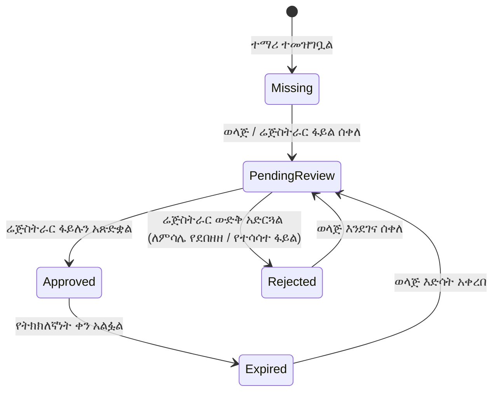

# ሰነዶች እና ተገዢነት አጠቃላይ እይታ

የ**ትምህርት ቤት ሰነዶች እና ተገዢነት ማዕከል** ለሁሉም የተቋም ፖሊሲዎች፣ የቁጥጥር መዝገቦች እና የተማሪ መግቢያ ሰነዶች የተማከለ፣ ደህንነቱ የተጠበቀ ማከማቻ ያቀርባል። እያንዳንዱ የተመዘገበ ተማሪ አስገዳጅ ህጋዊ እና የትምህርት ሰነድ መስፈርቶችን የሚያሟላ መሆኑን ያረጋግጣል፣ በተመሳሳይ ጊዜ ለሰራተኞች እና ለወላጆች የፀደቁ የትምህርት ቤት መመሪያዎችን ፈጣን መዳረሻ ይሰጣል።

::u-page-grid
:::u-page-card
---
title: የተቋም ማከማቻ
icon: i-lucide-files
---
የትምህርት ቤት ህጎችን፣ የሰራተኛ መመሪያ ደብተሮችን፣ የስርዓተ-ትምህርት መግለጫዎችን እና ይፋዊ ቅጾችን በሚና-ተኮር የመዳረሻ ቁጥጥር (role-based access control) ያከማቹ እና ያደራጁ።
:::

:::u-page-card
---
title: የተማሪ ተገዢነት
icon: i-lucide-shield-check
---
የልደት የምስክር ወረቀቶችን፣ የክትባት ካርዶችን፣ የዝውውር የምስክር ወረቀቶችን እና የቀድሞ የውጤት ቅጂዎችን ጨምሮ አስገዳጅ የመግቢያ ሰነዶችን ይከታተሉ።
:::

:::u-page-card
---
title: የማረጋገጫ ወረፋ
icon: i-lucide-user-check
---
ሬጅስትራሮች የወላጅ ስቀለቶችን እንዲገመግሙ፣ ትክክለኛነትን እንዲያረጋግጡ እና ስቀለቶችን በግብረመልስ እንዲያጸድቁ ወይም እንዲቀበሉ የሚያስችል የተስተካከለ የስራ ሂደት።
:::
::

---

## የሰነድ ምደባ እና ምድቦች

በYeneSchool ውስጥ የተሰቀሉ ሁሉም ሰነዶች በመደበኛ ምድቦች ይደራጃሉ፡

| ምድብ | የተካተቱ የተለመዱ ሰነዶች | ነባሪ እይታ |
| :--- | :--- | :--- |
| **`POLICIES`** | የሰራተኛ መመሪያ ደብተሮች፣ የተማሪ የስነምግባር ደንብ፣ የደህንነት እና የድንገተኛ አደጋ እቅዶች | ለሰራተኞች ብቻ ወይም ለህዝብ |
| **`ACADEMIC`** | የስርዓተ-ትምህርት ማዕቀፎች፣ የስርዓተ-ትምህርት መመሪያዎች፣ የብሄራዊ ፈተና መርሃ ግብሮች | ለሰራተኞች እና ተማሪዎች |
| **`FORMS`** | የመግቢያ ማመልከቻዎች፣ የፈቃድ ጥያቄ ቅጾች፣ የተማሪ ጉዞ ፈቃድ ቅጾች | ለህዝብ |
| **`LEGAL`** | የትምህርት ሚኒስቴር እውቅና፣ የትምህርት ቤት ምዝገባ የምስክር ወረቀቶች | ለአስተዳዳሪዎች ብቻ |
| **`GENERAL`** | የጋዜጣ (Newsletter) ማህደሮች፣ የትምህርት ዘመን ካሌንደሮች፣ የወላጅ-መምህር ማህበር (PTA) ስብሰባ ደቂቃዎች | ለህዝብ |

---

## የመዳረሻ ቁጥጥር እና ታዳሚ ደረጃዎች

ደህንነትን እና ግላዊነትን ለመጠበቅ፣ እያንዳንዱ ሰነድ **የታዳሚ ምልክት** (Audience Flag) ይመደብለታል፡

- 🌐 **`PUBLIC`**: ለሁሉም የገቡ ወላጆች፣ ተማሪዎች፣ መምህራን እና የአስተዳደር ሰራተኞች ተደራሽ። ለትምህርት ዘመን ቀናት፣ ለክስተት መርሃ ግብሮች እና ለትምህርት ቤት የስነምግባር ደንቦች ተስማሚ።
- 🧑‍🏫 **`STAFF_ONLY`**: ለዳይሬክተሮች፣ መምህራን፣ ሬጅስትራሮች እና የፋይናንስ ኦፊሰሮች ብቻ የተገደበ። ለውስጣዊ የሰራተኛ መመሪያ ደብተሮች እና የመማር-ማስተማር መመሪያዎች ያገለግላል።
- 🔒 **`ADMIN_ONLY`**: በጥብቅ ለትምህርት ቤት ዳይሬክተሮች እና ሬጅስትራሮች ብቻ ይታያል። ለሚስጥር የቁጥጥር መዝገቦች እና የህጋዊ ኦዲት ሰነዶች የተያዘ።

---

## የተማሪ ተገዢነት ሁኔታ የህይወት ዑደት

እያንዳንዱ የተማሪ ምዝገባ ሰነድ ራስ-ሰር የተገዢነት የህይወት ዑደት ያልፋል፡

---

## ቀጣይ እርምጃዎች

- [የተማሪ ተገዢነት ማረጋገጫ](/am/documents/student-compliance) — በእያንዳንዱ ተማሪ የሚፈለጉ ፋይሎችን ይከታተሉ
- [የወላጅ ስቀለቶች እና የግምገማ ወረፋ](/am/documents/parent-submissions) — የቀረቡ ሰነዶችን ይገምግሙ እና ያረጋግጡ
- [የተቋም ፖሊሲዎች እና መመሪያ ደብተሮች](/am/documents/institutional-policies) — የትምህርት ቤት መመሪያዎችን እና ቅጾችን ያትሙ