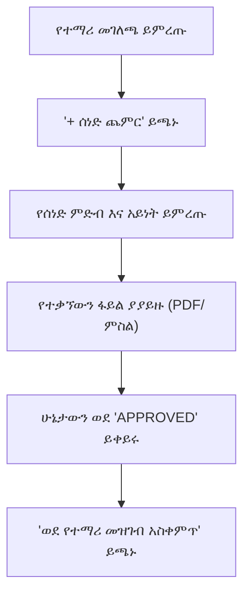

# የተማሪ ተገዢነት ክትትል

የትምህርት ባለስልጣናት እና የትምህርት ቤት እውቅና ደረጃዎች ተቋማት ለእያንዳንዱ የተመዘገበ ተማሪ የተሟላ እና የተረጋገጠ መዝገብ እንዲይዙ ይጠይቃሉ። **የተማሪ ተገዢነት ዳሽቦርድ** (`/documents`) ሬጅስትራሮች እና ዳይሬክተሮች በሁሉም የክፍል ደረጃዎች የሰነድ ሙሉነትን በእውነተኛ ጊዜ እንዲከታተሉ ያስችላቸዋል።

---

## መደበኛ የተገዢነት ቼክሊስት

ተማሪ ሲመዘገብ፣ ስርዓቱ በትምህርት ቤቱ በተዋቀሩ የመግቢያ መስፈርቶች ላይ በመመስረት የተገዢነት ቼክሊስት በራስ-ሰር ይከፍታል፡

| የሚፈለግ ሰነድ | መግለጫ | ተቀባይነት ያለው ቅርጸት | አስገዳጅ? |
| :--- | :--- | :--- | :--- |
| **የልደት የምስክር ወረቀት** | ዕድሜን እና ህጋዊ ስም የሚያረጋግጥ በመንግስት የተሰጠ ይፋዊ የልደት የምስክር ወረቀት | PDF, JPG, PNG | አዎ (ሁሉም ክፍሎች) |
| **የክትባት ካርድ** | በፈቃድ ባለው ክሊኒክ ወይም ሆስፒታል የተፈረመ የጤና እና የክትባት ካርድ | PDF, JPG, PNG | አዎ (ከመዋዕለ ህፃናት – 4ኛ ክፍል) |
| **የዝውውር የምስክር ወረቀት (TC)** | ከቀድሞው የተማሪ ትምህርት ቤት ይፋዊ የመልቀቂያ የምስክር ወረቀት | PDF | አዎ (የዝውውር ተማሪዎች) |
| **የቀድሞ የትምህርት ውጤት ቅጂ** | ከተጠናቀቀው የመጨረሻ ክፍል የተረጋገጠ የውጤት ካርድ ወይም ትራንስክሪፕት | PDF | አዎ (ከ1ኛ – 12ኛ ክፍል) |
| **የአሳዳጊ መታወቂያ / የቀበሌ ካርድ** | የተሾመው ዋና አሳዳጊ የመንግስት መታወቂያ ካርድ | PDF, JPG, PNG | አዎ (ሁሉም ተማሪዎች) |
| **የፓስፖርት ፎቶ** | ለመታወቂያ ባጅ ህትመት የቅርብ ጊዜ ዲጂታል የፓስፖርት ፎቶ | JPG, PNG | አዎ (ሁሉም ተማሪዎች) |

---

## የተገዢነት ዳሽቦርዱን ማሰስ

የተማሪ ተገዢነት ሁኔታን ለመገምገም፡

1. የግራ የጎን ምናሌ ይክፈቱ እና **ሰነዶች**ን ይጫኑ።
2. **የተማሪ ተገዢነት** ትሩን ይምረጡ።
3. ውጤቶቹን በ**የትምህርት ዘመን**፣ በ**ክፍል ደረጃ** ወይም በ**ክፍልፋይ (ለምሳሌ 9ኛ ክፍል A)** ለማጥራት የማጣሪያ ተቆልቋይ ምናሌዎችን ይጠቀሙ።
4. እያንዳንዱ ተማሪ የማጠቃለያ ባጅ ያሳያል፡
   - 🟢 **ተገዢ (100%)**: ሁሉም አስገዳጅ ፋይሎች ተሰቅለው ተረጋግጠዋል።
   - 🟡 **ያልተሟላ**: አንዳንድ አስገዳጅ ሰነዶች ጎድለዋል ወይም በግምገማ ላይ ናቸው።
   - 🔴 **ተገዢ ያልሆነ**: በመዝገብ ላይ የተረጋገጡ ሰነዶች የሉም።

---

## ደረጃ በደረጃ፡ በሬጅስትራር ቀጥታ ሰነድ ስቀላ

ወላጆች በፖርታላቸው በኩል ሰነዶችን ማስገባት ቢችሉም፣ ሬጅስትራሮች በአካል በቢሮ ጉብኝት ወቅት የተቃኙ አካላዊ ሰነዶችን ወደ ስርዓቱ ማስገባት ይችላሉ፡

1. የተማሪውን ረድፍ ጠቅ በማድረግ **የተገዢነት ዝርዝር መሳቢያቸውን** (Compliance Detail Drawer) ይክፈቱ።
2. ከጎደለው የሰነድ ንጥል አጠገብ **ሰነድ ይስቀሉ** ቁልፉን ይጫኑ።
3. የተቃኘውን ፋይል (PDF፣ JPG ወይም PNG፣ እስከ 10MB) ይጎትቱ እና ይጥሉ።
4. ማንኛውንም አማራጭ ማስታወሻ ያስገቡ (ለምሳሌ፣ *"ዋናው ሰነድ በሬጅስትራር 2018-01-15 ዓ.ም ላይ ተረጋግጧል"*)።
5. **አረጋግጥ እና አስቀምጥ**ን ይጫኑ። ሰነዱ ወዲያውኑ እንደ **ተፈቅዷል** ምልክት ይደረግበታል።

---

## የተገዢነት ኦዲት ዝርዝሮች ማስተላለፍ

ለቁጥጥር ፍተሻዎች ወይም ለሚኒስቴር ሪፖርት፡

1. ከሠንጠረዡ በላይ በቀኝ በኩል **ሪፖርት አስተላልፍ** (Export Report) ቁልፉን ይጫኑ።
2. የሚመርጡትን ቅርጸት ይምረጡ፡ **Excel (.xlsx)** ወይም **PDF ማጠቃለያ**።
3. የመነጨው ዝርዝር የሚያመላክቱት፡
   - የተማሪ ሙሉ ስም እና መለያ ቁጥር
   - ክፍል እና ክፍልፋይ (Section)
   - ለእያንዳንዱ አስገዳጅ ሰነድ የቼክሊስት ሁኔታ
   - የማረጋገጫ ቀን እና የገምጋሚው ሬጅስትራር ስም

---

## ቀጣይ እርምጃዎች

- [የወላጅ ስቀለቶች እና የግምገማ ወረፋ](/am/documents/parent-submissions) — ከወላጆች የቀረቡ በመጠባበቅ ላይ ያሉ ስቀለቶችን ይገምግሙ
- [የተቋም ፖሊሲዎች እና መመሪያ ደብተሮች](/am/documents/institutional-policies) — የትምህርት ቤት አቀፍ ፖሊሲዎችን እና ህጎችን ይስቀሉ
- [የሬጅስትራር የተማሪ አስተዳደር](/am/registrar/student-management) — የተማሪ የትምህርት መገለጫዎችን ያስተዳድሩ