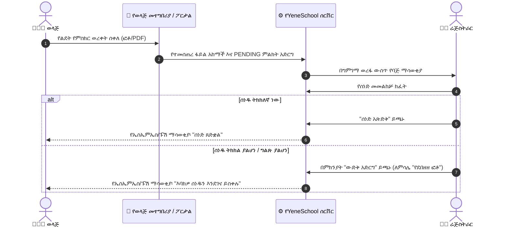

# የወላጅ ስቀለቶች እና የግምገማ ወረፋ

YeneSchool ለወላጆች ራስን የማገልገል ዲጂታል የማስገቢያ ሂደት ያቀርባል፣ ይህም በየአመቱ በመግቢያ ወቅት ረጅም የቢሮ ወረፋዎችን ያስወግዳል። ወላጆች አስፈላጊ ሰነዶችን በቀጥታ ከስማርትፎናቸው ወይም ከኮምፒውተራቸው ፎቶ ማንሳት ወይም መቃኘት ይችላሉ። ከዚያም ሬጅስትራሮች የገቡትን ፋይሎች በበይነ-ተግባራዊ የግምገማ ወረፋ ያካሂዳሉ።

---

## ወላጆች ሰነዶችን እንዴት ይሰቅላሉ (የወላጅ ተሞክሮ)

ወላጆች የሰነድ ፖርታሉን ከሁለቱም **ድር ፖርታል** እና **የYeneSchool ሞባይል መተግበሪያ** ያገኛሉ፡

1. ወደ **የወላጅ ፖርታል** ይግቡ ወይም የሞባይል መተግበሪያውን ይክፈቱ።
2. ወደ **ልጆቼ** ይሂዱ እና የልጁን መገለጫ ይምረጡ።
3. **ሰነዶች እና ተገዢነት** ትሩን ይጫኑ።
4. ስክሪኑ ሁሉንም የሚፈለጉ ነገሮች ከአሁኑ ሁኔታቸው ጋር ያሳያል፡
   - 🔴 **ድርጊት ይፈለጋል**: መሰቀል የሚያስፈልገው የጎደለ ሰነድ።
   - 🟡 **በግምገማ ላይ**: ፋይል ደርሷል እና የሬጅስትራር ማረጋገጫ እየጠበቀ ነው።
   - 🟢 **ጸድቋል**: ፋይሉ በትምህርት ቤቱ ተፈትሾ ተረጋግጧል።
   - ⚠️ **ውድቅ ተደርጓል**: ፋይሉ ከአስተያየት ማስታወሻዎች ጋር ተመልሷል (ለምሳሌ የደበዘዘ ምስል ወይም የተረገመ ካርድ)።
5. **ፋይል ይስቀሉ**ን ይጫኑ፣ ፋይሉን ይምረጡ ወይም በስልክ ካሜራ ግልጽ ፎቶ ያንሱ፣ እና **ሰነድ ያስገቡ**ን ይጫኑ።

---

## የሬጅስትራር የግምገማ ወረፋ (`/documents`)

ወላጆች ሰነዶችን ሲያስገቡ፣ ፋይሉ ወዲያውኑ በሬጅስትራሩ የስራ ቦታ ውስጥ ወደ **በመጠባበቅ ላይ ያለ የግምገማ ወረፋ** ይገባል፡

---

## ደረጃ በደረጃ፡ በወረፋው ውስጥ ስቀለቶችን ማካሄድ

1. በጎን ምናሌው ውስጥ ወደ **ሰነዶች** ይሂዱ።
2. **በመጠባበቅ ላይ ያለ ግምገማ** ትሩን ይጫኑ። የባጅ መቁጠሪያው ስንት ሰነዶች ፍተሻ እየጠበቁ እንዳሉ ያሳያል።
3. በማንኛውም በመጠባበቅ ላይ ባለ ስቀላ ላይ **ግምገማ (የአይን አዶ)** ቁልፉን ጠቅ በማድረግ **የሰነድ መርማሪ ሞዳሉን** (Document Inspector Modal) ይክፈቱ፡
   - **የሙሉ ስክሪን ቅድመ-እይታ**: ጽሑፍን፣ ማህተሞችን እና ፊርማዎችን ለመመርመር ባለከፍተኛ ጥራት ማጉላት።
   - **የተማሪ መረጃ**: የተማሪ ስም፣ መለያ፣ የክፍል ደረጃ እና የአሳዳጊ ስም።
   - **ሜታዳታ**: የቀረበበት ቀን፣ የፋይል መጠን እና የፋይል አይነት።
4. ተግባር ይምረጡ፡
   - **ጸድቅ**: ሰነዱ ትክክለኛ መሆኑን ያረጋግጣል። የተማሪው ቼክሊስት ወዲያውኑ ይዘምናል።
   - **ውድቅ አድርግ**: ውድቅ የማድረጊያ መገናኛ ይከፍታል። አስቀድሞ የተገለጸ ምክንያት (*የደበዘዘ/ለመነበብ ያልቻለ*፣ *የተረገመ ሰነድ*፣ *የተሳሳተ የልጅ ፋይል*፣ *ያልተሟሉ ገፆች*) ይምረጡ ወይም ለወላጁ የተበጀ መመሪያ ይጻፉ።
5. **ውሳኔ ያስገቡ**ን ይጫኑ። ወላጁ ዝማኔውን እንዲመለከት በኤስኤምኤስ እና በፑሽ ማሳወቂያ በራስ-ሰር ይነገረዋል።

---

## ራስ-ሰር የማሳወቂያ ቀስቅሴዎች

ወላጆች ሬጅስትራሩ በሰነዶቻቸው ላይ በተግባር በተንቀሳቀሰ ቁጥር ራስ-ሰር ማስጠንቀቂያዎችን ይቀበላሉ፡

| ተግባር | የተቀሰቀሰ ማሳወቂያ | የመልዕክት ይዘት |
| :--- | :--- | :--- |
| **ማጽደቅ** | የፑሽ ማሳወቂያ + በመተግበሪያ ውስጥ ባጅ | *"የ[የተማሪ ስም] የልደት የምስክር ወረቀት በሬጅስትራሩ ተረጋግጦ ጸድቋል።"* |
| **ውድቅ ማድረግ** | ኤስኤምኤስ + የፑሽ ማሳወቂያ | *"የ[የተማሪ ስም] የልደት የምስክር ወረቀት አልጸደቀም። ምክንያት፡ [የሬጅስትራር ማስታወሻ]። እባክዎ በወላጅ ፖርታሉ በኩል ግልጽ ቅጂ ይስቀሉ።"* |
| **ሰነድ ተርጓሚ** | በመተግበሪያ ውስጥ ማስጠንቀቂያ (ከማለቁ 30 ቀናት በፊት) | *"አስታዋሽ፡ የ[የተማሪ ስም] የህክምና ፈቃድ በ[ቀን] ያበቃል። እባክዎ የዘመነ ቅጂ ያስገቡ።"* |

---

## ቀጣይ እርምጃዎች

- [የተማሪ ተገዢነት ማረጋገጫ](/am/documents/student-compliance) — በእያንዳንዱ ክፍል አጠቃላይ የተገዢነት ውጤቶችን ይመልከቱ
- [የተቋም ፖሊሲዎች እና መመሪያ ደብተሮች](/am/documents/institutional-policies) — የትምህርት ቤት ህጎችን እና ፖሊሲዎችን ያስተዳድሩ
- [የወላጅ ፖርታል አጠቃላይ እይታ](/am/parent/overview) — ወላጆችን የፖርታል ባህሪያትን እንዲጠቀሙ ይምሩ