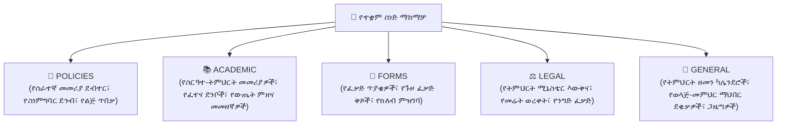

# የተቋም ፖሊሲዎች እና መመሪያ ደብተሮች

በሰነዶች ማዕከሉ (`/documents`) ውስጥ ያለው **የተቋም ማከማቻ** የትምህርት ቤት ዳይሬክተሮች እና ሬጅስትራሮች ይፋዊ የትምህርት ቤት ሰነዶችን፣ መመሪያ ደብተሮችን፣ የማመልከቻ ቅጾችን እና የቁጥጥር ህጎችን ለመምህራን፣ ለተማሪዎች እና ለወላጆች እንዲያትሙ እና እንዲያከፋፍሉ ያስችላቸዋል።

---

## የሰነድ ምደባ እና አደረጃጀት

ሰነዶች በአምስት መደበኛ ምድቦች ስር ሊጣሩ እና ሊተዳደሩ ይችላሉ፡

---

## ደረጃ በደረጃ፡ አዲስ የተቋም ሰነድ ማስገባት

1. በመጠቀሚያ ምናሌው ውስጥ ወደ **ሰነዶች** ይሂዱ።
2. በ**የትምህርት ቤት ሰነዶች** ትር ላይ መሆንዎን ያረጋግጡ።
3. በላይኛው ራስጌ ላይ **+ ሰነድ ይስቀሉ** ቁልፉን ይጫኑ።
4. የሰነዱን ሜታዳታ ይሙሉ፡
   - **የሰነድ ርዕስ**: ግልጽ ስም ያስገቡ (ለምሳሌ *"2018 የትምህርት ዘመን የሰራተኛ መመሪያ ደብተር"*)።
   - **ምድብ**: `POLICIES`፣ `ACADEMIC`፣ `FORMS`፣ `LEGAL` ወይም `GENERAL` ይምረጡ።
   - **ታዳሚ**: ፋይሉን ማየት እና ማውረድ የሚችሉትን ይምረጡ፡
     - `PUBLIC` (ሁሉም ወላጆች፣ ተማሪዎች እና ሰራተኞች)
     - `STAFF_ONLY` (መምህራን፣ ሬጅስትራሮች፣ የፋይናንስ ኦፊሰሮች እና ዳይሬክተሮች)
     - `ADMIN_ONLY` (ዳይሬክተሮች እና ሬጅስትራሮች ብቻ)
   - **ስሪት / ዘመን**: የትምህርት ዘመኑን ወይም የክለሳ ስሪቱን ይግለጹ (ለምሳሌ *"v2.4 (2018 ዓ.ም.)"*)።
   - **የፋይል ዓባሪ**: የPDF፣ DOCX ወይም XLSX ፋይሉን (እስከ 25MB) ይጎትቱ እና ይጥሉ።
5. **ሰነድ ያትሙ**ን ይጫኑ። ፋይሉ ለተመረጠው ታዳሚ ወዲያውኑ ይታያል።

---

## ነባር ሰነዶችን እና ክለሳዎችን ማስተዳደር

- **ማውረድ**: የመጀመሪያውን ፋይል ለማግኘት **ማውረድ (ወደታች ቀስት)** አዶውን ይጫኑ።
- **ቅድመ-እይታ**: ሳያወርዱ በአሳሹ ውስጥ የPDF አንባቢን ለመክፈት **እይታ (የአይን)** አዶውን ይጫኑ።
- **ፋይል ማዘመን**: አዲስ የትምህርት ዘመን ሲጀመር ፖሊሲ ሲከለስ፣ **አርትዕ**ን ይጫኑ፣ አዲሱን የፋይል ስሪት ይስቀሉ እና የስሪት መለያውን ያዘምኑ። የማውረጃ አገናኙ በራስ-ሰር የቅርብ ጊዜውን ስሪት ያንጸባርቃል።
- **ማህደር / መሰረዝ**: ጊዜ ያለፈበትን ሰነድ ለማስወገድ የ**ቆሻሻ መጣያ** አዶውን ይጫኑ እና መሰረዙን ያረጋግጡ።

---

## የታተሙ ሰነዶችን መድረስ (ለመምህራን እና ለወላጆች)

- **መምህራን**: በመምህር የጎን ምናሌአቸው ውስጥ **ሰነዶች** አገናኙን ይክፈቱ። መምህራን የትምህርት እቅድ አብነቶችን፣ የውጤት መመሪያዎችን እና የትምህርት ቤት መመሪያ ደብተሮችን ጨምሮ ሁሉንም `PUBLIC` እና `STAFF_ONLY` ግብዓቶች ያያሉ።
- **ወላጆች**: በወላጅ ፖርታሉ ውስጥ **የትምህርት ቤት ሰነዶች** ክፍሉን ይክፈቱ። ወላጆች ሊወርዱ የሚችሉ የጉዞ ፈቃድ ቅጾችን፣ የክፍያ መርሃ ግብሮችን፣ የዩኒፎርም ፖሊሲዎችን እና የትምህርት ቤት የትምህርት ዘመን ካሌንደሮችን በአንድ ጠቅታ የመድረስ መብት አላቸው።

---

## ቀጣይ እርምጃዎች

- [ሰነዶች እና ተገዢነት አጠቃላይ እይታ](/am/documents/overview) — የምድብ አይነቶችን እና የታዳሚ ምልክቶችን ይገምግሙ
- [የተማሪ ተገዢነት ማረጋገጫ](/am/documents/student-compliance) — የተማሪ መግቢያ ሰነዶችን ይከታተሉ
- [የዳይሬክተር ትምህርት ቤት ቅንብሮች](/am/director/school-settings) — ትምህርት ቤት አቀፍ የአሰራር ነባሪዎችን ያዋቅሩ