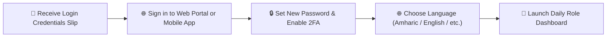

# Getting Started with YeneSchool

Welcome to **YeneSchool** — the modern school management platform tailored for Ethiopian educational institutions. This guide helps you sign in for the first time, configure your language preferences, and navigate your daily dashboard.

---

## 1. Signing in for the First Time

Every student, parent, teacher, and administrator receives a unique login username and initial password from the school registrar:

1. Open your web browser and navigate to your school's YeneSchool portal address (e.g., `https://yeneschool.me` or your institution's custom domain).
2. Enter your **Username, Email, or Unique ID Code** and your **Initial Temporary Password**.
3. **Change Temporary Password**: On your very first sign-in, the system prompts you to create a secure, private password.
4. **Enable Biometric / 2FA**: Optionally configure Two-Factor Authentication or Fingerprint/Face Unlock on mobile for quick access.

---

## 2. Choosing Your Preferred Language

YeneSchool provides a fully localized multilingual interface supporting **Amharic (አማርኛ)**, **Afaan Oromoo**, **Tigrinya**, **Somali**, **Arabic**, and **English**:

- **On Desktop Web**: Click the **Language Picker** icon on the top-right header bar and select your language.
- **On Mobile App**: Tap your profile avatar > **Language** to switch instantly.
- The interface, dates (Ethiopian / Gregorian calendar), and currency formatting update immediately.

---

## 3. Installing the Mobile App

For Teachers, Parents, and Students on the go:
- **Android**: Download the official YeneSchool App from Google Play Store or scan the APK QR code provided on your school portal.
- **iOS / iPhone**: Install via Apple App Store.
- The mobile app includes **offline mode**, allowing you to mark attendance, view timetables, and check grades even when disconnected from the internet.

---

## 4. Role Portals at a Glance

| Role | Primary Daily Activities |
| :--- | :--- |
| **School Director** | Institutional settings, teacher evaluations, risk analytics, siren bells, and reports. |
| **Teacher** | Daily classroom roll-calls, gradebook mark entry, lesson plans, and parent communication. |
| **Registrar** | Student enrollment, bulk CSV imports, student profiles, and report card generation. |
| **Finance Officer** | Tuition fee collection, receipts, bank transfer reconciliation, and payroll runs. |
| **Parent** | Real-time attendance feeds, report card downloads, online fee payments, and bus tracking. |
| **Student** | Timetable view, digital lesson notes, homework submissions, and online computer-based tests. |

---

## Next Steps

- [Role-Based Access Matrix](/en/guides/role-based-access) — Overview of permissions per role
- [Director Guide Overview](/en/director/overview) — Academic and administrative controls
- [Teacher Guide Overview](/en/teacher/overview) — Classroom workflows and grading
- [Parent Guide Overview](/en/parent/overview) — Monitoring your child's educational progress
