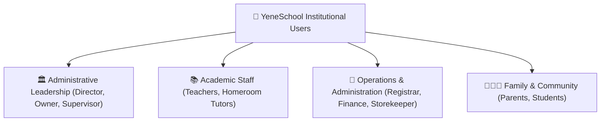

# Role-Based Access & User Portals

YeneSchool is built around a secure, role-based architecture. Every user signs in to a customized workspace tailored specifically to their daily tasks and privacy boundaries.

---

## 1. User Roles & Permission Matrix

| User Role | Primary Responsibilities | Workspace Link |
| :--- | :--- | :--- |
| **School Director** | Overall school management, academic calendar, timetables, siren bells, teacher evaluations, risk analytics, and institutional settings. | [Director Guide](/en/director/overview) |
| **Teacher** | Classroom attendance (online/offline), gradebook mark entry, lesson planning, homework assignments, student discipline, and parent communication. | [Teacher Guide](/en/teacher/overview) |
| **Registrar** | New student admissions, bulk CSV imports, student records, ID card generation, terminal report card publishing, and grade promotions. | [Registrar Guide](/en/registrar/overview) |
| **Finance Officer** | Fee structure definitions, tuition collection, digital and cash receipts, sibling discounts, overdue reports, and monthly payroll disbursement. | [Finance Guide](/en/finance/overview) |
| **Parent / Guardian** | Live attendance monitoring, continuous assessment grades, digital report cards, online fee payments, communication book, and bus tracking. | [Parent Guide](/en/parent/overview) |
| **Student** | Daily timetable, digital lesson materials, assignment submissions, CBT online examinations, and term progress reports. | [Student Guide](/en/student/overview) |
| **Storekeeper / Inventory**| Warehouse inventory, textbook and uniform sales, consumable requisitions, stock transactions, and low-stock alerts. | [Inventory Guide](/en/inventory/overview) |
| **Academic Supervisor** | Multi-branch QA audits, classroom observation rubrics, teacher performance leaderboards, and curriculum pacing reviews. | [Supervisor Guide](/en/supervisor/overview) |
| **School Owner** | Executive multi-campus oversight, financial health indicators, capital expenditure, and subscription license management. | [Owner Guide](/en/owner/overview) |

---

## 2. Privacy & Multi-Branch Data Scoping

- **Data Isolation**: Teachers only access student records and registers for classes they teach.
- **Financial Confidentiality**: Student fee records, payment balances, and staff payroll information are strictly restricted to the Finance Officer, Director, and School Owner.
- **Branch Scoping**: Staff members assigned to a specific campus branch can only view records belonging to that branch.

---

## Next Steps

- [Getting Started Guide](/en/guides/getting-started) — Account setup and first-time login
- [Reporting Issues & Getting Support](/en/guides/support-error-reporting) — How to submit help tickets
- [Director Guide Overview](/en/director/overview) — Academic and administrative controls
