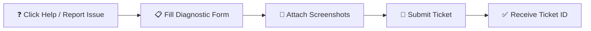

# Support, Error Reporting & Feature Requests

YeneSchool is committed to 99.9% system availability and continuous product improvement based on direct feedback from school directors, teachers, registrars, and parents. This guide explains how to submit bug reports, attach diagnostic logs, request custom features, and contact official customer support.

---

## 1. Reporting an Error or Bug

If you encounter an unexpected error, a failed submission, or a calculation discrepancy:

### Step-by-Step Error Submission:
1. Click the **Help & Support icon (`?`)** in the top navigation bar, or navigate to **Director → Subscription → Report an Issue**.
2. Complete the diagnostic report form:
   - **Issue Title:** Brief, descriptive summary (e.g., *Grade 9B attendance sync failed in offline mode*).
   - **Affected Module:** Select from dropdown (*Attendance, Gradebook, Online Exams, Finance/Billing, Siren, Report Cards*).
   - **Severity / Priority:**
     - `Critical / Blocker:` Prevents core operations (e.g., cannot enter final exam marks, server down).
     - `High:` Feature works incorrectly with significant inconvenience.
     - `Medium / Low:` Visual glitch, translation typo, or minor inconvenience.
   - **Steps to Reproduce:** Numbered list describing what you clicked before the error occurred.
   - **Expected vs Actual Behavior:** What should have happened vs what actually displayed.
3. **Upload Screenshots or Error Logs:** Drag and drop PNG/JPG screenshots of the error banner or dialog.
4. Click **Submit Error Report**.
5. You will receive an immediate **Ticket Tracking ID** (e.g., `#YS-8492`) with live status updates delivered via email and Telegram.

---

## 2. Requesting Custom Features & Product Enhancements

Have an idea for a feature that would improve your school's workflow? YeneSchool welcomes feature requests from all partner schools!

1. Open **Director → Subscription → Request a Feature**.
2. Fill in your feature proposal:
   - **Feature Name:** (e.g., *Automated SMS alert when library books are 3 days overdue*).
   - **Target User Role:** Who will use this (*Teachers, Registrars, Parents, Directors*).
   - **Business Justification:** How this feature will save administrative time or improve learning outcomes.
   - **Workflow Description:** Step-by-step description of how the ideal screen or button should function.
3. Click **Submit Feature Request**.
4. The YeneSchool Product Engineering Board reviews submissions during weekly sprint planning. You can track your proposal's status: `Under Review`, `Planned for Next Release`, `In Development`, or `Shipped`.

---

## 3. Official Support Channels

Need urgent assistance or direct consultation with an educational technology specialist?

| Support Channel | Availability | Contact Information / Link |
| :--- | :--- | :--- |
| **In-App Ticket Desk** | 24/7 Submission | Help menu in top navbar |
| **Official Telegram Support**| Mon–Sat (08:00 – 18:00 EAT) | [`@YeneSchoolSupport`](https://t.me/yeneschool) |
| **Official Support Email** | 24-Hour SLA Response | `support@yeneschool.me` |
| **Emergency Telephone Line** | Critical Outages Only | `+251 91 100 0000` |

---

## Next Steps & Related Guides

- [User Profile & 2FA Security](/en/platform/user-profile-security) — Securing your account credentials.
- [Director Dashboard Overview](/en/director/overview) — Navigating school command centers.
- [Offline Mode & Data Sync](/en/platform/offline) — Troubleshooting offline PWA data synchronization.
