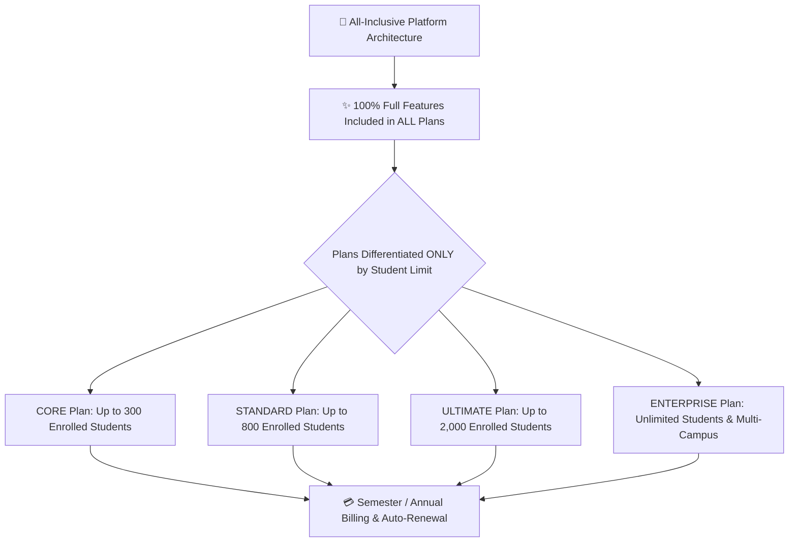

# School Subscription, Plans & Billing

The **Subscription Management Console** (`/director/subscription`) allows School Directors and Administrators to view their school's active subscription tier, track real-time student seat utilization, submit renewal payments, request new platform features, and download official receipts.



---

## 1. Equal All-Inclusive Features (Student Limit Pricing)

Unlike traditional software that locks advanced features behind expensive tiers, **YeneSchool provides 100% equal access to all features and modules across every plan**. Every enrolled institution—regardless of plan size—receives all academic, administrative, AI, and mobile capabilities.

The **only difference between plan tiers is the maximum number of enrolled students allowed**:

| Plan Tier | Maximum Student Capacity Limit | Included Modules & Features |
| :--- | :--- | :---: |
| **`CORE` Tier** | **Up to 300 Students** | **100% All Features Included** |
| **`STANDARD` Tier** | **Up to 800 Students** | **100% All Features Included** |
| **`ULTIMATE` Tier** | **Up to 2,000 Students** | **100% All Features Included** |
| **`ENTERPRISE` Tier** | **Unlimited Students** (Multi-Campus) | **100% All Features Included** + Dedicated SLA |

### Every Plan Includes:
- **Core Academics**: Classes, sections, subjects, terms, and auto-provisioning.
- **Attendance**: Daily homeroom, period-by-period, contactless NFC tap, and offline PWA.
- **Grading & Report Cards**: Continuous assessment gradebook, customizable report card templates, and transcripts.
- **Examinations**: Offline exam schedules, anti-cheat zigzag seating generator, and online computer-based testing (CBT).
- **Communication & AI**: Announcements, digital communication book, Telegram bot integration, and Autonomous AI Copilots.
- **School Operations**: Automated siren bell hardware relays, transport fleet tracking, bookstore POS, and data quality audits.
- **Mobile Apps**: Full Android and iOS mobile app access for all Teachers, Parents, and Students.
- **Financials**: Student fee structures, installment tracking, and staff payroll calculations.

---

## 2. Subscription Statuses & Grace Period Lifecycle

Your school's subscription moves through explicit lifecycle states:

| Status Code | Description & Platform Impact |
| :--- | :--- |
| **`ACTIVE`** | The school's subscription is fully active. All administrative and classroom features operate with unlimited write access. |
| **`GRACE_PERIOD`** | When a subscription reaches its renewal date, YeneSchool activates an automated grace period. Teachers and directors experience **zero interruption** while an amber banner reminds administrators to settle the renewal invoice. |
| **`EXPIRED`** | If payment is not verified before the grace period lapses, write operations (e.g., publishing new report cards or creating new classes) are locked until payment is verified. Historical data remains 100% safe and accessible. |
| **`DRAFT`** | Initial setup state for newly registered institutions awaiting first plan activation. |
| **`CANCELLED`** | Decommissioned institutional account status. |

---

## 3. Real-Time Resource Quotas & Usage Tracking

In the **Director > Subscription** overview, live meters monitor institutional resource consumption:

```
[ Active Students ]  ████████████░░░░  680 / 800 Seats (85%)
[ Staff Accounts  ]  ██████████░░░░░░   42 / 60 Staff (70%)
[ AI Tokens       ]  ██████████████░░  4.2M / 5.0M Tokens (84%)
[ Cloud Storage   ]  ████░░░░░░░░░░░░  12.4 GB / 50.0 GB (25%)
```

- **Student Seat Alert**: When active enrollment reaches 90% of your plan's maximum capacity, the director dashboard displays a prompt to upgrade to the next tier so new student admissions are never blocked.

---

## 4. Submitting Renewal & Upgrade Payments

Directors can renew their current plan or upgrade to a higher student capacity tier directly in the portal:

### Step-by-Step Payment Submission Workflow
1. Navigate to **Director > Subscription**.
2. Click **Renew Subscription** or **Upgrade Plan**.
3. Select the desired **Plan Tier** based on your projected student enrollment:
   - **Semester Billing**: Billed bi-annually at term commencement.
   - **Annual Plan (Recommended)**: Includes a **15% discount** and priority onboarding assistance.
4. Choose your payment channel:
   - **Commercial Bank of Ethiopia (CBE) / Bank Transfer**: Transfer the total amount to YeneSchool's institutional account, enter the Bank Reference / FT Number, and upload the scanned deposit slip.
   - **Telebirr / CBE Birr**: Enter your mobile number for instant USSD push authorization.
5. Click **Submit Payment for Verification**.
6. The payment status changes to `PENDING_VERIFICATION`. Once verified by finance, the subscription immediately updates to `ACTIVE` and the renewal expiration date advances automatically.

---

## 5. Direct Feature Request Portal

School Directors can submit feature requests, custom module enhancements, or specific regional reporting requirements directly from the subscription interface:

1. In **Director > Subscription**, scroll to the **Feature Requests** tab.
2. Click **+ Request New Feature**.
3. Provide:
   - **Feature Title**: E.g., *Ministry Zone 4 Custom Quarterly Report Card Template*.
   - **Category**: `Academic`, `Financial`, `AI Assistant`, `Mobile App`, or `Hardware Integration`.
   - **Business Rationale & Description**: Explain how the feature will benefit your school's daily operations.
4. Click **Submit Proposal**.
5. Track your request status (`UNDER_REVIEW`, `PLANNED`, `IN_DEVELOPMENT`, `RELEASED`) with live developer updates.

---

## Next Steps

- [School-Wide Settings & Configuration](/en/director/school-settings) — Configure academic calendars, branding, and policies
- [Reporting Errors & Getting Support](/en/guides/support-error-reporting) — Submit support tickets and technical assistance
- [Multi-Branch School Management](/en/owner/multi-branch) — Manage subscription licenses across multiple campuses
