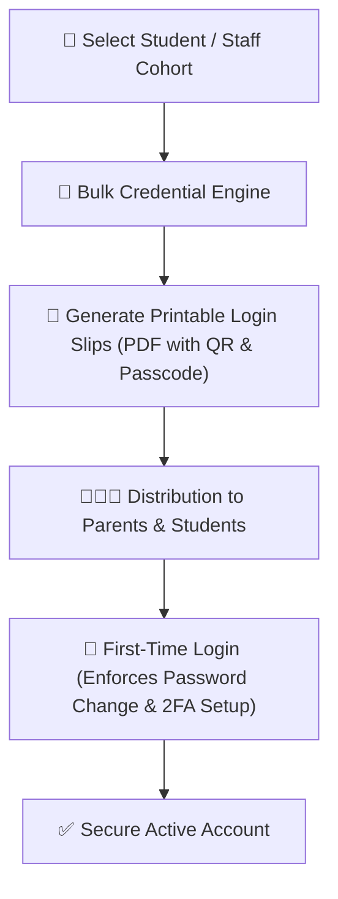

# User Credentials & Login Slips Management

At the start of an academic year or when admitting new batches of students and staff, school administrators need to securely distribute login credentials (`CredentialGenerationLog`, `PendingCredential`, `PasswordResetToken`). YeneSchool provides bulk generation tools and printable PDF login slips.

---

## 1. Bulk Credential Generation

### Steps to Generate Passwords for a Class Cohort
1. Navigate to **Director > Credentials & Accounts** (or **Registrar > Credential Manager**).
2. Select the **Target Role** (`Student`, `Parent`, or `Teacher`).
3. Filter by **Academic Year**, **Grade Level**, and **Section** (e.g., *Grade 7A*).
4. Select the generation mode:
   - **New Accounts Only**: Generates credentials only for students who have never signed in.
   - **Batch Password Reset**: Resets forgotten credentials for all selected accounts.
5. Choose password complexity requirements:
   - `Memorable Pronounceable Passwords` (ideal for primary school students, e.g., `BlueLion82`).
   - `High-Entropy Random Strings` (for secondary students and staff).
6. Click **Generate Credentials Batch**.

---

## 2. Printing Personalized Login Slips

Once generated, administrators can print wallet-sized or half-page physical credential slips:

1. Click **Export Printable Login Slips (PDF)**.
2. The system formats slips with:
   - School Crest, Name, and Official Motto.
   - Student Full Name, Student Code, and Section.
   - Assigned Username and Initial One-Time Password.
   - Direct QR Code linking straight to the school's mobile login portal.
   - Step-by-step instructions in Amharic and English for first-time password setup.
3. Print and distribute to parents during orientation day or sealed inside envelope packets.

---

## 3. First-Time Sign-In & Security Enforcement

When a user logs in with their temporary credential:
- The system automatically triggers the **Forced Password Change Guard** (`mustChangePassword: true`).
- The user must create a strong, private password using the live strength meter.
- The temporary password record is immediately sanitized and removed from `PendingCredential` logs.
- The administrator can monitor account activation rates on the **Onboarding Progress Dashboard**.

---

## Next Steps

- [Teacher Performance & Evaluation](/en/director/teacher-evaluation) — Monitor teacher attendance, lesson completion, and ratings
- [School-Wide Settings & Configuration](/en/director/school-settings) — Define password complexity rules and session timeouts
- [User Profile & 2FA Security](/en/platform/user-profile-security) — Setting up Two-Factor Authentication and trusted devices
