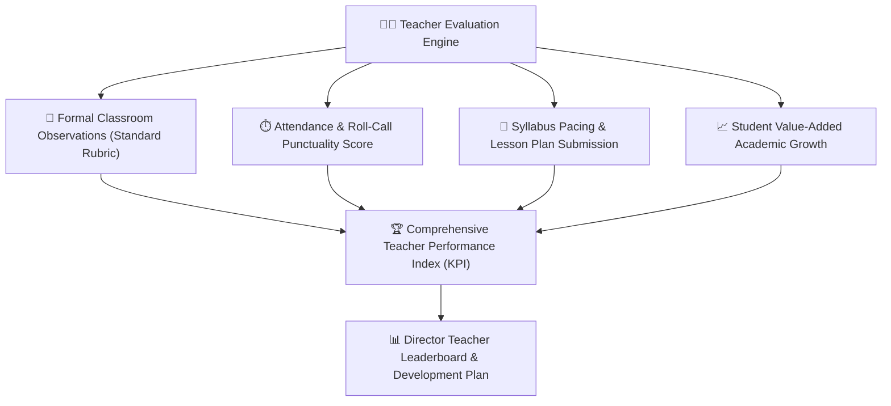

# Teacher Performance, Evaluation & Leaderboard

The **Teacher Performance & Quality Assurance Module** provides objective, data-driven evaluation tools for School Directors and Supervisors. It synthesizes classroom observation rubrics, attendance punctuality, syllabus completion rates, and student academic growth into comprehensive teacher performance profiles.

---

## 1. The Four Pillars of Teacher Evaluation

YeneSchool calculates an institutional Teacher Performance Score (0% – 100%) based on four weighted dimensions:

| Dimension | Weight | Metrics Analyzed by the System |
| :--- | :--- | :--- |
| **1. Classroom Observation Rubrics** | 40% | Direct in-class assessments conducted by the Director or Department Head across 5 pedagogical standards. |
| **2. Operational Punctuality** | 25% | Timely morning arrival, zero unexcused missed periods, and prompt submission of daily roll-calls within cutoff windows. |
| **3. Curriculum & Syllabus Pacing** | 20% | Percentage of textbook chapters and syllabus milestones completed according to the academic calendar. |
| **4. Student Academic Progress** | 15% | Value-added growth in student continuous assessment scores, homework turnaround, and exam pass rates. |

---

## 2. Conducting a Classroom Observation

### Observation Workflow
1. Navigate to **Director > Teacher Performance > + New Observation**.
2. Select the **Teacher**, **Subject**, **Class Section**, and **Date/Period**.
3. Evaluate the teacher across standard Ministry-aligned rubrics (rated 1 to 5):
   - **Instructional Clarity & Objective Setting**: Were learning goals communicated clearly?
   - **Student Engagement & Active Participation**: Did students actively participate in exercises?
   - **Classroom Management & Learning Environment**: Was order and discipline maintained respectfully?
   - **Formative Assessment & Questioning**: Did the teacher verify student understanding during the lecture?
   - **Use of Visual Aids & Practical Teaching Tools**: Utilization of laboratory equipment, charts, or digital lessons.
4. Add qualitative commendations and areas for professional growth.
5. Choose whether to share the feedback immediately with the teacher or keep it confidential until a 1-on-1 debrief.
6. Click **Submit Observation Report**.

---

## 3. Teacher Leaderboard & Professional Development

- **Institutional Leaderboard**: The Director can view teachers ranked by composite performance scores to recognize outstanding educators and award end-of-term excellence certificates.
- **Individual Development Plans (IDP)**: For teachers scoring below benchmark in specific areas (e.g., student engagement), the system suggests targeted professional development workshops and pairs them with experienced mentor teachers.

---

## Next Steps

- [School-Wide Settings & Configuration](/en/director/school-settings) — Configure observation rubric weights
- [Director Siren & Bell Management](/en/director/siren-management) — Monitor class period adherence
- [Supervisor Quality Assurance](/en/supervisor/overview) — Supervisor role and academic audits
