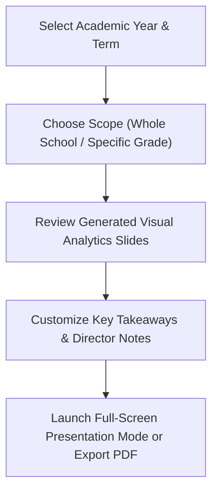

# PTA Parent Presentation Generator

School Directors frequently present academic results, attendance trends, and school-wide achievements to families during Parent-Teacher Association (PTA) meetings and term closing assemblies. The **Parent Presentation Generator** (`/director/reports/parent-presentation`) automatically compiles complex school data into executive visual slide decks and charts ready for live projection.

---

## Key Presentation Highlights

::u-page-grid
:::u-page-card
---
title: Academic Growth Charts
icon: i-lucide-bar-chart-3
---
Visual bar charts comparing average subject scores, pass rates, and grade distribution across sections and terms.
:::

:::u-page-card
---
title: Attendance Reliability
icon: i-lucide-user-check
---
School-wide punctuality metrics, chronic absenteeism reduction rates, and top attendance classrooms.
:::

:::u-page-card
---
title: Top Achievers Showcase
icon: i-lucide-trophy
---
Automatic recognition slides highlighting honor roll students, subject matter champions, and outstanding improvement.
:::
::

---

## Step-by-Step: Generating a PTA Presentation Deck

### 1. Configure the Presentation Scope
1. In the Director navigation menu, click **Reports** > **Parent Presentation**.
2. Select the **Academic Year** (e.g. *2018 E.C.*) and **Term / Quarter** (e.g. *Quarter 2*).
3. Select the target cohort:
   - **All Grades**: For whole-school townhalls and general PTA assemblies.
   - **Specific Grade Level (e.g. Grade 8 or Grade 12)**: For national exam briefing sessions.
   - **Specific Class Section (e.g. Grade 10B)**: For classroom-level parent-teacher conferences.

### 2. Slide Deck Sections Automatically Compiled

The presentation engine compiles five structured presentation modules:

1. **Executive Summary**: Total enrollment, gender ratio, overall pass percentage, and overall school average score.
2. **Subject Mastery Overview**: Interactive bar charts ranking subject performance from highest scoring (e.g. Mathematics 84%) to subjects needing focus.
3. **Attendance & Discipline Health**: Percentage of students with >95% attendance and positive behavioral merit milestones.
4. **Top Achievers & Honor Roll**: Top 3 ranking students per section with photos and cumulative averages.
5. **Next Term Priorities & Action Plan**: Key academic milestones, exam dates, fee deadlines, and extracurricular schedules.

---

## Presentation Modes & Export Options

- **Live Presentation Mode**: Click **Present Fullscreen** to project the slide deck onto classroom projectors or smart TVs. Use keyboard arrow keys (`←` / `→`) to advance slides smoothly.
- **Export to PDF**: Download a high-resolution printable handout to distribute to attending parents.
- **Export to Excel / Spreadsheet**: Export the underlying statistical data for school board governance records.

---

## Next Steps

- [Data Consistency & Audit Engine](/en/director/data-consistency) — Verify all grade and attendance data before presenting
- [Director Reports & Analytics](/en/director/reports-analytics) — View school performance statistics
- [Custom Certificate & Transcript Builder](/en/registrar/certificate-templates) — Prepare honor roll awards
