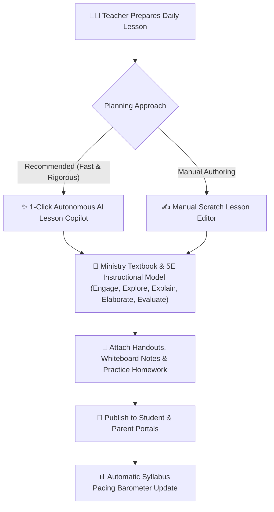

# Lesson Plans & Homework Assignments (AI Copilot & Manual)

The **YeneSchool Lesson Planning & Assignment Suite** (`Lesson`, `CurriculumTextbookUnit`, `ContentSubmission`) empowers teachers to prepare high-quality, Ministry-aligned instructional plans and digital homework. While teachers can author lesson plans manually from scratch, using the **Autonomous AI Lesson Copilot (Recommended)** saves hours of preparation while elevating pedagogical rigor.



---

## 1. Autonomous AI Lesson Plan Generator (Recommended)

The AI Lesson Copilot understands the Ethiopian National Curriculum and automatically structures lessons using the globally recognized **5E Instructional Model**.

```
┌────────────────────────────────────────────────────────────────────────┐
│ 🤖 AI Lesson Copilot Prompt                                            │
│ "Grade 10 Physics — Unit 3: Newton's Laws of Motion (45-Min Period)"   │
├────────────────────────────────────────────────────────────────────────┤
│ 1. Engage (5 Mins): Real-world demonstration hook with a moving cart.  │
│ 2. Explore (15 Mins): Student group experiment with inclined planes.   │
│ 3. Explain (15 Mins): Mathematical derivation of F = m × a on board.   │
│ 4. Elaborate (5 Mins): Real-life automotive braking distance problem.  │
│ 5. Evaluate (5 Mins): 3-question diagnostic exit ticket quiz.          │
└────────────────────────────────────────────────────────────────────────┘
```

### Steps to Generate an AI Lesson Plan
1. Navigate to **Teacher Portal > Lessons > + New Lesson Plan**.
2. Click **✨ Generate with AI Copilot (Recommended)** at the top.
3. Select the **Subject**, **Grade Level**, and **Textbook Chapter/Unit** (e.g., *Grade 9 Biology — Unit 2: Cell Structure & Organelles*).
4. Specify the **Target Period Duration** (e.g., *45 Minutes* or *90-Minute Double Lab Period*).
5. (Optional) Provide customized instructions (e.g., *"Focus on interactive group work using local materials"* or *"Include Amharic term definitions"*).
6. Click **Generate Lesson Plan**.
7. In under 5 seconds, the AI produces:
   - **Clear Behavioral Learning Objectives**: E.g., *"SWBAT identify and differentiate plant and animal cells under a microscope."*
   - **Timed 5E Stage Breakdown**: Minute-by-minute classroom activity roadmap.
   - **Teaching Aids & Visual Materials**: Recommended whiteboard diagrams and everyday materials.
   - **Formative Exit-Ticket Questions**: 3 to 5 quick assessment questions.
8. Review, edit any text inline, and click **Save & Publish Lesson**.

---

## 2. Manual Lesson Plan Authoring

For teachers who prefer crafting custom notes and original lecture plans manually:

1. In **Lessons > + New Lesson Plan**, select **Blank Lesson Editor**.
2. Enter the **Lesson Title**, **Subject**, and **Class Section**.
3. Link the lesson to the corresponding **Curriculum Unit** (`CurriculumTextbookUnit`) so the school's syllabus pacing tracker automatically increments.
4. Use the **Rich Text Editor** to format headings, bullet points, mathematical LaTeX formulas, and embed images or YouTube video demonstrations.
5. Attach supplementary PDF study guides or worksheet files.
6. Choose **Save as Draft** to refine later, or **Publish to Class** to make it accessible to students immediately.

---

## 3. Creating & Distributing Homework Assignments

1. Navigate to **Teacher Portal > Assignments > + Create Assignment**.
2. Set the assignment parameters:
   - **Target Class & Subject**: Select the specific section (e.g., *Grade 8A General Science*).
   - **Submission Deadline**: Set the due date and time cutoff (e.g., *Friday 05:00 PM*).
   - **Maximum Marks**: E.g., `10` or `20` points.
   - **Submission Method**:
     - `Online File Upload` (Students submit scanned PDF/photos of homework).
     - `In-App Text Entry` (Students type answers directly in their portal).
     - `Physical Classroom Turn-In` (Teacher marks physical exercise books).
3. Click **Publish Assignment**. Students and parents instantly receive an in-app push and Telegram alert.

---

## 4. Grading Submissions & Auto-Syncing to Gradebook

1. Open the assignment to view the **Live Submissions Tracker**:
   - Color-coded counts: *Submitted (Green)*, *Pending (Yellow)*, *Overdue (Red)*.
2. Click on a student's submission to inspect their uploaded document in the built-in document viewer.
3. Enter the **Score** and write constructive qualitative feedback.
4. Toggle **Sync with Gradebook**:
   - The score automatically transfers into the student's continuous assessment gradebook column (e.g., *Homework Assignment #3*), eliminating manual double-entry.
5. Click **Return Feedback to Student**.

---

## Next Steps

- [AI Teaching Assistant & Quiz Generator](/en/teacher/ai-copilot) — Generate chapter quizzes and diagnostic worksheets
- [Gradebook Entry & Continuous Assessments](/en/teacher/gradebook-entry) — Entering midterms and test scores
- [Curriculum & Textbook Chapter Mapping](/en/teacher/curriculum-syllabus) — Monitoring syllabus completion pacing
