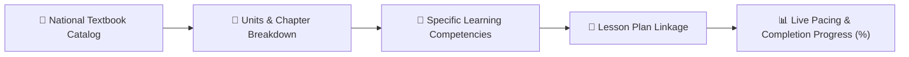

# Curriculum & Textbook Chapter Mapping

YeneSchool connects daily lesson plans directly to official national textbooks and syllabus standards (`CurriculumTextbook`, `CurriculumTextbookUnit`, `SyllabusMapping`). This ensures teachers maintain steady pacing throughout the academic term and prevents curriculum gaps before midterm and final examinations.



---

## 1. Textbook Structure & Unit Breakdown

Teachers can view the pre-loaded national curriculum textbooks assigned to their teaching subjects:

| Grade & Subject | Official Textbook Title | Units / Chapters | Expected Pacing |
| :--- | :--- | :--- | :--- |
| **Grade 9 Mathematics** | *Ministry of Education Student Textbook Grade 9* | 8 Units (Number Systems to Trigonometry) | 2 Units per Quarter |
| **Grade 10 Physics** | *Grade 10 Physics Ethiopian National Curriculum* | 6 Units (Kinematics, Dynamics, Thermodynamics...) | 3 Units per Semester |
| **Grade 11 Biology** | *Grade 11 Biology Student Resource Book* | 5 Units (Biochemical molecules, Genetics...) | 2.5 Units per Semester |

---

## 2. Linking Daily Lessons to Textbook Competencies

When creating a daily lesson plan:
1. Navigate to **Teacher Portal > Lessons > + Create Lesson Plan**.
2. Select the **Subject** and **Class Section**.
3. In the **Curriculum Unit Selector**, pick the active unit (e.g., *Unit 3: Quadratic Equations & Applications*).
4. Select the specific **Learning Competency / Chapter Topic**:
   - E.g., *Section 3.2: Solving Quadratics by Factoring and Completing the Square*.
5. Attach lesson handouts, whiteboard summary notes, or homework assignments.
6. Check **Mark Chapter Sub-Topic as Completed** when the lecture is delivered.

---

## 3. Tracking Syllabus Completion & Pacing Progress

On the **Teacher Dashboard** and **Director Curriculum Overview**:
- A real-time **Pacing Barometer** shows syllabus completion against the academic calendar:
  ```
  [ Grade 9B Mathematics ]  █████████████░░░░░  65% Completed (On Schedule)
  [ Grade 10A Physics    ]  ████████░░░░░░░░░░░  40% Completed (2 Weeks Behind Pace)
  ```
- If a class is falling behind the expected weekly pacing target, the system alerts the teacher with recommended review sessions or tutorial periods.

---

## Next Steps

- [Timetable Overrides & Period Swap Requests](/en/teacher/period-swaps) — Request temporary teacher substitution
- [AI Teaching Assistant & Quiz Generator](/en/teacher/ai-copilot) — Generate exam questions matching textbook chapters
- [Lessons & Homework Assignments](/en/teacher/lessons-assignments) — Share digital resources with students
