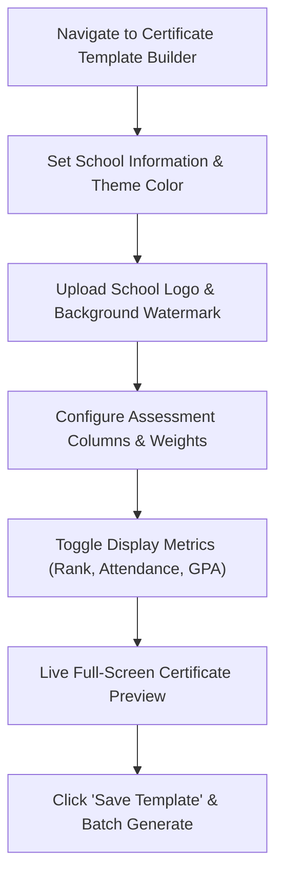

# Custom Certificate & Transcript Builder

YeneSchool gives Directors and Registrars full control over the visual branding, formatting, and legal authenticity of official student transcripts, term report cards, and certificates of academic excellence (`/director/report-cards/certificate-template`).

---

## Key Template Customization Features

::u-page-grid
:::u-page-card
---
title: Institutional Branding
icon: i-lucide-palette
---
Upload high-resolution school crests, specify custom brand color palettes, and set official letterhead addresses and contact info.
:::

:::u-page-card
---
title: Watermark & Background
icon: i-lucide-stamp
---
Apply anti-forgery watermark stamps, custom decorative certificate borders, and official seal overlays.
:::

:::u-page-card
---
title: Dynamic Metrics Toggles
icon: i-lucide-sliders
---
Enable or hide Class Rank, Attendance %, Cumulative GPA, Assessment Breakdown, and Principal Signatures with one click.
:::
::

---

## Step-by-Step: Configuring Certificate & Report Card Templates

### 1. Header Information & School Details
1. Go to **Report Cards** in the navigation menu and click **Certificate Template**.
2. Complete the institutional details:
   - **Certificate Title**: E.g. *"Official Student Academic Achievement Certificate"* or *"Term End Report Card"*.
   - **School Name & Address**: Official registered institution name, campus address, phone number, and email.
   - **Principal / Director Name**: Printed alongside the designated signature line.

### 2. Branding & Watermark Styling
1. **Theme Color**: Click the color picker to match your school's brand palette (default: Royal Navy `#1B4F72` or Crimson `#800020`). This color styles the header banners, table borders, and grade badges.
2. **School Logo**: Upload a high-resolution transparent PNG or SVG of your official school crest.
3. **Custom Background / Watermark**: Toggle **Use Custom Background** and upload a light watermark image (such as an embossed seal or certificate border).

### 3. Assessment Columns & Weighting
Configure how continuous assessment scores appear on the transcript:
- Add assessment components (e.g. *Class Tests (20%)*, *Mid-term Exam (30%)*, *Final Exam (50%)*).
- Check that component percentages total 100%.

### 4. Display Toggles & Privacy Flags

| Toggle Setting | Description | Recommended Usage |
| :--- | :--- | :--- |
| **Show Class Rank** | Displays student's position in section (e.g. 1st of 45 students) | Enabled for academic excellence certificates; optional on general report cards |
| **Show Attendance %** | Prints the student's term punctuality and attendance percentage | Enabled on official quarterly report cards |
| **Show GPA / Average** | Calculates and prints cumulative Grade Point Average | Enabled for High School and Preparatory transcripts |
| **Bilingual Grading Legend** | Prints standard letter grade scale (A, B, C, D, F) alongside Ethiopian score ranges | Enabled for all official government certifications |

---

## Live Full-Screen Preview & Batch Generation

Before saving and distributing certificates:

1. Click the **Preview Certificate** button to launch the live modal with sample student data.
2. Verify visual alignment, margins, text clarity, and watermark opacity.
3. Click **Save Template**.
4. To batch generate certificates for a whole class or graduating cohort, go to **Report Cards** > **Batch Print**, select the class section, and click **Print Official Certificates (PDF)**.

---

## Next Steps

- [Report Cards Generation](/en/registrar/report-cards) — Batch generate and print quarterly report cards
- [Student ID Cards Generation](/en/registrar/id-cards) — Generate photo ID badges
- [Director Reports & Analytics](/en/director/reports-analytics) — View school performance statistics
