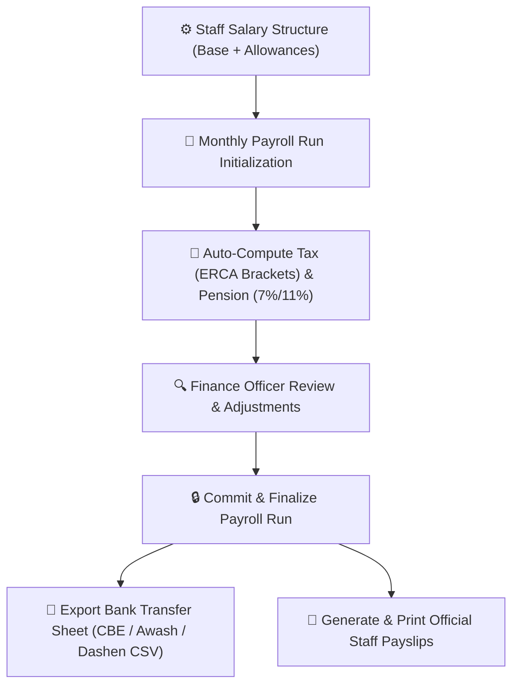

# Staff Payroll & Salary Management

The **YeneSchool Payroll Module** (`PayrollRun`, `PayrollSalary`, `PayrollEntry`) automates monthly salary calculations for teaching faculty, administrative personnel, and support staff. It handles statutory deductions (Ethiopian income tax and pension funds), allowances, net pay calculation, and automated bank disbursement file generation.

---

## 1. Configuring Staff Salary Structures

Every employee profile is linked to a customized salary profile (`PayrollSalary`):

### Components of a Salary Profile
1. Navigate to **Finance > Payroll > Salary Structures**.
2. Search for the staff member or create a template by job role (e.g., *Senior High School Teacher*, *Lab Technician*, *Registrar*).
3. Configure the earning components:
   - **Gross Base Salary (ETB)**: Contractual monthly base wage.
   - **Position & Responsibility Allowance**: For Department Heads, Homeroom Teachers, or Club Coordinators.
   - **Transport & Housing Allowance**: Standard monthly stipends.
   - **Performance Bonus / Overtime**: Additional compensation for weekend tutorials or extra periods.
4. Click **Save Salary Structure**.

---

## 2. Statutory Deductions & Ethiopian Tax Calculation

YeneSchool automatically calculates mandatory statutory withholdings in compliance with Ethiopian labor and revenue regulations:

| Component | Rate / Rules | Notes |
| :--- | :--- | :--- |
| **Employee Pension Contribution** | 7.0% of Gross Base Salary | Deducted directly from employee paycheck. |
| **Employer Pension Contribution** | 11.0% of Gross Base Salary | Paid by the school institution. |
| **Employment Income Tax (PIT)** | Progressive Brackets (0% – 35%) | Computed automatically based on taxable income after pension exemption. |
| **Voluntary Deductions** | Flat ETB Amount | Staff cooperative loans, salary advances, or social welfare fund. |

---

## 3. Running Monthly Payroll

### Step-by-Step Payroll Run Workflow
1. Navigate to **Finance > Payroll > Payroll Runs**.
2. Click **+ Start New Payroll Run**.
3. Select the **Pay Period** (e.g., *Meskerem 2017 / September 2024*) and **Branch**.
4. The system populates all active staff, calculates gross earnings, applies statutory pension/tax formulas, and computes the exact **Net Salary Payable**.
5. **Review & Adjust**: Add any one-time deductions (e.g., unexcused absence pay cuts) or bonuses.
6. Click **Lock & Finalize Payroll Run**. Once finalized, records become immutable and audit-logged.

---

## 4. Bank Transfer Export Sheets & Payslips

### Commercial Bank of Ethiopia (CBE) Direct Deposit Export
1. In the finalized Payroll Run, click **Export Bank Transfer File**.
2. Select your banking provider (e.g., *Commercial Bank of Ethiopia (CBE)*, *Awash Bank*, *Dashen Bank*).
3. The system generates a compliant CSV/Excel disbursement file with Staff Legal Names, Bank Account Numbers, and Net Amounts ready for direct batch upload to the bank's corporate portal.

### Staff Digital Payslips
- Staff members can securely view and download their monthly **PDF Payslip** on their personal portal or mobile app.
- Payslips clearly present the institutional crest, gross earnings, itemized tax and pension deductions, and final take-home pay.

---

## Next Steps

- [Fee Structures & Tuition Setup](/en/finance/fee-structures) — Configure student tuition fee items
- [Overdue Fee Reports & Reminders](/en/finance/overdue-reports) — Track outstanding parent fee balances
- [Recording Payments & Receipts](/en/finance/record-payment) — Cashier payment workflows
