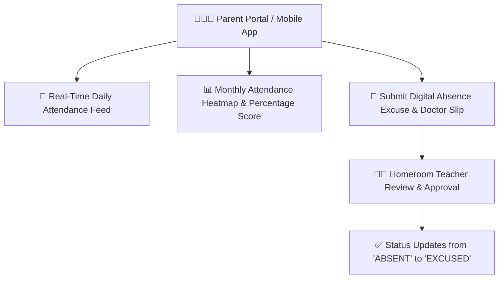

# Parent Attendance Monitoring & Excuse Submission

The **Parent Attendance Center** provides families with transparent, real-time visibility into their children's daily classroom attendance, arrival times, monthly attendance rates, and automated absence alerts. Parents can also submit digital medical excuses and leave requests directly through the portal.

---

## 1. Multi-Child Attendance Switcher

For parents with multiple children enrolled in the school:
- The top header features an active **Child Switcher**. Tap on any child to view their specific class section, homeroom teacher, and individual attendance history.
- Real-time morning status badges display whether the child is currently on campus (e.g., *Nahom: Present in Class 9B (Checked in at 07:54 AM)*).

---

## 2. Monthly Attendance Heatmap & Metrics

The attendance dashboard summarizes monthly performance metrics:

| Metric Card | What It Represents | Benchmark Goal |
| :--- | :--- | :--- |
| **Total School Days** | Count of official operating days in the selected Ethiopian/Gregorian month. | — |
| **Present Days** | Days your child attended on time. | Highest possible |
| **Tardy / Late Arrivals** | Days arrived past the school morning cutoff time (`ATTENDANCE_CUTOFF_TIME`). | < 2 per term |
| **Excused Leaves** | Verified medical leaves or authorized family absences. | Approved records |
| **Unexcused Absences** | Missed days without verified parent authorization. | **0 Days** |
| **Attendance Cumulative Rate**| Percentage of required school days attended. | **>= 90% (Green)** |

> [!WARNING]
> If a student's cumulative attendance falls below **80%**, the system flags the student with an academic risk warning, and year-end promotion eligibility may be jeopardized.

---

## 3. Submitting a Digital Absence Excuse

When your child is sick or has a family emergency:

1. In the **Attendance** tab, click **+ Submit Absence Excuse**.
2. Select the **Child**, **Date Range**, and **Reason Category**:
   - `Medical / Sickness`
   - `Family Emergency / Bereavement`
   - `Religious Observance`
   - `Authorized Travel`
3. Enter explanatory details for the homeroom teacher.
4. (Optional) Upload a photo or PDF scan of a medical certificate or doctor's slip.
5. Click **Submit Excuse Request**.
6. The homeroom teacher reviews the submission. Once approved, the student's status automatically converts from `ABSENT` to `EXCUSED (Blue E)`, preventing negative impact on their promotion score.

---

## Next Steps

- [Parent Dashboard Overview](/en/parent/overview) — General parent portal overview
- [Notification Channels & Preferences](/en/platform/notifications) — Configure SMS and Telegram absence notifications
- [Teacher Attendance Marking Workflow](/en/teacher/attendance-marking) — How teachers take daily roll-call
