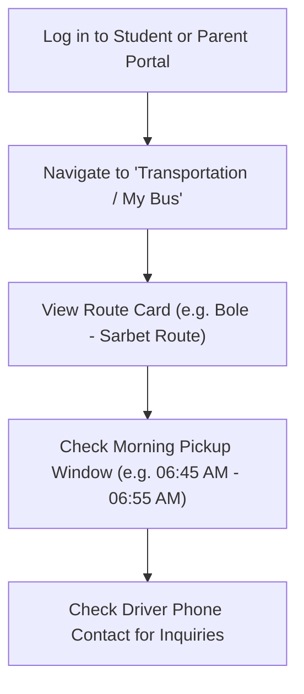

# School Bus & Transport Tracking

Students enrolled in school bus transportation can view their complete daily transit schedule from the **My Bus Dashboard** (`/student/transport`). The portal provides clear details on vehicle plate numbers, designated pickup and drop-off times, exact stop coordinates, and direct driver contact information.

---

## What is Shown on the 'My Bus' Dashboard

::u-page-grid
:::u-page-card
---
title: Route & Schedule
icon: i-lucide-map-pin
---
Designated morning pickup time and afternoon drop-off time for your assigned bus stop.
:::

:::u-page-card
---
title: Bus Vehicle Details
icon: i-lucide-bus
---
Bus code (e.g. *Bus #4*), vehicle model, license plate number, and seating capacity.
:::

:::u-page-card
---
title: Driver & Attendant
icon: i-lucide-phone
---
Name and emergency mobile phone number of the assigned school bus driver and bus monitor.
:::
::

---

## Step-by-Step: Checking Your Daily Bus Details

1. Open the left menu and click **Transportation** (or **My Bus**).
2. The active bus allocation card displays:
   - **Route Name**: E.g., *Route 02 — Bole Medhanialem via Megenagna*.
   - **Your Assigned Stop**: Exact physical landmark (e.g. *In front of Edna Mall / Tele post*).
   - **Morning Pickup Time**: Target arrival time (e.g. *06:50 AM*). Arrive at least 5 minutes before scheduled departure.
   - **Afternoon Departure Time**: Departure time from school campus (e.g. *03:45 PM*).
   - **Vehicle License Plate**: Visible on the front windshield of the bus for easy identification.
3. If running late or unable to find the vehicle at your designated stop, click the **Driver Phone** link to contact the driver directly.

---

## Safety & Boarding Guidelines for Students

- **QR Attendance Scan**: When boarding, hold your Student ID Card in front of the driver or attendant's scanner to log attendance. Parents receive an immediate check-in notification.
- **Assigned Seat Protocol**: Remain seated while the vehicle is in motion and follow instructions from the bus monitor.
- **Route Change Requests**: If your family relocates or you need to switch stops, your parent must submit a formal route update request through the school transport office at least 3 business days in advance.

---

## Next Steps

- [Director Transport Fleet Management](/en/operations/transport) — How routes and vehicles are configured
- [QR Attendance Scanning](/en/mobile/qr-attendance) — How boarding scans sync with school attendance
- [Student Portal Overview](/en/student/overview) — Guide to all student features
