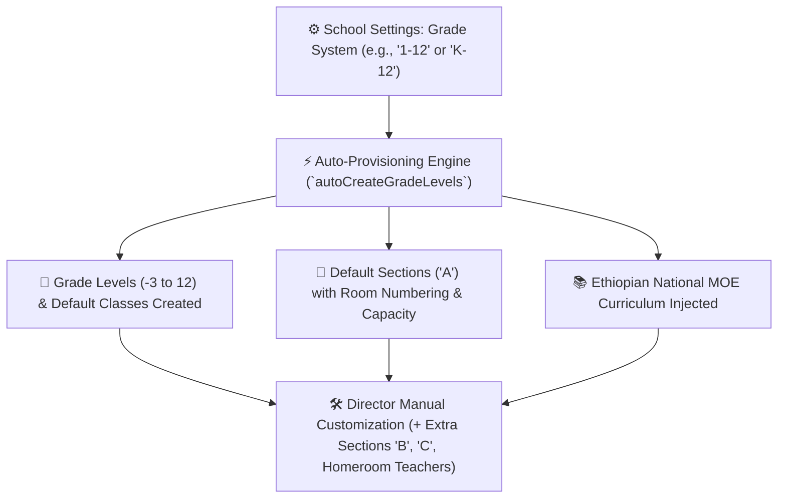

# Classes, Sections & Auto-Provisioning

In YeneSchool, class structures organize students into manageable pedagogical units for attendance, grading, and timetabling (`Class`, `Section`, `GradeLevel`, `autoCreateGradeLevels`). The platform features an intelligent **Auto-Provisioning Engine** that builds your entire institutional class structure with a single setting.



---

## 1. Automatic Class & Section Provisioning

When a School Director configures the school's **Grade System** in **Director > School Settings**:

```
Supported Grade System Ranges:
- '1-8'          --> Grade 1 to Grade 8
- '1-10'         --> Grade 1 to Grade 10
- '1-12'         --> Grade 1 to Grade 12
- '9-12'         --> Grade 9 to Grade 12 (Secondary/Prep)
- 'K-12' / 'KG-12' --> Nursery (-3), KG 1 (-2), KG 2 (-1), KG 3 (0) + Grades 1–12
- 'KG-ONLY'      --> Nursery, KG 1, KG 2, KG 3
```

### What YeneSchool Auto-Generates:
1. **GradeLevel Entities**: Sets up numeric levels from `-3` (Nursery) to `12` (Grade 12).
2. **Default Section A**: Automatically creates Section `A` for every active grade level.
3. **Classroom Capacity**: Applies `DEFAULT_SECTION_CAPACITY` (e.g., `40` students).
4. **Room Numbering**: Generates classroom names automatically according to `ROOM_NAMING_CONVENTION` (e.g., `Room 101`, `Room G9-A`).
5. **National MOE Syllabus**: Injects standard Ministry of Education subject lists for each grade.

---

## 2. Adding Extra Sections (Sections B, C, D)

When student enrollment expands beyond single section capacity:

1. Navigate to **Academic Management > Classes & Sections**.
2. Click on the target grade (e.g., *Grade 9*).
3. Click **+ Add Section**:
   - **Section Name**: E.g., `Section B`, `Section C`, or `Natural Science Stream 1`.
   - **Assigned Classroom / Room #**: E.g., `Block B - Room 204`.
   - **Student Capacity Limit**: Maximum seats before the system triggers an enrollment overflow warning (Default: `40`).
   - **Assigned Homeroom Teacher**: Designate the faculty member responsible for daily morning roll-call and parent communication.
4. Click **Save Section**.

---

## 3. Homeroom Class Teachers & Subject Assignments

Each classroom section maintains two layers of instructional responsibility:

1. **Homeroom Class Teacher (`ClassHomeroom`)**:
   - Manages daily morning attendance and general student discipline.
   - Conducts parent-teacher consultations and writes end-of-term qualitative conduct comments on report cards.
2. **Subject-Teacher Assignments (`TeacherSubjectAssignment`)**:
   - Specific subject teachers assigned to teach Math, English, Physics, etc., to that section.
   - Automatically generates the teacher's personal timetable and grants gradebook marking access.

---

## 4. Class Capacity Management & Rebalancing

- **Live Capacity Barometer**: Color-coded badges indicate seat occupancy (e.g., *36/40 Enrolled — 90%*).
- **Auto-Balance Student Allocations**: When importing students via bulk CSV, the registrar can toggle **Auto-Distribute Sections** to balance male/female ratios and academic scores evenly across sections `A`, `B`, and `C`.

---

## Next Steps

- [Subjects & Curriculum Framework](/en/academic/subjects) — Manage subject assignments and weekly periods
- [Timetable Management](/en/academic/timetable) — Build the master weekly schedule
- [Registrar Student Enrollment](/en/registrar/enroll-student) — Assign new students to classes and sections
