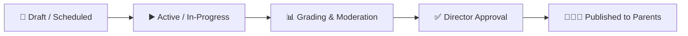

# Examinations & Continuous Assessments

The **YeneSchool Examination & Assessment Engine** manages the complete lifecycle of student evaluation — from continuous classroom quizzes and homework assignments to high-stakes semester midterms, terminal finals, and national examination registrations.

---

## 1. Assessment Architecture & Component Weighting

YeneSchool supports flexible continuous assessment frameworks aligned with national curriculum guidelines (e.g., Ethiopian Ministry of Education assessment standards). A standard subject grading structure consists of:

| Component Category | Standard Weight | Frequency | Who Manages It | Description & Recording |
| :--- | :---: | :--- | :--- | :--- |
| **Continuous Quizzes & Tests** | 20% | Bi-weekly | Classroom Teacher | Short in-class quizzes (10–20 marks each) averaged automatically. |
| **Homework & Projects** | 15% | Weekly / Monthly | Classroom Teacher | Independent assignments, group projects, and laboratory practicals. |
| **Class Participation & Conduct**| 5% | Ongoing | Homeroom Teacher | Discipline, punctuality, and active classroom engagement score. |
| **Midterm Examination** | 20% | Mid-Semester | Exam Committee / Teacher | Formal written or computer-based exam covering First Quarter curriculum. |
| **Final Semester Examination** | 40% | End of Term | School Administration | Comprehensive standardized terminal examination. |
| **Total Cumulative Mark** | **100%** | Semester End | Automated System Engine | Sum of all weighted components; computes letter grade and class rank. |

---

## 2. Step-by-Step: Creating a New Formal Examination

1. Navigate to **Examinations → Assessments** in the main sidebar.
2. Click the **+ Create Examination** button in the top-right header.
3. Complete the examination profile form:
   - **Academic Year & Term:** Select the active session (e.g., *2016 E.C. — Semester 1*).
   - **Exam Title:** Enter a descriptive name (e.g., *Grade 10 Semester 1 Final Examination*).
   - **Target Grade Levels:** Select specific classes (e.g., *Grade 9, Grade 10, Grade 11, Grade 12*) or apply school-wide.
   - **Exam Window:** Set the official start and end dates for the exam period.
   - **Grading Scale:** Choose between *Standard 100-Point Letter Scale (A–F)*, *Percentage Only*, or *KG Descriptive Scale (Exceeds, Meets, Developing)*.
4. Click **Create & Proceed to Subject Timetable**.

---

## 3. Scheduling Subject Papers & Hall Allocations

Once an examination is initialized, schedule individual subject papers:

1. In the exam details view, select **Subject Papers & Schedule**.
2. Click **+ Add Subject Paper**:
   - **Subject:** (e.g., *Physics, Amharic Literature, General Mathematics*).
   - **Paper Date & Shift:** Date and time slot (e.g., *Meskerem 24, 2016 E.C. | 08:30 AM – 10:30 AM*).
   - **Maximum Raw Marks:** (e.g., *100 Marks* or *60 Marks* scaled to component weight).
   - **Passing Mark:** (e.g., *50%*).
   - **Assigned Chief Invigilator:** Select the lead proctor/teacher responsible for the hall.
   - **Exam Hall / Room:** Designate the examination room or auditorium.
3. Click **Save Subject Schedule**.

---

## 4. Mark Entry, Moderation & Locking

Teachers can enter student marks via three flexible methods:

### Method A: Direct In-Browser Gradebook Entry
1. Open **Teacher → Grading & Assessments**.
2. Select your Class, Section, and Exam Paper.
3. Enter scores directly in the responsive spreadsheet grid.
4. The system validates inputs in real time: flags any score exceeding the maximum allowed mark in red, preventing accidental typos.
5. Click **Save Draft** at any time, or click **Submit for Moderation** when complete.

### Method B: Offline Spreadsheet Export & Bulk Import
1. Click **Export Marking Sheet (CSV / Excel)** to download a pre-formatted roster containing Student IDs, Names, and Roll Numbers.
2. Enter student marks offline without requiring internet connectivity.
3. Upload the completed spreadsheet via **Bulk Upload Marks**. The system performs instant schema validation and updates the gradebook.

### Method C: Online Computer-Based Test (Auto-Grading)
- For objective examinations administered via the [Online CBT Portal](/en/exams/online-exams-system), multiple choice and true/false scores are computed automatically upon submission and transferred directly into the gradebook.

---

## 5. Examination Lifecycle & Security Workflow

1. **Draft / Scheduled:** Timetable and seating plans configured; invisible to students.
2. **Active / In-Progress:** Exam is live; invigilators record attendance and report incidents.
3. **Grading & Moderation:** Teachers submit marks; department heads and academic supervisors review grade distributions and check for anomalies.
4. **Director Approval & Lock:** The School Director reviews school-wide grade statistics, approves the results, and locks the gradebook against further edits.
5. **Published:** Final marks and letter grades become visible on the [Student Portal](/en/student/grades-report-cards) and [Parent Portal](/en/parent/grades).

---

## 6. Exam Seating & Hall Allocation

To maintain academic integrity and prevent exam malpractices, YeneSchool includes an intelligent seating allocator:

1. Navigate to **Examinations → Seating Plans**.
2. Select the **Exam Hall** and specify the room layout (e.g., *5 Rows × 6 Columns = 30 Desks*).
3. Choose the **Allocation Strategy**:
   - **Interleaved Classes (Recommended):** Alternates students from different grade levels (e.g., *Grade 9 student seated next to a Grade 11 student*) to eliminate peer copying.
   - **Alphabetical Roll Order:** Seats students by registration roll number.
   - **Randomized Seating:** Shuffles students across designated examination rooms.
4. Click **Generate Seating Plan**.
5. Print the **Desk Label Cards** (with student photo and QR code) and the **Hall Door Manifest**.

---

## Next Steps & Related Guides

- [Online CBT Examination System](/en/exams/online-exams-system) — Authoring computer-based tests, question banks, and timer controls.
- [Teacher Gradebook Entry Manual](/en/teacher/gradebook-entry) — Detailed teacher walkthrough for continuous assessments.
- [Report Card Generation & PDF Export](/en/registrar/report-cards) — Printing terminal report cards for students and parents.
- [Student Early Warning Risk Engine](/en/director/student-risk) — Identifying academically struggling students before exams.
