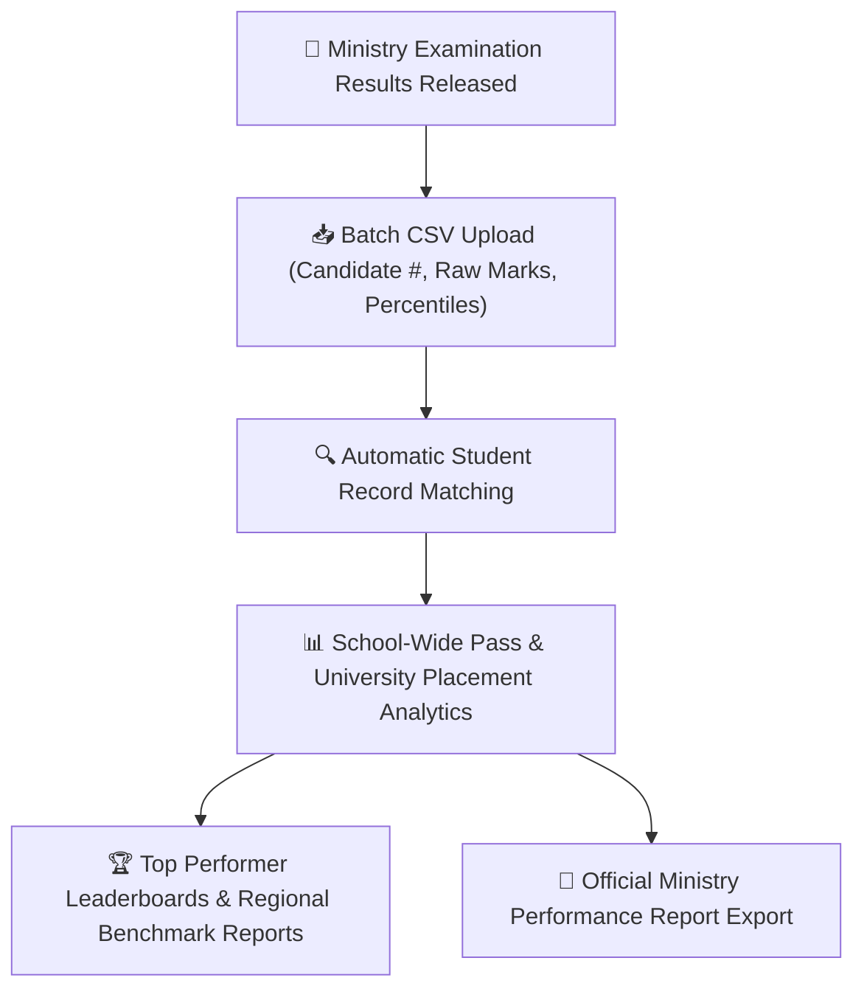

# National & Regional Examination Benchmarking

In addition to internal school assessments, Ethiopian educational institutions participate in standardized regional and national leaving examinations (`NationalExamResult`, `NationalExamResultBatch`, `NationalExamSubjectResult`). YeneSchool provides specialized tools to record national candidate numbers, import official Ministry results, track university qualification rates, and benchmark school performance against regional averages.

---

## 1. Supported Standardized Examinations

| Examination Tier | Target Cohort | Key Metrics Tracked |
| :--- | :--- | :--- |
| **Ministry Primary Leaving Exam** | Grade 6 | Passing rate for progression into Middle School (Grade 7). |
| **Regional Middle School Leaving Exam** | Grade 8 | Promotion cutoff scores into Secondary High School (Grade 9). |
| **Ethiopian Secondary School Leaving Certificate (ESSLCE)** | Grade 12 | Natural & Social Sciences stream totals (out of 600/700), University entrance qualification rates. |

---

## 2. Bulk Uploading National Exam Results

When the Ministry of Education or Regional Education Bureau releases official examination result sheets:

1. Navigate to **Examinations > National Examinations > Upload Batch**.
2. Select the **Examination Type** (e.g., *Grade 12 ESSLCE*) and **Academic Year**.
3. Download the pre-formatted CSV template containing columns:
   - `candidate_number`: Official national registration number.
   - `student_code`: Internal school student ID code.
   - Subject score columns (e.g., `english`, `mathematics`, `physics`, `chemistry`, `biology`, `civics`, `aptitude`).
   - `total_score` and `national_percentile`.
4. Upload the completed CSV file.
5. The system performs validation matching student names and candidate IDs with enrolled student records.
6. Click **Confirm & Publish National Results**.

---

## 3. Institutional Analytics & Performance Trends

Once results are uploaded, the Director and Supervisors can access deep insights:
- **University Entrance Pass Rate**: Percentage of Grade 12 students achieving the national cutoff for public university admission.
- **Subject-by-Subject Gap Analysis**: Identifies subjects where students outperformed or underperformed compared to national averages (e.g., *School scored 14% higher than regional average in Mathematics*).
- **Multi-Year Historical Trend**: 5-year progression graphs highlighting curriculum improvements and academic growth.
- **Honor Roll & Top Achievers**: One-click generation of social media announcements and graduation certificates honoring top national scorers.

---

## Next Steps

- [Exam Seating & Anti-Cheat Hall Generator](/en/exams/exam-seating-halls) — Automated zigzag hall layout generator
- [Online Computer-Based Testing (CBT)](/en/exams/online-exams-system) — Running internal digital mock examinations
- [Examinations & Continuous Assessments Overview](/en/exams/exams-assessments) — Overview of internal school assessments
